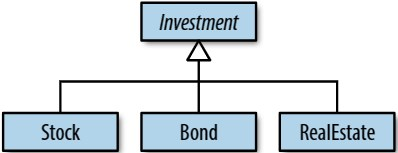
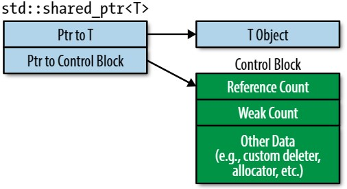
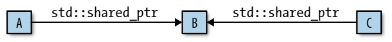
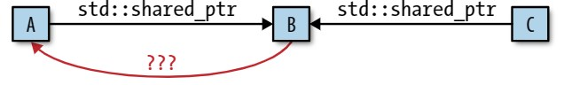

- [_Chapter 4_ 智能指针](#chapter-4-智能指针)
  - [_Item 18_ 对于 _exclusive-ownership_ 的资源管理使用 _std::unique\_ptr_](#item-18-对于-exclusive-ownership-的资源管理使用-stdunique_ptr)
    - [需要记住的规则](#需要记住的规则)
  - [_Item 19_ 对于 _shared-ownership_ 的资源管理使用 _std::shared\_ptr_](#item-19-对于-shared-ownership-的资源管理使用-stdshared_ptr)
    - [需要记住的规则](#需要记住的规则-1)
  - [_Item 20_ 对于可能会悬空的 _std::shared\_ptr-like_ 指针使用 _std::weak\_ptr_](#item-20-对于可能会悬空的-stdshared_ptr-like-指针使用-stdweak_ptr)
    - [需要记住的规则](#需要记住的规则-2)
  - [_Item 21_ 首选 _std::make\_unique_ 和 _std::make\_shared_ 而不是直接使用 _new_](#item-21-首选-stdmake_unique-和-stdmake_shared-而不是直接使用-new)
    - [需要记住的规则](#需要记住的规则-3)
  - [_Item 22_ 当使用 _Pimpl Idiom_ 时，在源文件中定义特殊成员函数](#item-22-当使用-pimpl-idiom-时在源文件中定义特殊成员函数)
    - [需要记住的规则](#需要记住的规则-4)

# _Chapter 4_ 智能指针

诗人和作曲家都对爱情情有独钟，有时候也对计数情有独钟。偶尔两者都有。受到 _Elizabeth Barrett Browning_ 的
**_How do I love thee? Let me count the ways._** 和 _Paul Simon_ 的 **_There must be 50 ways to leave your lover._** 在爱与计数方面不同观点的启发，我们可以试着去列举原始指针很难被喜欢的原因：  
* 原始指针的声明不会表明这个原始指针是指向单个对象还是一组对象。
* 原始指针的声明没有透露：当你使用完这个原始指针的时候，你是否应该销毁这个原始指针所指向的内容，即为：这个原始指针是否 **_拥有_** 它所指向的内容。
* 如果你确定应该销毁原始指针所指向的内容的话，那么是没有方法告诉你应该如何进行的。应该使用 _delete_ 还是应该使用不同的析构机制呢？比如：应该将原始指针传入到一个专用的析构函数中。
* 如果你发现了 _delete_ 是合适的方法的话，那么也可能并不知道应该使用 _delete_ 还是应该使用 _delete[]_ 呢？如果你使用了错误的格式的话，那么结果是未定义的。
* 假设你确定：原始指针拥有它所指向的内容，而且你知道了应该如何销毁它，但还是很难去沿着你代码的每一条路径和这些路径所导致的异常，去确定只执行了一次析构。错过一条路径会导致资源泄露，而多执行一次析构则会导致 _undefined behavior_。
* 通常没有方法可以表明原始指针是否悬空了，即为：原始指针所指向的内存不再保存它应该指向的对象了。当对象被销毁，而原始指针仍然指向这个对象时，悬空指针就产生了。

原始指针是强大的工具，这是可以肯定的，但是数十年的经验已经证明：只要在专注和纪律中有一点小疏忽，这些工具可以反过来攻击使用它的人。

智能指针是解决这些问题的一种方法。智能指针是原始指针的包装，它表现的非常像它所包装的那个原始指针，而且它还可以避免很多原始指针的陷阱。因此，应该首选智能指针而不是原始指针。智能指针几乎可以做原始指针可以做的所有事，并且出错的机会要少的多。

_C++11_ 有 _4_ 种智能指针：_std::auto_ptr_、_std::unique_ptr_ 、_std::shared_ptr_ 和 _std::weak_ptr_。它们是被设计来帮助管理动态分配的对象的生命周期的，即为：通过确认这些对象是在合适的时间以合适的方式被销毁来避免资源泄露，包括在异常事件中。 

_std::auto_ptr_ 是 _C++98_ 遗留下来的一个被废弃的类型，它是对后来成为标准化 _C++11_ 的 _std::unique_ptr_ 的尝试。想要正确的完成这个工作是需要移动语义的，但是 _C++98_ 并没有移动语义。做为一种解决方法，_std::auto_ptr_ 利用了它的 _copy operation_ 来完成移动。这会产生令人惊讶的代码：拷贝 _std::auto_ptr_ 会将它设置为空，这也会导致令人沮丧的使用限制，比如：不能在 _container_ 中存储 _std::auto_ptr_ 类型的对象。

_std::unique_ptr_ 可以做 _std::auto_ptr_ 可以做的所有事情，而且更多。_std::unique_ptr_ 可以高效率地完成工作，而且是在不改变复制对象含义的情况下完成的工作。无论哪个方面，_std::unique_ptr_ 都比 _std::auto_ptr_ 要好。 唯一合理的使用 _std::auto_ptr_ 的场景是需要使用 _C++98_ 编译器来编译代码。除非有这种限制，否则应该使用 _std::unique_ptr_ 来代替 _std::auto_ptr_，并且永不再用 _std::auto_ptr_。

智能指针的 _API_ 多种多样。唯一对于所有的智能指针都共有的功能是默认构造。因为这些 _API_ 所对应的全面的参考文档非常地多，所以我将专注于讨论那些通常在 _API_ 的概述中所没有的信息，比如，值得使用的场景和运行成本分析等等。掌握这些信息会让你从只会使用智能指针变为高效使用智能指针。

## _Item 18_ 对于 _exclusive-ownership_ 的资源管理使用 _std::unique_ptr_

当你接触到智能指针时，_std::unique_ptr_ 通常应该是首选。默认情况下，有理由去假设： _std::unique_ptr_ 和原始指针是一样大的，并且对于大多数操作来说，包括解引用，它们执行的都是相同的指令。这意味着即使在内存和周期都很紧张的情况下也可以使用 _std::unique_ptr_。如果原始指针对于你来说是足够小和快的话，那么 _std::unique_ptr_ 几乎也可以确定是这样的。

_std::unique_ptr_ 体现了 _exclusive ownership_ 的语义。一个非空的 _std::unique_ptr_ 总是拥有着它所指向的内容。移动 _std::unique_ptr_ 会将所对应的 _ownership_ 从源指针转移到目标指针中，源指针会被设置为空。而拷贝 _std::unique_ptr_ 是不被允许的，因为如果你可以拷贝的话，那么你最终将有两个指向相同资源的 _std::unique_ptr_，而且每一个都认为自己拥有着这个资源且应该自己去销毁这个资源。因此，_std::unique_ptr_ 是 _move-only_ 类型。一旦发生析构时，非空的 _std::unique_ptr_ 应该去销毁它的资源。默认情况下，资源析构是通过在 _std::unique_ptr_ 内应用 _delete_ 到原始指针来完成的。

一个对于 _std::unique_ptr_ 的常见用法是做为层级结构中的对象的工厂函数的返回类型。假设我们有一个关于投资类型的层级结构，比如：股票、债券、房地产等，使用的 _base class_ 是 _Investment_。  
```C++
  class Investment { … };
  
  class Stock:
    public Investment { … };
  
  class Bond:
    public Investment { … };
  
  class RealEstate:
    public Investment { … };
```

  

这个层级结构的工厂函数一般会在堆上分配一个对象，并返回一个指向这个对象的指针，当不再需要这个对象时，调用方负责去删除这个对象。这是 _std::unique_ptr_ 的完美匹配，因为调用方承担了工厂函数所返回的资源的责任，即为：_exclusive ownership_，当 _std::unique_ptr_ 被销毁时，_std::unique_ptr_ 会自动删除它所指向的对象。_Investment_ 的层级结构的工厂函数被声明为下面这样：
```C++
  template<typename... Ts>              // return std::unique_ptr
  std::unique_ptr<Investment>           // to an object created
  makeInvestment(Ts&&... params);       // from the given args
```  

调用方可以像下面这样在单一作用域内使用返回的 _std::unique_ptr_：  
```C++
  {
    …

    auto pInvestment =                  // pInvestment is of type
      makeInvestment( arguments );      // std::unique_ptr<Investment>
    
    …
}
```  
但是也可以在 _ownership-migration_ 的情景下使用它，比如：将工厂函数所返回的 _std::unique_ptr_ 移动到 _container_ 中，随后又将 _container_ 中的这个 _std::unique_ptr_ 移动到某个对象的数据成员中，最后这个对象被销毁。当这种情况发生时，这个对象的 _std::unique_ptr_ 数据成员也是会被销毁，_std::unique_ptr_ 的析构函数会导致工厂函数返回的资源被销毁。如果 _ownership_ 链条由于异常或者其他非典型的控制流程而中断了，比如：提前结束函数或者中断循环，拥有所管理的资源的 _std::unique_ptr_ 最终还是会调用到它的析构函数，这会将正在管理的资源销毁掉。

默认情况下，析构是通过 _delete_ 来进行的，但是也可以在构造期间使用 _custom deleter_ 来对 _std::unique_ptr_ 对象进行配置：当到了要销毁资源的时候，这些任意的函数或函数对象，包括 _lambda expression_ 所产生的 _closure_，会被执行。如果 _makeInvestment_ 所创建的对象不应该直接被直接被删除，而是应该先写一个 _log_ 的话，那么可以向下面这样来实现  _makeInvestment_，代码后面跟着解释，所以当你看到一些事情的意图不太明显时，不要担心：  
```C++
  auto delInvmt = [](Investment* pInvestment)               // custom
  {                                                         // deleter
    makeLogEntry(pInvestment);                              // (a lambda
    delete pInvestment;                                     // expression)
  };

  template<typename... Ts>                                  // revised
  std::unique_ptr<Investment, decltype(delInvmt)>           // return type
  makeInvestment(Ts&&... params)
  {
    std::unique_ptr<Investment, decltype(delInvmt)>         // ptr to be
      pInv(nullptr, delInvmt);                              // returned

    if ( /* a Stock object should be created */ )
    {
      pInv.reset(new Stock(std::forward<Ts>(params)...));
    }
    else if ( /* a Bond object should be created */ )
    {
      pInv.reset(new Bond(std::forward<Ts>(params)...));
    }
    else if ( /* a RealEstate object should be created */ )
    {
      pInv.reset(new RealEstate(std::forward<Ts>(params)...));
    }
    return pInv;
  }
```   
稍后，我会解释这些是如何工作的，但是我们先来考虑一下：如果你是调用方的话，那么事情会是怎样的。假设你将 _makeInvestment_ 的结果存储到了 _auto_ 变量中，你是可以忽略你所使用的资源是需要在删除期间被特殊对待的事实的。事实上，你该高兴，因为使用 _std::unique_ptr_ 意味着：不需要关心资源应该何时被销毁，更不用去确保在程序中的每条路径上只发生了一次析构。_std::unique_ptr_ 会自动处理这些事情。站在客户的角度，_makeInvestment_ 的接口是完美的。

一旦你理解了以下内容，这个实现也是非常好的：  
* _delInvmt_ 是 _makeInvestment_ 所返回的对象所对应的 _custom deleter_。所有的 _custom deleter_ 都接收一个指向了会被销毁的对象的原始指针，会去做一些要销毁这个对象所必须要做的动作。在这个场景中，这个所对应的动作是调用  _makeLogEntry_，然后应用 _delete_。使用 _lambda expression_ 去创建 _delInvmt_ 是方便的，而且正如我们很快会看到的，使用 _lambda expression_ 比使用常规的函数是要高效的。
* 当一个 _custom deleter_ 被使用时，它的类型是被用来做为 _std::unique_ptr_ 的第二个类型实参的。在这个场景中，它是 _delInvmt_ 的类型，_makeInvestment_ 所返回的类型必须是 _std::unique_ptr&lt;Investment, decltype(delInvmt)&gt;_。 更多关于 _decltype_ 的信息见 [_Item 3_](Chapter%201.md#item-3-理解-decltype)。
* _makeInvestment_ 的基本策略是创建一个空的 _std::unique_ptr_ 并使它指向一个合适类型的对象，然后再返回这个 _std::unique_ptr_。为了将 _custom deleter_ _delInvmt_ 与 _pInv_ 关联起来，我们将 _delInvmt_ 来做为 _std::unique_ptr_ 的构造函数的第二个实参。
* 尝试将从 _new_ 得来的原始指针赋值给 _std::unique_ptr_ 是不能通过编译的，因为这将被视为从原始指针到智能指针的隐式转换。这样的隐式转换是有问题的，所以 _C++11_ 的智能指针禁止了这种转换。这也是为什么需要使用 _reset_ 来让 _pInv_ 获取到通过 _new_ 所创建的对象的 _ownership_。
* 在每次使用 _new_ 时，我们都使用 _std::forward_ 来完美转发所传递给 _makeInvestment_ 的实参，见 [_Item 25_](Chapter%205.md#item-25-stdmove-用于右值引用-stdforward-用于-univeral-reference)。这使得所创建的对象的构造函数可以获取到调用方所提供的全部信息。
* _custom deleter_ 持有一个 _Investment*_ 类型的形参。不管在 _makeInvestment_ 中所创建的对象的类型是什么，即为：类型是 _Stock_、_Bond_ 还是 _RealEstate_，最终在 _lambda expression_ 中都是做为一个 _Investment*_ 对象来删除的。这意味着我们可以通过 _base class_ 指针来删除 _derived class_ 对象。为了可以这样，_base class_ _Investment_ 必须有一个 _virtual_ 析构函数：
```C++
  class Investment {
    public:
    …                         // essential
    virtual ~Investment();    // design
    …                         // component!
  };
```

在 _C++14_ 中，函数返回类型推导的存在，见 [_Item 3_](Chapter%201.md#item-3-理解-decltype)，意味着 _makeInvestment_ 可以以更简洁和更好封装的形式来实现：  
```C++
  template<typename... Ts>
  auto makeInvestment(Ts&&... params)             // C++14
  {
    auto delInvmt = [](Investment* pInvestment)             // this is now
    {                                                       // inside
      makeLogEntry(pInvestment);                            // make-
      delete pInvestment;                                   // Investment
    };

    std::unique_ptr<Investment, decltype(delInvmt)>         // as
      pInv(nullptr, delInvmt);                              // before
    
    if ( … )                                                // as before
    {
      pInv.reset(new Stock(std::forward<Ts>(params)...));
    }
    else if ( … )                                           // as before
    {
      pInv.reset(new Bond(std::forward<Ts>(params)...));
    }
    else if ( … )                                           // as before
    {
      pInv.reset(new RealEstate(std::forward<Ts>(params)...));
    }
    
    return pInv;                                            // as before
  }
```  

我之前就提到过，当使用 _default deleter_ 时，即为 _delete_，你有理由假设 _std::unique_ptr_ 和原始指针是一样大的。当 _custom deleter_ 参与进来时，可能就不是这样了。当 _deleter_ 是函数指针时，通常会导致 _std::unique_ptr_ 的大小由一个字增长为两个字。而对于 _deleter_ 是函数对象的情况，大小的改变依赖于有多少种状态存储在函数对象中。无状态的函数对象，比如没有捕获的 _lambda expression_，不会改变大小，这意味着：当 _custom deleter_ 的实现可以由函数或无捕获的 _lambda expression_ 来实现时，_lambda expression_ 是更好的选择：
```C++
  auto delInvmt1 = [](Investment* pInvestment)    // custom
  {                                               // deleter
    makeLogEntry(pInvestment);                    // as
    delete pInvestment;                           // stateless
  };                                              // lambda
  
  template<typename... Ts>                        // return type
  std::unique_ptr<Investment, decltype(delInvmt1)>// has size of
  makeInvestment(Ts&&... args);                   // Investment*
  
  void delInvmt2(Investment* pInvestment)         // custom
  {                                               // deleter
    makeLogEntry(pInvestment);                    // as function
    delete pInvestment;
  }
  
  template<typename... Ts>                        // return type has
  std::unique_ptr<Investment,                     // size of Investment*
                  void (*)(Investment*)>          // plus at least size
  makeInvestment(Ts&&... params);                 // of function pointer!
```  

具有大量状态的函数对象 _deleter_ 可以产生显著增大的 _std::unique_ptr_ 对象。如果你发现了 _custom deleter_ 使你的 _std::unique_ptr_ 变的大到不可接受了的话，那么你大概需要去改变你的设计了。

工厂函数并不是 _std::unique_ptr_ 唯一常见的使用场景。工厂函数更常见的是做为实现 _Pimpl Idiom_ 的机制。工厂函数实现 _Pimpl Idiom_ 的代码并不复杂，只是在一些场景中，没有那么直观，所以，我推荐你去看 [_Item 22_](#item-22-当使用-pimpl-idiom-时在源文件中定义特殊成员函数)，其中专门描述了这个话题。

_std::unique_ptr_ 有两种形式：_std::unique_ptr&lt;T&gt;_ 对应于单个对象，_std::unique_ptr&lt;T[]&gt;_ 对应于数组对象。总之，对于 _std::unique_ptr_ 所指向的实体永远不会有任何歧义。_std::unique_ptr_ 的 _API_ 是被设计成与你正在使用的形式相匹配的。例如：对于单个对象的形式是没有 _operator[]_ 的，而对于数组形式是没有 _operator*_ 和 _operator->_ 的。

对于数组形式的 _std::unique_ptr_，你只需要知道它是存在的就可以了。因为 _std::array_、_std::vector_ 和 _std::string_ 相比于原始数组几乎总是更好的数据结构选择。只有一种我可以想到的情况：当你正在使用一个会返回指向堆数组的原始指针的 _C-like_ 的 _API_，并且你拥有这个堆数组的所有权时，再去使用 _std::unique_ptr&lt;T[]&gt;_ 才能说的通。

_std::unique_ptr_ 是 _C++11_ 表达 _exclusive ownership_ 的方法，但是它还有一个十分吸引人的特性：_std::unique_ptr_ 是可以被简单高效地转换为 _std::shared_ptr_：
```C++
  std::shared_ptr<Investment> sp =      // converts std::unique_ptr
  makeInvestment( arguments );          // to std::shared_ptr
```  
这个特性使得 _std::unique_ptr_ 非常适合来做为工厂函数的返回类型。因为对于工厂函数所返回的对象来说，工厂函数并不知道调用方会使用 _exclusive ownership_ 语义还是 _shared ownership_ 语义，即为：_std::shared_ptr_ 是否会更合适。通过返回 _std::unique_ptr_，工厂函数只是提供给了调用方一个高效的智能指针，但并不会阻碍调用方使用更灵活的其他智能指针来代替它。更多关于 _std::shared_ptr_ 的信息见 [_Item 19_](#item-19-对于-shared-ownership-的资源管理使用-stdshared_ptr)。

### 需要记住的规则

* _std::unique_ptr_ 是小的、快的和 _move-only_ 的智能指针，用于使用 _exclusive-ownership_ 语义来管理资源。
* 资源析构默认是通过 _delete_ 来进行的，但是也可以指定 _custom deleters_。带状态的 _stateful deleter_ 和函数指针做为 _deleter_ 时，会增加 _std::unique_ptr_ 对象的大小。
* 转换 _std::unique_ptr_ 为 _std::shared_ptr_ 是容易的。  

## _Item 19_ 对于 _shared-ownership_ 的资源管理使用 _std::shared_ptr_

那些使用具有垃圾回收的语言的程序员会指着嘲笑 _C++_ 程序员为了避免资源泄露所做的一切。他们会嘲笑：“太原始了!”，“你们难道没有收到 _1960_ 年代 _Lisp_ 的备忘录吗？机器应该管理资源的生命周期，而不是人类。” _C++_ 开发者会翻翻白眼说 “只有内存是资源吗？而且你们的资源的回收时机还是不确定的。我们更喜欢析构函数的通用性和可预测性。谢谢你！”但是我们的勇气中有点虚张声势的成分。垃圾回收真的是方便的，手动管理生命周期真的就像是在使用石刀和熊皮来构建一个记忆内存电路。为什么我们不可以同时拥有两者呢?：一个自动运行的系统，类似于垃圾回收，而且它仍然适用于所有的资源且有可预测的时机，类似于析构函数。

_C++11_ 的 _std::shared_ptr_ 将两者绑定在了一起。通过 _std::shared_ptr_ 所访问的对象的生命周期是由 _std::shared_ptr_ 通过 _shared ownership_ 来进行管理的。不是特定的哪一个 _std::shared_ptr_ 会拥有这个对象。相反地是，所有的指向这个对象的 _std::shared_ptr_ 都拥有这个对象，它们会相互协作来确保当这个对象不再被需要时再销毁它。当最后一个指向某个对象的 _std::shared_ptr_ 不再被使用时，比如：因为 _std::shared_ptr_ 被销毁或者被指向了另一个对象时，_std::shared_ptr_ 会销毁它所指向的那个对象。正如使用垃圾回收一样，客户不需要自己关心所指向的对象的生命周期的管理，而且就像使用析构函数一样，对象的析构操作的时机是确定的。

_std::shared_ptr_ 可以通过查询资源的引用计数来知道它是否是最后一个指向所对应资源的 _std::shared_ptr_，资源的引用计数是一个值，它表明了有多少个 _std::shared_ptr_ 指向了这个资源。_std::shared_ptr_ 的构造函数 **_通常_** 都会增加引用计数，_std::shared_ptr_ 的析构函数会减少引用计数，而 _std::shared_ptr_ 的 _copy assignment operator_ 会同时增加和减少引用计数。如果 _sp1_ 和 _sp2_ 是指向不同对象的 _std::shared_ptr_ 的话，那么 _sp1 = sp2;_ 会更改 _sp1_，因为 _sp1_ 现在指向 _sp2_ 所指向的对象了。这个操作的结果是 _sp1_ 原先指向的对象的引用计数会减少，而 _sp2_ 所指向的对象的引用计数会增加。如果 _std::shared_ptr_ 在执行一次减少操作后，看到了引用计数成为 _0_ 了的话，那么就是没有 _std::shared_ptr_ 指向这个资源了，所以 _std::shared_ptr_ 会去销毁这个资源。

引用计数的存在会带来性能影响：  
* _std::shared_ptr_ 是原始指针的两倍大小，因为它内部包含了指向资源的原始指针和指向资源的引用计数的原始指针。
* 引用计数的内存必须被动态分配。在概念上，引用计数是和所指向的对象相关的，但是所指向的对象是不知道这些的。因此所指向的对象是没有地方去存储引用计数的，令人愉快的是：任何的对象，甚至是那些内建类型的对象，都可以被 _std::shared_ptr_ 所管理。[_Item 21_](#item-21-首选-stdmake_unique-和-stdmake_shared-而不是直接使用-new) 解释了：当 _std::shared_ptr_ 是被 _std::make_shared_ 所创建时，动态分配的成本是可以被避免的。但是 _std::make_shared_ 不可以在一些场景中使用。不管怎样，引用计数是做为动态分配的数据来存储的。
* 引用计数的增加和减少必须是原子的，因为在不同线程中可以同时进行读写。例如：在一个线程中，指向某个资源的 _std::shared_ptr_ 可以执行它的的析构函数，这可以减少它所指向的资源的引用计数，而在另一个线程中，指向同一个资源的 _std::shared_ptr_ 可以被拷贝，这可以增加它所指向的资源的引用计数。原子操作一般比非原子操作要慢，所以尽管引用计数通常只有一个字的大小，但你仍然应该假设读写引用计数的成本是相对大的。

当我写下 _std::shared_ptr_ 的构造函数只是 **_通常_** 会增加它所指向的对象的引用计数时，是否有激起你的好奇心呢？创建一个指向一个对象的 _std::shared_ptr_ 总是会产生另一个指向同一个对象的 _std::shared_ptr_，那为什么不是 **_总是_** 增加引用计数呢？

是因为移动构造。移动构造新的 _std::shared_ptr_ 会使旧的 _std::shared_ptr_ 指向空，这意味着在新的 _std::shared_ptr_ 开始时旧的 _std::shared_ptr_ 就不再指向所对应的资源了。因此，不需要对引用计数进行操作。移动 _std::shared_ptr_ 是比拷贝 _std::shared_ptr_ 要快的：拷贝需要增加引用计数，而移动则不需要操作引用计数。构造和赋值都是这样，_move constructor_ 是比 _copy constructor_ 快的，_move assignment operator_ 是比 _copy assignment operator_ 快的。

就像 _std::unique_ptr_ 一样，见 [_Item 18_](#item-18-对于-exclusive-ownership-的资源管理使用-stdunique_ptr)，_std::shared_ptr_ 也会使用 _delete_ 做它的默认的资源析构机制，但也是支持 _custom deleter_ 的。然而，_std::shared_ptr_ 所支持的设计和 _std::unique_ptr_ 所支持的设计是不同的。_std::unique_ptr_ 所对应的 _deleter_ 的类型是智能指针的类型的一部分，而 _std::shared_ptr_ 却不是这样的：  
```C++
  auto loggingDel = [](Widget *pw)      // custom deleter
  {                                     // (as in Item 18)
    makeLogEntry(pw);
    delete pw;
  };

  std::unique_ptr<                      // deleter type is
    Widget, decltype(loggingDel)        // part of ptr type
    > upw(new Widget, loggingDel);

  std::shared_ptr<Widget>               // deleter type is not
    spw(new Widget, loggingDel);        // part of ptr type
```

_std::shared_ptr_ 的设计更加灵活。考虑两个 _std::shared_ptr&lt;Widget&gt;_，它们使用了不同类型的 _custom deleter_，比如：_custom deleter_ 是通过 _lambda expression_ 来指定的。
```C++
  auto customDeleter1 = [](Widget *pw) { … };     // custom deleters,
  auto customDeleter2 = [](Widget *pw) { … };     // each with a
                                                  // different type
  
  std::shared_ptr<Widget> pw1(new Widget, customDeleter1);
  std::shared_ptr<Widget> pw2(new Widget, customDeleter2);
```  
因为 _pw1_ 和 _pw2_ 有相同的类型，它们可以被放置在同一类的容器中：  
```C++
  std::vector<std::shared_ptr<Widget>> vpw{ pw1, pw2 };
```  
它们也可以相互赋值，它们都可以被传递给持有 _std::shared_ptr&lt;Widget&gt;_ 类型形参的函数。对于 _custom deleters_ 的类型是不同的 _std::unique_ptr_ 来说，是不可以完成这些的，因为 _custom deleters_ 的类型会影响 _std::unique_ptr_ 的类型。

另一个与 _std::unique_ptr_ 不同的地方是指定一个 _custom deleters_ 不会改变 _std::shared_ptr_ 对象的大小。不管 _deleter_ 是什么，_std::shared_ptr_ 对象的总是两个指针那么大的。这是好消息，但是这应该会让你略感不安。这是因为 _custom deleters_ 可以是函数对象，而函数对象是可以包含任意数量的数据的。这意味着它可以是任意大小的。那么 _std::shared_ptr_ 是如何可以在没有使用更多的内存的情况下，而去引用任意大小的 _deleter_ 呢？

这是不可能的，必须要使用更多的内存。然而，这些内存不是 _std::shared_ptr_ 对象的一部分。这些内存是在堆上的，或者如果 _std::shared_ptr_ 的创建者有利用 _std::shared_ptr_ 对于 _custom allocators_ 的支持的话，那么这些内存是在这个 _allocator_ 所管理的内存的任意位置上的。我之前就有提到过，_std::shared_ptr_ 对象是包含有一个它所指向的对象的引用计数的指针的。这是正确的，但是却有点误导人，因为引用计数只是被称为是 _control block_ 的数据结构的一部分。对于每一个被 _std::shared_ptr_ 所管理的对象，都有一个所对应的 _control block_。除了引用计数外，如果 _custom deleters_ 被指定的了的话，那么 _control black_ 还会包含有这个 _custom deleters_ 副本。同样地还有，如果 _allocator deleters_ 也被指定的了的话，那么 _control black_ 还会包含这个 _allocator deleters_ 副本。_control block_ 也可以包含额外的数据，像 [_Item 21_](#item-21-首选-stdmake_unique-和-stdmake_shared-而不是直接使用-new) 所解释的那样，包括被称为是 _weak count_ 的第二引用计数，但是我们在本 _Item_ 中先忽略这些数据。我们可以设想与 _std::shared_ptr&lt;T&gt;_ 对象相关的内存就像下面这样：  

  

一个对象的 _control block_ 是由创建第一个指向该对象的 _std::shared_ptr_ 的函数所设置的。至少应该这样的。通常，创建指向一个对象的 _std::shared_ptr_ 的函数是不可能知道是否有其他的 _std::shared_ptr_ 已经指向了这个对象的，所以下面的创建 _control block_ 的规则会被使用到：  
* _std::make_shared_，见 [_Item 21_](#item-21-首选-stdmake_unique-和-stdmake_shared-而不是直接使用-new)，总是创建一个 _control block_。它会生成一个所指向的新对象，所以，当调用它时，这个新对象所对应的 _control block_ 肯定是不存在的。
* 当 _std::shared_ptr_ 是根据 _unique-ownership_ 的指针，即为：_std::unique_ptr_ 或 _std::auto_ptr_，所构造出的时，一个 _control block_ 就被创建了。_unique-ownership_ 的指针是不会使用 _control block_ 的，所以它们所指向的对象是不会有 _control block_ 的。做为 _std::shared_ptr_ 的构造函数的一部分，_std::shared_ptr_ 获取了所指向的对象的 _ownership_，而 _unique-ownership_ 的指针指向了空。
* 当使用原始指针来调用 _std::shared_ptr_ 的构造函数时，这个构造函数会创建 _control block_。如果是想根据已经有了 _control block_ 的对象来创建 _std::shared_ptr_ 的话，那么你需要做的是去传递一个 _std::shared_ptr_ 或 _std::weak_ptr_ 类型的对象来做为 _std::shared_ptr_ 的构造函数的实参，见 [_Item 20_](#item-20-对于可能会悬空的-stdshared_ptr-like-指针使用-stdweak_ptr)，而不是去传递一个原始指针类型的对象来做为实参。当传递的是 _std::shared_ptr_ 或 _std::weak_ptr_ 类型的对象来做为 _std::shared_ptr_ 的构造函数的实参时，是不会创建 _control block_ 的，因为此时可以依赖所传入的智能指针所对应的 _control block_。

这些规则的结果是：根据单个原始指针构造多个 _std::shared_ptr_ 会让你免费搭载上 _undefined behavior_ 的粒子加速器，因为所指向的对象会有多个 _control block_。多个 _control block_ 意味着有多个引用计数，而多个引用计数意味着这个对象会被销毁多次，每个引用计数都会销毁一次。这意味着像这样的代码是非常糟糕的：
```C++
  auto pw = new Widget;                           // pw is raw ptr
  
  …
  
  std::shared_ptr<Widget> spw1(pw, loggingDel);   // create control
                                                  // block for *pw
  …

  std::shared_ptr<Widget> spw2(pw, loggingDel);   // create 2nd
                                                  // control block
                                                  // for *pw!
```  
创建指向动态分配的对象的原始指针 _pw_ 是糟糕的，因为这与本章的建议是背道而驰的：首选智能指针而不是原始指针。如果你已经忘记这个建议的意图的话，那么回顾下 [_Chapter 4_](#chapter-4-智能指针) 的介绍。但是先放在一边不谈，虽然创建 _pw_ 的那一行的风格是令人厌恶的，但是至少不会导致 _undefined behavior_。

现在，因为在调用 _spw1_ 的构造函数时使用了原始指针，所以这就为所指向的对象创建了一个 _control block_，也就是创建了一个引用计数。在这个场景中，所指向的对象是 _*pw_，即为：_pw_ 所指向的对象。这是可以的，但是因为在调用 _spw2_ 的构造函数时使用了相同的原始指针，所以这就为 _*pw_ 又创建了一个 _control block_，也就是又创建了一个引用计数。因此 _*pw_ 就有两个引用计数了，这两个引用计数都最终会变为 _0_，这最终将会导致去销毁 _*pw_ 两次。第二次的析构操作会导致 _undefined behavior_。

此处至少有两个关于使用 _std::shared_ptr_ 的注意事项：首选，避免传递原始指针到 _std::shared_ptr_ 的构造函数中。常用的替代方法是去使用 _std::make_shared_，见 [_Item 21_](#item-21-首选-stdmake_unique-和-stdmake_shared-而不是直接使用-new)，但在上面的例子中，我们使用了 _custom deleter_，这就不能使用 _std::make_shared_ 了。其次，如果你必须要传递一个原始指针到 _std::shared_ptr_ 的构造函数中的话，那么应该直接传递 _new_ 的结果来代替原始指针变量。如果上面的代码被重写成了下面这样：  
```C++
  std::shared_ptr<Widget> spw1(new Widget,        // direct use of new
                                loggingDel);
```  
这样就不会根据相同的原始指针来创建第二个 _std::shared_ptr_ 了。相反地是，创建 _spw2_ 的代码的作者会自然地以 _spw1_ 来做为初始化实参，即为：将会调用 _std::shared_ptr_ 的拷贝构造函数，这不会造成任何问题：  
```C++
 std::shared_ptr<Widget> spw2(spw1);    // spw2 uses same
                                        // control block as spw1 
```  
使用原始指针来做为 _std::shared_ptr_ 的构造函数的实参是一个特别令人惊讶的方法，这可以导致多个 _control block_ 都牵涉到这个指针。假定我们的程序使用 _std::shared_ptr_ 来管理 _Widget_ 对象，并且我们使用一个数据结构来追踪已经处理过的 _Widget_ 对象：  
```C++
  std::vector<std::shared_ptr<Widget>> processedWidgets;
```  
假定，_Winget_ 有一个成员函数来做这种处理：  
```C++
  class Widget {
  public:
    …
    void process();
    …
  };
```  
这是 _Widget::process_ 的一个看起来像是合理的方法：  
```C++
  void Widget::process()
  {
    …                                             // process the Widget
    
    processedWidgets.emplace_back(this);          // add it to list of
  }                                               // processed Widgets;
                                                  // this is wrong!
```  

关于错误，注释已经说明了一切，至少说明了大部分。错误是因为传递了 _this_，而不是使用了 _emplace_back_。如果你不熟悉 _emplace_back_ 的话，那么见 [_Item 42_](Chapter%208.md#item-42-考虑使用-emplacement-来代替-insertion)。这个代码是可以编译的，但是却是将原始指针 _this_ 传递到到了 _std::shared_ptr_ 所对应的 _container_ 中。因此，所构造的 _std::shared_ptr_ 将会为 _*this_ 来创建一个新的 _control block_。这听起来好像没什么问题，直到你意识到：如果在成员函数外已经存在有了其他 _shared_ptr_ 指向了这个 _Widget_ 的话，那么就会发生 _undefined behavior_。  

_std::shared_ptr_ 的 _API_ 包含有这种情况所对应的工具。它的名字可能是 _C++_ 标准库中最古怪的一个名字：_std::enable_shared_from_this_。如果想要根据 _this_ 指针来安全地创建 _std::shared_ptr_ 的话，那么这是一个你所需要继承的 _base class_ 模板。在我们的例子中， _Widget_ 将会继承 _std::enable_shared_from_this_，正如下面这样：  
```C++
  class Widget: public std::enable_shared_from_this<Widget> {
  public:
    …
    void process();
    …
  };
```  

正如我所说的，_std::enable_shared_from_this_ 是一个 _base class_ 模板。它的类型形参总是继承它的那个类的名字。所以此处 _Widget_ 继承的是 _std::enable_shared_from_this&lt;Widget&gt;_。_derived class_ 所对应的 _base class_ 是根据 _derived class_ 所模板化的，如果这个做法让你感到头痛的话，那么就试着不要去想它了。这个代码完全是合法的，它背后的设计模式也是完善的，这个设计模式有一个标准的名字，这个设计模式的名字和 _std::enable_shared_from_this_ 一样地奇怪。它的名字就是 _The Curiously Recurring Template Pattern (CRTP)_。如果你想了解更多的话，那么打开搜索引擎去搜索吧，因为我们需要继续回头讨论 _std::enable_shared_from_this_ 了。

_std::enable_shared_from_this_ 定义有一个成员函数，它会创建一个指向当前对象的 _std::shared_ptr_，但是不会重复创建 _control block_。这个成员函数是 _shared_from_this_，所以，无论什么时候你想要一个指向和 _this_ 指针一样的对象的 _std::shared_ptr_ 时，你都可以在成员函数中使用 _shared_from_this_。下面是 _Widget::process_ 的安全实现方式：  
```C++
  void Widget::process()
  {
    // as before, process the Widget
    …
    
    // add std::shared_ptr to current object to processedWidgets
    processedWidgets.emplace_back(shared_from_this());
  }
```  
_shared_from_this_ 会在内部找出当前对象的 _control block_，然后会创建一个新的指向那个所找出的 _control block_ 的 _std::shared_ptr_。这种设计依赖于当前对象已经有了它所对应的 _control block_ 了。为了可以这样，必须已经存在一个当前对象的 _std::shared_ptr_，比如：已经在成员函数之外调用了 _shared_from_this_。如果这样的 _std::shared_ptr_ 不存在的话，即为：当前对象没有所对应的 _control block_ 的话，那么行为将是未定义的，尽管 _shared_from_this_ 一般是会抛出一个异常。

为了避免客户在 _std::shared_ptr_ 指向某对象前就先去调用了执行了 _shared_from_this_ 的成员函数，那些继承自 _std::enable_shared_from_this_ 的类通常会声明它们的构造函数为 _private_，并让客户通过返回类型为 _std::shared_ptr_  的工厂函数来让创建对象。例如：像是下面这样：  
```C++
  class Widget: public std::enable_shared_from_this<Widget> {
  public:
    // factory function that perfect-forwards args
    // to a private ctor
    template<typename... Ts>
    static std::shared_ptr<Widget> create(Ts&&... params);
    
    …
    void process();           // as before
    …
  
  private:
    …                         // ctors
  };
```  
现在，你可能只能模糊地记得：我们对于 _control block_ 的讨论是想要明白 _std::shared_ptr_ 所相关的成本。既然我们知道了如何避免创建太多的 _control block_，那么让我们回到原始的论题。

一个 _control block_ 一般只有几个字节大小，虽然 _custom deleter_ 和 _allocator_ 可能会使它变大点。_control block_ 的实现一般会比你所想的要更复杂。它利用了继承和 _virtual function_，它们被用来确保所指向的对象能被正确销毁。这意味着：使用 _std::shared_ptr_ 是有成本的，而这些成本是 _control block_ 所使用的 _virtual function_ 带来的。 

动态分配的 _control block_、任意大小的 _deleter_ 和 _allocator_、_virtual function_ 的机制和原子引用计数操作，在你了解了这些概念之后，你对于 _std::shared_ptr_ 的热情可能已经有点消退了。其实还好。对于所有的资源管理问题它们不一定都是最好的解决方案。但是对于 _std::shared_ptr_ 所提供的功能来说，这些成本还算合理。在使用 _default deleter_ 和 _default allocator_ 的一般的条件下且 _std::shared_ptr_ 是由 _std::make_shared_ 所生成的时，_control block_ 就只有 3 个字那么大，并且它的分配几乎是无成本的。因为这些成本被并入到了它所指向的对象所对应的内存分配操作中了。见 [_Item 21_](#item-21-首选-stdmake_unique-和-stdmake_shared-而不是直接使用-new)。解引用 _std::shared_ptr_ 的成本并不会比解引用原始指针的成本大太多。执行那些需要引用计数的操作时，比如：_copy constructor_、_copy assignment operator_ 和析构函数，是需要一个或两个原子操作的，但是这些操作一般都会映射到独立的机器指令上，所以虽然相对于非原子指令来说是有成本的，但是仍然是单一指令的。_control block_ 中的虚函数机制通常只会在每个由 _std::shared_ptr_ 管理的对象上使用一次：就是当对象被销毁时。

这些相当小的成本换取了动态分配的资源的自动生命周期管理。大部分情况，使用 _std::shared_ptr_ 要远比尝试手动管理 _shared ownership_ 的对象的生命周期要好的多。如果你发现你在怀疑是否可以负担得起使用 _std::shared_ptr_ 的话，那么你应该重新考虑是否 _shared ownership_。如果 _exclusive ownership_ 可以完成或可能完成的话，那么 _std::unique_ptr_ 是一个更好的选择。它的性能接近于原始指针。从 _std::unique_ptr_ 到 _std::shared_ptr_ 的升级也是简单的，因为可以根据 _std::unique_ptr_ 来创建 _std::shared_ptr_。

反过来是不正确的。一旦你已经将资源的生命周期的管理交给了 _std::shared_ptr_，就不能再改变你的想法了。即使引用计数是 _1_ 了，也不能为了让 _std::unique_ptr_ 来管理资源就收回该资源的 _ownership_。因为资源和指向该资源的 _std::shared_ptr_ 之间的 _ownership_ 约定是直到死亡才能分开的。不能违约，不能废除，不能豁免。

另一个和 _std::unique_ptr_ 不同的是 _std::shared_ptr_ 不能用于处理数组，_std::shared_ptr_ 的 _API_ 只是为了那些指向单个对象的指针而设计的。没有 _std::shared_ptr&lt;T[]&gt;_。时不时地，总有些 _聪明的_ 程序员会想到 _std::shared_ptr&lt;T[]&gt;_ 指向数组的方法，那就是指定一个 _custom deleter_ 去执行数组的删除，即为：_delete []_。这是可以编译的，但却是一个糟糕的想法。一方面，_std::shared_ptr_ 没有提供 _operator[]_，所以，对数组进行索引需要用到那些难处理的基于指针语法的表达式，另一方面，_std::shared_ptr_ 支持 _derived-to-base_ 指针的转换，这种转换对于单个对象是合理的，但是当应用于数组时，就是在类型系统中打开了漏洞。为此，_std::unique_ptr&lt;T[]&gt;_ 的 _API_ 禁止这样的转换。更重要的是，鉴于 _C++11_ 提供了各种替代内建数组的选择，比如：_std::array_、_std::vector_ 和 _std::string_，所以声明一个指向数组的智能指针几乎总是糟糕设计的标志。 

### 需要记住的规则

* _std::shared_ptr_ 提供了一种接近于垃圾回收的便利，用于管理任意资源的 _shared_ 生命周期。
* 相比于 _std::unique_ptr_，_std::shared_ptr_ 是它的两倍大的，并且还有 _control block_ 的开销和需要原子引用计数操作。
* 默认的资源析构是 _delete_，但是 _custom delete_ 也是支持的。_deleter_ 的类型不影响 _std::shared_ptr_ 的类型。
* 避免使用原始指针类型的变量来创建 _std::shared_ptr_。

## _Item 20_ 对于可能会悬空的 _std::shared_ptr-like_ 指针使用 _std::weak_ptr_

可以拥有一个表现地像 _std::shared_ptr_，见 [_Item 19_](#item-19-对于-shared-ownership-的资源管理使用-stdshared_ptr)，但却又不参与所指向的资源的 _shared ownership_ 的智能指针是方便的，虽然有点矛盾。换句话说，一个像是 _std::shared_ptr_ 的指针，但却不影响对象的引用计数。这种类型的智能指针必须要面对一个对于 _std::shared_ptr_ 来说是不存在的问题：所指向的对象可能已经被销毁了。真正的智能指针将会通过追踪它自己何时悬空来解决这个问题，即为：当它所指向的对象不再存在的时候。这种类型的智能指针是 _std::weak_ptr_。

你可能好奇 _std::weak_ptr_ 如何有用。当你看过 _std::weak_ptr_ 的 _API_ 后，你可能会更好奇。它看起来一点都不智能。_std::weak_ptr_ 不可以被解引用，也不可以被测试是否为空。这是因为 _std::weak_ptr_ 不是一个独立的智能指针。  
它是 _std::shared_ptr_ 的扩充。

这种关系从出生时就开始了。_std::weak_ptr_ 通常是根据 _std::shared_ptr_ 来创建的。当使用 _std::shared_ptr_ 来初始化 _std::weak_ptr_ 时，它们就指向了相同的位置，但是 _std::weak_ptr_ 不影响它所指向的对象的引用计数：  
```C++
  auto spw =                            // after spw is constructed,
    std::make_shared<Widget>();         // the pointed-to Widget's
                                        // ref count (RC) is 1. (See
                                        // Item 21 for info on
                                        // std::make_shared.)
  …
  std::weak_ptr<Widget> wpw(spw);       // wpw points to same Widget
                                        // as spw. RC remains 1
  …
  spw = nullptr;                        // RC goes to 0, and the
                                        // Widget is destroyed.
                                        // wpw now dangles
```  

悬空的 _std::weak_ptrs_ 被认为是已经过期的。你可以直接这样来测试，
```C++
  if (wpw.expired()) …        // if wpw doesn't point
                              // to an object…
```  
但是通常想要的是这样做：去检查 _std::weak_ptr_ 是否已经过期，如果没有的话，即为：没有悬空的话，那么就去访问 _std::weak_ptr_ 所指向的对象。但是这说起来容易做起来难。因为 _std::weak_ptr_ 没有解引用操作，没有办法写这样的代码。即使有这样的代码，将检查和解引用分开也会引入竞争：在调用 _expired_ 和解引用操作之间，另一个线程可能会 _reassign_ 或者销毁最后一个指向对象的 _std::shared_ptr_，从而导致对象被销毁。在这个场景中，你的解引用操作将会导致 _undefined behavior_。

你需要的是一个原子操作去检查 _std::weak_ptr_ 是否已经过期，如果没有过期的话，那么再去访问所指向的对象。这是通过根据 _std::weak_ptr_ 所创建的 _std::shared_ptr_ 来完成的。这个操作带来了两种形式：这是依赖于当你想要尝试根据 _std::weak_ptr_ 来创建 _std::shared_ptr_，而发现 _std::weak_ptr_ 已经是过期了的时，你所希望发生的事。第一种形式是 _std::weak_ptr::lock_，它会返回 _std::shared_ptr_。如果 _std::weak_ptr_ 已经过期了的话，那么返回的 _std::shared_ptr_ 会是空的：  
```C++
  std::shared_ptr<Widget> spw1 = wpw.lock();      // if wpw's expired,
                                                  // spw1 is null

  auto spw2 = wpw.lock();                         // same as above,
                                                  // but uses auto
```  
第二种形式是 _std::shared_ptr_ 构造函数接收一个 _std::weak_ptr_ 类型的实参。在这种场景下，如果 _std::weak_ptr_ 已经过期了的话，那么会抛出一个异常：  
```C++
  std::shared_ptr<Widget> spw3(wpw);    // if wpw's expired,
                                        // throw std::bad_weak_ptr
```  

但是你大概仍然在好奇 _std::weak_ptr_ 到底有什么作用。考虑一个工厂函数，它生成一个指向只读对象的智能指针且这个只读对象是基于一个 _unique ID_ 的。与 [_Item 18_](#item-18-对于-exclusive-ownership-的资源管理使用-stdunique_ptr) 中关于工厂函数的返回类型的建议一致，这个工厂函数返回一个 _std::unique_ptr_。
```C++
  std::unique_ptr<const Widget> loadWidget(WidgetID id);
```  
如果 _loadWidget_ 是成本大的调用，比如：执行了文件操作或者 _database IO_，并且经常会重复使用 _ID_ 话，那么一个合理优化是：写一个函数去做 _loadWidget_ 所做的事情，但是会缓存下它的结果。然而，那些曾经已经请求过的 _Widget_ 都会堆积在缓存中，这会导致性能问题，所以另一个合理的优化是：当缓存中的那些 _Widget_ 时不再被使用时，就去销毁它们。

对于这个缓存类型的工厂函数来说，返回类型为 _std::unique_ptr_ 就不合适了。调用方应该肯定会接收这些指向缓存对象的智能指针，这样的话，调用方就控制了这些缓存对象的生命周期了，但是缓存也需要那些指向这些缓存对象的指针。缓存中的指针需要能够探测它们何时才是悬空的，因为，工厂函数的客户在使用完了工厂函数所返回的对象之后，这些对象就会被销毁了，相应的缓存中的指针也将会悬空了。因此缓存中的指针应该是 _std::weak_ptr_，因为 _std::weak_ptr_ 才可以探测它们何时是悬空的。这意味着工厂函数的返回类型应该是 _std::shared_ptr_ 的，因为只有当一个对象的生命周期是由 _std::shared_ptr_ 管理时，_std::weak_ptr_ 才可以探测它们何时是悬空的。 

此处是 _quick-and-dirty_  的 _loadWidget_ 的缓存版本的实现：  
```C++
  std::shared_ptr<const Widget> fastLoadWidget(WidgetID id)
{
  static std::unordered_map<WidgetID,
    std::weak_ptr<const Widget>> cache;
  
  auto objPtr = cache[id].lock();       // objPtr is std::shared_ptr
                                        // to cached object (or null
                                        // if object's not in cache)
  
  if (!objPtr) {                        // if not in cache,
    objPtr = loadWidget(id);            // load it
    cache[id] = objPtr;                 // cache it
  }
  return objPtr;
}
```  
这个实现使用了 _C++11_ 的一个 _hash table container_，虽然它并没有展示本应该存在的 _WidgetID_ 的  _hashing_ 函数 _equality-comparison_ 函数。

这个 _fastLoadWidget_ 的实现忽略了以下事实：缓存可能会累积那些不再被使用的已经被销毁的 _Widget_ 所对应的过期  _std::weak_ptr_。这个实现可以优化，但是不要花时间在一个对理解 _std::weak_ptr_ 没有提供任何额外帮助的问题上。让我们考虑第二种使用场景吧：观察者设计模式。这种设计模式的主要组件是 _subject_，是状态可能会改变的对象，和 _observer_，是状态改变发生时将要被通知的对象。在大部分的实现中，每一个 _subject_ 都包含一个数据成员，在这个数据成员中保存着指向所对应的 _observer_ 的指针。这使得 _subject_ 可以非常容易地发出状态改变的通知。_subjects_ 没有兴趣去控制它们所对应的 _observer_ 的生命周期，即为：_observer_ 何时被销毁，但是 _subject_ 非常有兴趣去确定某个 _observer_ 是否已经被销毁了，如果被销毁了的话，那么 _subject_ 就不会尝试去访问这个 _observer_ 了。一个合理的设计是：对于每个 _subject_ 来说，都持有一个 _std::weak_ptr_ 的 _container_，这个 _container_ 中的每个 _std::weak_ptr_ 都指向一个 _observer_。这样的话，_subject_ 就可以在使用指针之前先去确认指针是否是悬空的了。 

做为 _std::weak_ptr_ 的实用用法最后一个例子，考虑一个有着 _A_、_B_ 和 _C_ 三个对象的数据结构，其中 _A_ 和 _C_ _share_ _B_ 的 _ownership_，因此持有指向 _B_ 的 _std::shared_ptr_：  

  

假设有一个 _B_ 到 _A_ 的指针也是有用的，那这个指针的类型应该是什么呢？

  

此处有三种选择：  
* 原始指针，使用这种方法，如果 _A_ 被销毁了，但是 _C_ 仍然指向 _B_ 的话，那么 _B_ 将包含一个指向了悬空了的 _A_ 的指针。_B_ 不能够检测到这个，所以 _B_ 可能会无意间解引用这个悬空的指针。这会产生 _undefined behavior_。
* _std::shared_ptr_。在这个设计中，_A_ 和 _B_ 分别包含着指向对方的 _std::shared_ptr_。这导致了 _std::shared_ptr_ 的相互嵌套：_A_ 指向 _B_，_B_ 指向 _A_，这将会阻止 _A_ 和 _B_ 被销毁。即使其他的程序数据都不再访问 _A_ 和 _B_ 了，比如：_C_ 不再指向 _B_ 了， _A_ 和 _B_ 的引用计数仍然为 _1_。如果发生了这种情况，_A_ 和 _B_ 将会被泄露，事实上，程序不可以访问 _A_ 和 _B_ 了，而且资源也永远不会被回收了。
* _std::weak_ptr_。它避免了上面的问题。如果 _A_ 被销毁了的话，那么  _B_ 的指针将会悬空。但是 _B_ 可以检测到这个悬空。此外，即使 _A_ 和 _B_ 都指向了对方，_B_ 的指针也不会影响 _A_ 的引用计数，所以当 _std::shared_ptr_ 不再指向 _A_ 时， _B_ 的指针也不会阻止去销毁 _A_。

使用 _std::weak_ptr_ 明显是最好的选择。然而，值得注意的是利用 _std::weak_ptr_ 去破坏 _std::shared_ptr_ 的相互嵌套并不是很常见。在像树这样的严格层级的数据结构中，子节点通常只会被它们的父节点所拥有。当销毁父节点时，子节点也应该被销毁。因此，父到子的链接通常最好用 _std::unique_ptrs_ 来表示。而子到父的链接可以被安全地实现为原始指针，因为子节点的生命周期永远不会比它的父节点更长。因此，不会有子节点解引用父节点指针是悬空的这种风险。

当然，不是所有的基于指针的数据都是严格层级的，当不是时，和当在像缓存和像 _observer_ 的列表的实现这样的情境中，使用 _std::weak_ptr_ 就非常好了。

在效率方面，_std::weak_ptr_ 和 _std::shared_ptr_ 本质上是相同的。_std::weak_ptr_ 对象和 _std::shared_ptr_ 对象的大小是相同的，_std::weak_ptr_ 使用了和 _std::shared_ptr_ 相同的 _control block_，见 [_Item 19_](#item-19-对于-shared-ownership-的资源管理使用-stdshared_ptr)，像构造、析构和赋值这样的操作都涉及到了原子引用计数操作。这可能会让你感到惊讶，因为我在本 _Item_ 开头写过：_std::weak_ptr_ 是不参与引用计数的。这里说的和我在本 _Item_ 开头所写的不一样。我写的是 _std::weak_ptr_ 不参与对象的 _shared ownership_，因此不会影响所指向对象的引用计数。实际上在 _control block_ 中是有第二个引用计数的，这个引用计数是被 _std::weak_ptr_ 所操作的。更多的细节，见 [_Item 21_](#item-21-首选-stdmake_unique-和-stdmake_shared-而不是直接使用-new)。

### 需要记住的规则

* 对于可能会悬空的 _std::shared_ptr-like_ 指针使用 _std::weak_ptr_。
* _std::weak_ptr_ 的使用场景包括：缓存、_observer_ 列表和防止 _std::shared_ptr_ 互相嵌套。
  
## _Item 21_ 首选 _std::make_unique_ 和 _std::make_shared_ 而不是直接使用 _new_

我们首先为 _std::make_unique_ 和 _std::make_shared_ 来创建一个公平竞争的平台。_std::make_shared_ 是 _C++11_ 的一部分，但 _std::make_unique_ 却不是的，这很可惜。它是在 _C++14_ 中才被加入到标准库中的。如果你正在使用的是 _C++11_ 的话，那么也不要害怕，因为你自己也可以轻松地写出 _make_unique_ 的基础版本。见下面：
```C++
  template<typename T, typename... Ts>
  std::unique_ptr<T> make_unique(Ts&&... params)
  {
    return std::unique_ptr<T>(new T(std::forward<Ts>(params)...));
  }
```
正如你所看到的，_make_unique_ 首先完美转发它的形参到了正在被创建的对象的构造函数中，然后根据 _new_ 生成的原始指针构造出了一个 _std::unique_ptr_，最后返回了这个所创建的 _std::unique_ptr_。这种形式的函数不支持数组和 _custom deleters_，见 [_Item 18_](#item-18-对于-exclusive-ownership-的资源管理使用-stdunique_ptr)。但是它证明了：如果你需要的话，那么只需要一点努力就可以创建 _make_unique_。记住不要将你的版本放在 _namespace std_ 中，因为你不想当更新到 _C++14_ 标准库实现时，你的版本和厂商提供的版本有冲突。

_std::make_unique_ 和 _std::make_shared_ 是三个 _make function_ 中的两个。_make function_ 是这样的函数：它持有任意一组实参，它可以把这些实参完美转发到动态分配的对象的构造函数中，它返回了指向这个对象的智能指针。第三个 _make function_ 是 _std::allocate_shared_，除了它的第一个参数是被用于动态内存分配的 _allocator_ 对象外，其余和 _std::make_shared_ 都是一样的。

即使对有无使用 _make functiom_ 来创建智能指针来做一个最简单的比较，也能显示出首选 _make function_  的第一个原因。考虑：
```C++
  auto upw1(std::make_unique<Widget>());          // with make func
  std::unique_ptr<Widget> upw2(new Widget);       // without make func
  
  auto spw1(std::make_shared<Widget>());          // with make func
  std::shared_ptr<Widget> spw2(new Widget);       // without make func
```

我已经高亮了本质的区别：使用 _new_ 的版本需要重复被创建的类型，但是 _make function_ 则不需要。重复违背了软件工程师的核心原则：应该避免代码重复。代码中的重复会增加编译时间，会导致目标代码臃肿，还通常会使得代码更难处理。这通常会演变成不一致的代码，而代码中的不一致性通常会导致出现 _bug_。另外，敲两次会比敲一次更累，谁不想减少打字的负担呢？

首选 _make function_ 的第二个理由是与异常安全相关的。假定我们有一个函数，它会根据 _priority_ 来处理 _Widget_：  
```C++
  void processWidget(std::shared_ptr<Widget> spw, int priority);
```  
按 _by-value_ 的形式来传递 _std::shared_ptr_ 可能会有点可疑，但是  [_Item 41_](Chapter%208.md#item-41-对于移动是成本小的且总是会被拷贝的可拷贝的形参考虑-pass-by-value) 解释了：如果 _processWidget_ 总是会构造 _std::shared_ptr_ 的副本的话，比如，将已经处理过的 _std::shared_ptr_ 存储到一个数据结构中，那么这就是一个合理的设计选择了。

现在，假设我们有一个函数用于计算相关的优先级，
```C++
  int computePriority();
```  
然后，我们会在 _processWidget_ 调用中使用 _computePriority_，并使用 _new_ 来代替 _std::make_shared_：  
```C++
  processWidget(std::shared_ptr<Widget>(new Widget),        // potential
    computePriority());                                     // resource
                                                            // leak!
```  
正如注释说明的，这个代码可能会泄露 _new_ 所创建的 _Widget_。但是是如何泄露的呢？调用的代码和被调用的函数都使用了 _std::shared_ptr_，而 _std::shared_ptr_ 是被设计来避免资源泄露的，当最后一个指向对象的 _std::shared_ptr_ 消失时，它会自动销毁它所指向的对象。如果每个人都都使用了 _std::shared_ptrs_ 的话，那么这个代码是如何发生泄露的呢？

答案是和编译器将源代码转换为目标代码的过程有关，运行时，函数的实参必须在函数执行之前被求值，所以，在 _processWidget_ 的调用中，下面的事情必须要在 _processWidget_ 开始执行之前先发生：  
* 表达式 _new Widget_ 必须被求值，即为：一个 _Widget_ 被在堆上被创建。
* 负责管理 _new_ 所生成的指针的 _std::shared_ptr&lt;Widget&gt;_ 的构造函数必须被执行。 
* _computePriority_ 必须被运行。

编译器不需要按照这个顺序来生成执行代码。_new Widget_ 必须在 _std::shared_ptr_ 的构造函数被调用前先执行，因为 _new_ 的结果是被用来做为构造函数的实参的，但是 _computePriority_ 可以在这两个调用之前、之后或关键地之间被执行。也就是编译器可能按照下面这样的顺序来执行操作：  
* 执行 _new Widget_。
* 执行 _computePriority_。
* 执行 _std::shared_ptr_ 的构造函数。

 如果生成了这样的代码，并在运行时 _computePriority_ 产生了一个异常的话，那么动态分配的 _Widget_ 将会被泄露，因为它永远不会被存储到那个应该管理它的 _std::shared_ptr_ 中。

 使用 _std::make_shared_ 避免了这种问题。调用代码看起来像是这样：  
 ```C++
  processWidget(std::make_shared<Widget>(),       // no potential
                  computePriority());             // resource leak
 ```  
在运行时，_std::make_shared_ 或 _computePriority_ 都可以先被调用。如果 _std::make_shared_ 先被调用了的话，那么指向动态分配的 _Widget_ 的原始指针是可以在 _computePriority_ 被调用之前，就被安全存储到 _std::make_shared_ 所返回的 _std::shared_ptr_ 中的。如果 _computePriority_ 随后产生了一个异常的话，那么 _std::shared_ptr_ 的析构函数会销毁它拥有的 _Widget_。 如果 _computePriority_ 先被调用了，并产生了一个异常的话，那么 _std::make_shared_ 不会被执行，因此是不用担心动态分配的 _Widget_ 的。

如果使用 _std::unique_ptr_ 和 _std::make_unique_ 来分别代替 _std::shared_ptr_ 和  _std::make_shared_ 的话，那么推理过程是完全相同的。因此在写异常安全代码上，使用 _std::make_unique_ 来代替 _new_ 的重要性和使用 _std::make_shared_ 来代替 _new_ 是一样的。
  
相比于直接使用 _new_，_std::make_shared_ 的一个特性是提高了效率。使用 _std::make_shared_ 允许编译器生成小而快的代码，因为这些代码利用了更简洁的数据结构。考虑下面直接使用 _new_ 的方法：  
```C++
  std::shared_ptr<Widget> spw(new Widget);
```

很明显这个代码需要内存分配，但是实际上是执行了两次内存分配的。[_Item 19_](#item-19-对于-shared-ownership-的资源管理使用-stdshared_ptr) 解释了：每个 _std::shared_ptr_ 都指向有一个 _control block_，而这个 _control block_ 包含有所指向对象的引用计数，当然它还包含有其它的东西。而这个 _control block_ 的内存是在 _std::shared_ptr_ 的构造函数中被分配的。直接使用 _new_ 需要一次 _Widget_ 的分配，还需要一次 _control block_ 的分配。

如果使用 _std::make_shared_ 来代替的话，
```C++
  auto spw = std::make_shared<Widget>();
```  
那么一次分配就足够了。这是因为 _std::make_shared_ 分配了一块可以同时保存 _control block_ 和 _Widget_ 的内存。这个优化减小了程序的静态大小，因为代码只包含了一次内存分配调用，也提升了代码的执行速度，因为内存只被分配了一次，此外，使用 _std::make_shared_ 可以避免一些在 _control block_ 中所需要的 _bookkeeping information_，这潜在地减少了程序的 _memory footprint_ 总量。 

对于 _std::make_shared_ 的效率分析同样适用于 _std::allocate_shared_，所以 _std::make_shared_ 的性能优势也扩展到了 _std::allocate_shared_。

首选 _make_ 函数而不是直接使用 _new_ 的论点是非常有说服力的。然而，尽管 _make_ 函数在软件工程、异常安全和效率方面都有优势，但是本 _Item_ 也说的是：首选 _make_ 函数，而不是就完全依赖 _make_ 函数。这是因为 _make_ 函数存在不可以被使用或者不应该被使用的的场景。

例如：_make_ 函数都不允许指定 _custom deleters_，见 [_Item 18_](#item-18-对于-exclusive-ownership-的资源管理使用-stdunique_ptr) 和  [_Item 19__](#item-19-对于-shared-ownership-的资源管理使用-stdshared_ptr)，但是 _std::unique_ptr_ 和 _std::shared_ptr_ 的构造函数都可以指定。给定 _Widget_ 一个 _custom deleter_：
```C++
auto widgetDeleter = [](Widget* pw) { … };
```  
使用 _new_ 来创建一个使用 _widgetDeleter_ 的智能指针是简单的：
```C++
std::unique_ptr<Widget, decltype(widgetDeleter)>
    upw(new Widget, widgetDeleter);

std::shared_ptr<Widget> spw(new Widget, widgetDeleter);
```  
使用 _make_ 函数没有办法完成这个事情。

_make_ 函数的第二个限制来自于它们的实现的语法细节。[_Item 7_](Chapter%203.md#item-7-创建对象时区分--和) 解释了：当一个对象有 _std::initializer_list_ 构造函数也有 _non-std::initializer_list_ 构造函数时，使用 _{}_ 来创建对象会首选 _std::initializer_list_ 构造函数，而使用 _()_ 来创建对象会首选 _non-std::initializer_list_ 构造函数。_make_ 函数会将它们的形参完美转发到一个对象的构造函数中，但是使用的是 _()_ 还是 _{}_ 呢？对于一些类型，问题的答案会有很大的不同，例如：在下面的调用中：
```C++
  auto upv = std::make_unique<std::vector<int>>(10, 20);

  auto spv = std::make_shared<std::vector<int>>(10, 20);
```  
是生成有着 _10_ 个元素，每个元素都是 _20_ 的 _std::vector_ 所对应的智能指针呢？还是生成有着 _2_ 个元素，一个元素是 _10_，另一个元素是 _20_ 的 _std::vector_ 所对应的智能指针呢？或者说结果是不确定的？

好消息是结果是确定的。两个调用都是创建了有着 _10_ 个元素，每个元素都是 _20_ 的 _std::vectors_。这也意味着：在 _make_ 函数中，完美转发的代码使用的是 _()_ 而不是 _{}_ 。坏消息是：如果你想要使用 _braced initializer_ 来构造你所指向的对象的话，那么你必须要直接去使用 _new_。使用 _make_ 函数需要能够完美转发 _braced initializer_ 的能力，但是正如 [_Item 30_](Chapter%205.md#item-30-熟悉完美转发失败的场景) 所解释的，_braced initializer_ 不能被完美转发。而  [_Item 30_](Chapter%205.md#item-30-熟悉完美转发失败的场景) 也有描述了一个替代方案：使用 _auto_ 的类型推导，根据 _braced initializer_ 来创建 _std::initializer_list_ 对象，见 [_Item 2_](Chapter%201.md#item-2-理解-auto-的类型推导)，然后传递 _auto_ 所创建的对象到 _make_ 函数中：
```C++
  // create std::initializer_list
  auto initList = { 10, 20 };
  
  // create std::vector using std::initializer_list ctor
  auto spv = std::make_shared<std::vector<int>>(initList);
```  
对于 _std::unique_ptr_ 来说，它的 _custom deleter_ 和 _braced initializer_ 只是 _make_ 函数是会有问题的两个情景。对于 _std::shared_ptr_ 和它所对应的 _make_ 函数来说，还存在另外两个 _make_ 是会有问题的情景。但是都是边缘场景，只有一些开发者会遇到这两种边缘场景，不过你也可能是其中一个。

一些类定义有私有版本的 _operator new_ 和 _operator delete_。这些函数的存在说明了：全局版本的 _operator new_ 和 _operator delete_ 对于这些类的对象是不合适的。类的私有版本的 _operator new_ 和 _operator delete_ 是被用于分配和释放特定大小的内存块的，比如：_Widget_ 的私有版本的 _operator new_ 和 _operator delete_ 是被用于分配和释放 _sizeof(Widget)_ 大小的内存块的。类的私有版本的 _operator new_ 和 _operator delete_ 不适合于处理 _std::shared_ptr_ 所对应的 _custom allocation_ 和 _custom deallocation_，它们分别是通过 _std::allocate_shared_ 和 _custom deleter_ 来完成的，因为 _std::allocate_shared_ 所需要的内存的大小是不等于动态分配的对象的大小的，而是要再加上 _control block_ 的大小的。所以使用 _make_ 函数去创建有着私有版本的 _operator new_ 和 _operator delete_ 的类的对象通常不是一个好主意。

使用 _std::make_shared_ 相比于直接使用 _new_ 存在有内存大小和速度上的优势，因为 _std::shared_ptr_ 的 _control block_ 和它所管理的对象被放在了同一块内存中了。当对象的引用计数成为了 _0_ 时，这个对象就会被销毁，即为：这个对象的析构函数就会被调用。但是，这个对象所占用的内存是直到这个对象所对应的 _control block_ 被销毁后才能被释放的，这是因为同一个动态分配的内存块中同时包含了该对象和该对象所对应的 _control block_。 

我在前面说过，_control block_ 除了包含着引用计数外还包含着 _bookkeeping information_。引用计数记录着有多少个 _std::shared_ptrs_ 引用了这个 _control block_，但是 _control block_ 还包含着第二引用计数，这个引用计数记录着有多少个 _std::weak_ptr_ 引用了这个 _control block_。这个引用计数被称为 _weak count_。当 _std::weak_ptr_ 检查它自己是否过期时，就是通过检查它所指向的 _control block_ 中的引用计数来完成的，而不是通过 _weak count_ 来完成的。如果一个对象所对应的引用计数是为 _0_ 了的话，即为：如果没有 _std::shared_ptr_ 指向这个对象了，也就是这个对象已经被销毁了的话，那么 _std::weak_ptr_ 是已经过期了的，否则，是没有过期的。

只要有 _std::weak_ptr_ 引用着 _control block_，即为：_weak count_ 大于 _0_，这个 _control block_ 就必须保持存在。只要这个 _control block_ 存在，包含着这个 _control block_ 的内存也就必须存在。_std::shared_ptr_ 的 _make_ 函数所分配的内存只有当引用着这个内存的最后一个 _std::shared_ptr_ 和最后一个 _std::weak_ptr_ 都被销毁后，才能被释放。

如果对象是非常大的，并且此对象所对应的最后一个 _std::shared_ptr 和最后一个 _std::shared_ptr_ 之间的析构时间又是非常重要的话，那么在销毁这个对象和释放这个对象所占用的内存之间会有延迟：  
```C++
  class ReallyBigType { … };
  
  auto pBigObj =                        // create very large
    std::make_shared<ReallyBigType>();  // object via
                                        // std::make_shared
  
  …                                     // create std::shared_ptrs and std::weak_ptrs to
                                        // large object, use them to work with it
  
  …                                     // final std::shared_ptr to object destroyed here,
                                        // but std::weak_ptrs to it remain
  
  …                                     // during this period, memory formerly occupied
                                        // by large object remains allocated
 
  …                                     // final std::weak_ptr to object destroyed here;
                                        // memory for control block and object is released

```  
而直接使用 _new_ 的话，只要最后一个指向 _ReallyBigType_ 对象的 _std::shared_ptr_ 被销毁，这个 _ReallyBigType_ 对象的内存就会被释放：  
```C++
  class ReallyBigType { … };  // as before

  std::shared_ptr<ReallyBigType> pBigObj(new ReallyBigType);
                                        // create very large
                                        // object via new

  …                                     // as before, create std::shared_ptrs and
                                        // std::weak_ptrs to object, use them with it
  
  …                                     // final std::shared_ptr to object destroyed here,
                                        // but std::weak_ptrs to it remain;
                                        // memory for object is deallocated

  …                                     // during this period, only memory for the
                                        // control block remains allocated
  
  …                                     // final std::weak_ptr to object destroyed here;
                                        // memory for control block is released

```  
如果你发现你处在不可能或者不适合使用 _std::make_shared_ 的情景时，你要确保自己不会受到我们之前看到的那种异常安全问题。完成这个的最好方法是确保：当你直接使用 _new_ 时，要按照一条语句而不多做其他事情的原则来立即将 _new_ 的结果传递到智能指针的构造函数中。这可以避免编译器生成可能会抛出异常的代码，这个异常是在 _new_ 操作和 _new_ 操作的对象所对应的智能指针的构造函数的调用之间发生成的。

做为一个例子，我们对之前已经检查过的那个非异常安全调用 _processWidget_ 函数做个调整。这次，我们来指定一个 _custom deleter_：  
```C++
  void processWidget(std::shared_ptr<Widget> spw, // as before
                      int priority);

  void cusDel(Widget *ptr);                       // custom
                                                  // deleter
```  

这是非异常安全的调用：  
```C++
  processWidget(                                  // as before,
    std::shared_ptr<Widget>(new Widget, cusDel),  // potential
    computePriority()                             // resource
  );                                              // leak!
```  
回忆一下：如果 _computePriority_ 是在 _new Widget_ 之后，但是又是在 _std::shared_ptr_ 的构造函数之前被调用，并且 _computePriority_ 会产生一个异常的话，那么动态分配的 _Widget_ 就会被资源泄露了。

此处，使用了 _custom deleter_ 就不能使用 _std::make_shared_ 了，所以避免这个问题的方法就是将 _Widget_ 的分配和 _std::shared_ptr_ 的构造放到它们自己的语句中来生成，然后使用生成的 _std::shared_ptr_ 来调用 _processWidget_。这是这种技巧的本质，马上就可以看到，我们可以稍作调整来提高性能：  
```C++
  std::shared_ptr<Widget> spw(new Widget, cusDel);
  
  processWidget(spw, computePriority());          // correct, but not
                                                  // optimal; see below
```  
这没问题，因为 _std::shared_ptr_ 拥有所传递给它的构造函数的原始指针的 _ownership_，即使它的构造函数产生了一个异常，在这个例子中，如果 _spw_ 的构造函数抛出了一个异常的话，比如：不能为 _control block_ 动态分配的内存了，那么它仍然可以保证在 _new Widget_ 所生成的指针上执行 _cusDel_。

这里存在的微小的性能问题是：在非异常安全调用中，我们传递了一个右值到了 _processWidget_ 中，  
```C++
  processWidget(
    std::shared_ptr<Widget>(new Widget, cusDel),  // arg is rvalue
    computePriority()
);
```  
但是在异常安全调用中，我们传递的是一个左值：
```C++
  processWidget(spw, computePriority());          // arg is lvalue
```  
因为 _processWidget_ 的 _std::shared_ptr_ 形参是按 _by-value_ 的形式传递的，根据右值进行构造只需要一次移动，而根据左值进行的构造则需要一次拷贝。对于 _std::shared_ptr_ 来说，这有很大的不同，因为拷贝一个 _std::shared_ptr_ 需要引用计数的原子增加。而移动一个 _std::shared_ptr_ 则完全不需要引用计数的操作。为了可以让异常安全代码达到非异常安全代码的性能水平，我们需要应用 _std::move_ 到 _spw_ 上，以将 _spw_ 转换为右值，见 [_Item 23_](Chapter%205.md#item-23-理解-stdmove-和-stdforward)：  
```C++
  processWidget(std::move(spw),         // both efficient and
                  computePriority());   // exception safe
```  

这很有趣值得了解，但通常也无关紧要，因为你很少有理由不去使用 _make_ 函数。除非你有足够的理由不这么做，否则使用 _make_ 函数去做你应该做的。

### 需要记住的规则

* 相对于直接使用 _new_，_make_ 函数有以下优势：消除了代码重复、提高了异常安全，并且对于 _std::make_shared_ 和 _std::allocate_shared_ 来说，生成了小而快的代码。
* _make_ 函数是不合适的情景包括需要指定 _custom deleter_ 时和需要传递 _braced initializer_ 时。
* 对于 _std::make_shared_ 来说，_make_ 函数是不合适的额外情景还包括：当一些类有私有版本的 _operator new_ 和 _operator delete_ 和系统内存紧张、对象非常大并且 _std::weak_ptr_ 比所对应的 _std::shared_ptr_ 存在的更久。

## _Item 22_ 当使用 _Pimpl Idiom_ 时，在源文件中定义特殊成员函数

如果你曾经和过长的编译时间做过斗争的话，那么你应该是熟悉 _Pimpl(pointer to implementation) Idiom_ 的。这种技巧是：使用指向实现类或结构体的指针来代替类的数据成员，并把过去是在主类中的数据成员放到实现类中，然后直接通过指针来访问这些数据成员。例如：假设 _Widget_ 看起来是这样：
```C++
  class Widget {              // in header "widget.h"
  public:
    Widget();
    …
  private:
    std::string name;
    std::vector<double> data;
    Gadget g1, g2, g3;        // Gadget is some user-
  };                          // defined type
```

因为 _Widget_ 的数据成员的类型是 _std::string_、_std::vector_ 和 _Gadget_，所以这些类型所对应的头文件必须要存在，这样 _Widget_ 才可以编译，这意味着 _Widget_ 的客户必须要 _#include &lt;string&gt;_、_&lt;vector&gt;_ 和 _gadget.h_。这些头文件增加了 _Widget_ 的客户的编译时间，也会使得 _Widget_ 的客户依赖于这些头文件的内容。如果这些头文件中的内容发生了改变的话，那么 _Widget_ 的客户必须要重新编译。标准头文件 _&lt;string&gt;_ 和 _&lt;vector&gt;_ 不会被经常改变，但是 _gadget.h_ 可能会被经常修改。

当在 _C++98_ 中应用 _Pimpl Idiom_ 时，可以让 _Widget_ 使用指向已经被声明，但没有被定义的结构体的指针来代替它的数据成员：  
```C++
  class Widget {              // still in header "widget.h"
  public:
    Widget();
    ~Widget();                // dtor is needed—see below
    …
  
  private:
    struct Impl;              // declare implementation struct
    Impl *pImpl;              // and pointer to it
  };
```  

因为 _Widget_ 不再提及 _std::string_、_std::vector_ 和 _Gadget_ 了，所以 _Widget_ 的客户也不再需要 _#include_ 这些类型的头文件。这样会加快编译，也意味着：如果这些头文件中的内容有发生改变的话，那么 _Widget_ 是不受影响的。

已经被声明，但没有被定义的类型被称为 _incomplete type_。_Widget::Impl_ 就是这样的类型。对于 _incomplete type_，你可以做的事情很少，其中之一就是可以声明一个 _incomplete type_ 的指针。 _Pimpl Idiom_ 就利用了这一点。

_Pimpl Idiom_ 的第一部分是声明指向 _incomplete type_ 的指针数据成员。第二部分是是那些持有过去是在原始类中的数据成员的对象的动态分配和释放。这个分配和释放是源文件中的，比如：对于 _Widget_ 来说是在 _widget.cpp_ 中：  
```C++
  #include "widget.h"         // in impl. file _widget.cpp_
  #include "gadget.h"
  #include <string>
  #include <vector>

  struct Widget::Impl {       // definition of Widget::Impl
    std::string name;         // with data members formerly
    std::vector<double> data; // in Widget
    Gadget g1, g2, g3;
  };

  Widget::Widget()            // allocate data members for
  : pImpl(new Impl)           // this Widget object
  {}
  
  Widget::~Widget()           // destroy data members for
  { delete pImpl; }           // this object
```  
此处，我所展示的 _#include_ 指令是为了说明现在对 _std::string_、_std::vector_ 和 _Gadget_ 的头文件的依赖仍然是存在的。但是，这些依赖已经从 _widget.h_ 中被移动到了 _widget.cpp_ 中，_widget.h_ 仍然对客户可见且仍然可以被客户所使用，_widget.cpp_ 仍然对 _Widget_ 的实现者可见但只可以被 _Widget_ 的实现者所使用。我已经高亮了动态分配和释放 _Impl_ 对象的代码。当 _Widget_ 被销毁时，这个 _Impl_ 对象必须要被释放，这也是为什么 _Widget_ 必须要有析构函数。

但是，我展示给你的是散发了一千年臭味的 _C++98_ 的代码。它使用了原始指针、原始 _new_ 和原始 _delete_，这一切都太原始了。本章的主旨是首选智能指针而不是原始指针，那么如果我们想要的是在 _Widget_ 的构造函数中动态分配一个 _Widget::Impl_ 对象，并当 _Widget_ 被销毁时，这个 _Widget::Impl_ 对象也要被销毁的话，那么 _std::unique_ptr_ 正是我们所需要的工具，见 [_Item 18_](#item-18-对于-exclusive-ownership-的资源管理使用-stdunique_ptr)。使用 _std::unique_ptr_ 来代替原始的 _pImpl_ 指针可以生成这样头文件的代码，  
```C++
  class Widget {                        // in "widget.h"
  public:
    Widget();
    …
  
  private:
    struct Impl;
    std::unique_ptr<Impl> pImpl;        // use smart pointer
    };
```  
和这样的源文件的代码：  
```C++
  #include "widget.h"                   // in "widget.cpp"
  #include "gadget.h"
  #include <string>
  #include <vector>
  
  struct Widget::Impl {                 // as before
    std::string name;
    std::vector<double> data;
    Gadget g1, g2, g3;
  };

  Widget::Widget()                      // per Item 21, create
    : pImpl(std::make_unique<Impl>())   // std::unique_ptr
  {}                                    // via std::make_unique
```

你会注意到 _Widget_ 的析构函数不再存在了。因为我们不再需要在 _Widget_ 的析构函数中添加任何代码了。因为当 _std::unique_ptr_ 被销毁时，它会自动删除它所指向的对象，所以我们自己不需要去删除任何东西。智能指针吸引人的一点就是：不需要手动释放资源。

这个代码可以通过编译，但是遗憾的是，下面这样最简单的客户代码都不能通过编译：  
```C++
  #include "widget.h"

  Widget w;                   // error!
```  
你收到的错误信息是依赖于你正在使用的编译器的，但是这些信息通常都会提及到你是在 _incomplete type_ 上应用 _sizeof_ 者 _delete_ 了。你不可以使用这样的类型来做这些操作。

这个使用了 _std::unique_ptr_ 的 _Pimpl Idiom_ 的明显的失败让人很担忧，因为，首先，宣传的是 _std::unique_ptr_ 是支持 _incomplete type_ 的，其次 _Pimpl Idiom_ 是 _std::unique_ptrs_ 的最常见用法之一。幸运地是，让代码可以工作是非常简单的。所需要做的是对产生问题的原因做一个基础的理解。

这个问题是由 _w_ 被销毁时所生成的代码而引起的，比如：离开作用域时。在那个时刻，_w_ 的析构函数将会被调用。在使用了 _std::unique_ptr_ 的类的定义中，我们没有声明析构函数，因为不需要在 _Widget_ 的析构函数中添加任何代码。按照编译器生成特殊成员函数的通用规则，见 [_Item 17_](Chapter%203.md#item-17-理解特殊成员函数的生成)，编译器会生成一个析构函数。在这个析构函数中，编译器会插入调用 _Widget_ 的数据成员 _pImpl_ 的析构函数的代码。这个 _pImpl_ 是 _std::unique_ptr&lt;Widget::Impl&gt;_，即为：使用 _default deleter_ 的 _std::unique_ptr_。这个 _default deleter_ 会删除 _std::unique_ptr_ 中的原始指针。然而在使用 _delete_ 之前， _default deleter_ 通常会利用 _C++11_ 中的 _static_assert_ 去确保原始指针不会指向一个不完整类型。那么，当编译器生成 _Widget w_ 的析构函数的代码时，通常就会遭遇一个 _static_assert_ 错误了，也就导致错误信息产生了。这个错误信息是和 _w_ 被销毁的位置所相关的，因为 _Widget_ 的析构函数，像所有编译器生成的特殊成员函数一样，是隐式内联的。这个错误信息通常指向的是创建的 _w_ 的那一行，因为正是显式创建了对象的这一行导致了后续的隐式析构。

为了解决这个问题，你只要确保：在生成可以销毁 _std::unique_ptr&lt;Widget::Impl&gt;_ 的代码处，_Widget::Impl_ 是一个 _complete type_ 就可以了。当能看到 _Widget::Impl_ 的定义时，_Widget::Impl_ 就是 _complete type_ 了，而 _Widget::Impl_ 的定义是在 _widget.cpp_ 中的。那么，可以成功通过编译的关键是让编译器看到：_widget.cpp_ 中的  _Widget_ 的析构函数的函数体，即为：编译器生成可以销毁 _std::unique_ptr_ 数据成员的代码处，是在 _Widget::Impl_ 的定义之后的。

实现这个非常简单。在 _widget.h_ 中声明但是不定义 _Widget_ 的析构函数：
```C++
  class Widget {                        // as before, in "widget.h"
  public:
    Widget();
    ~Widget();                          // declaration only
    …

  private:                              // as before
    struct Impl;
    std::unique_ptr<Impl> pImpl;
  };
```

在 _Widget::Impl_ 被定义之后，再在 _widget.cpp_ 中声明 _Widget_ 的析构函数：
```C++
  #include "widget.h"         // as before, in "widget.cpp"
  #include "gadget.h"
  #include <string>
  #include <vector>
  
  struct Widget::Impl {                 // as before, definition of
    std::string name;                   // Widget::Impl
    std::vector<double> data;
    Gadget g1, g2, g3;
  };

  Widget::Widget()                      // as before
  : pImpl(std::make_unique<Impl>())
  {}
  
  Widget::~Widget()                     // ~Widget definition
  {}
```  
这个代码可以很好地工作，所需要的输入也最少，但是如果你想要的是强调：编译器所生成的析构函数会做正确的事情，如果你声明析构函数的唯一理由是让它的定义在 _Widget_ 的源文件中才被生成的话，那么可以使用 _=default_ 来定义析构函数的函数体：
```C++
  Widget::~Widget() = default;          // same effect as above
```  
使用了 _Pimpl Idiom_ 的类自然适合支持移动，因为编译器所生成的 _move operation_ 完全符合预期：在 _underlying_ _std::unique_ptr_ 上执行移动。正如 [_Item 17_](Chapter%203.md#item-17-理解特殊成员函数的生成) 解释的，声明 _Widget_ 的析构函数会阻止编译器生成 _move operation_，所以，如果你想要支持移动的话，那么你必须自己声明相关函数。鉴于编译器所生成的 _move operation_ 就有正确的行为，所以你可能尝试如下实现：  
```C++
  class Widget {                                  // still in
  public:                                         // "widget.h"
    Widget();
    ~Widget();
    Widget(Widget&& rhs) = default;               // right idea,
    Widget& operator=(Widget&& rhs) = default;    // wrong code!
    
    …
  
  private:                                        // as before
    struct Impl;
    std::unique_ptr<Impl> pImpl;
  };
```

这种方法所导致的问题和声明一个没有定义析构函数的类所导致的问题是一样的，而且它们产生问题的根本原因也是一样的。编译器生成的 _move assignment operator_ 要先销毁 _pImpl_ 所指向的对象后再重新赋值。但在 _Widget_ 的头文件中，_pImpl_ 却指向了一个 _incomplete type_。移动构造函数则又是不同的情况。它的问题是：编译器通常会在 _move constructor_ 中的抛出异常的事件中去生成销毁 _pImpl_ 的代码，而销毁 _pImpl_ 是需要 _Impl_ 是完整的。

因为问题和之前是一样的，所以也是这样来修复：将 _move operation_ 移动到源文件中：  
```C++
  class Widget {                        // still in "widget.h"
  public:
    Widget();
    ~Widget();
    
    Widget(Widget&& rhs);               // declarations
    Widget& operator=(Widget&& rhs);    // only
    
    …
  
  private:                              // as before
    struct Impl;
    std::unique_ptr<Impl> pImpl;
  };

  #include <string>                     // as before,
  …                                     // in "widget.cpp"
  
  struct Widget::Impl { … };            // as before

  Widget::Widget()                      // as before
  : pImpl(std::make_unique<Impl>())
  {}
  
  Widget::~Widget() = default;                              // as before
  
  Widget::Widget(Widget&& rhs) = default;                   // defini-
  Widget& Widget::operator=(Widget&& rhs) = default;        // tions
```

_Pimpl Idiom_ 是一种可以减少类的实现和类的客户之间的编译依赖的方法，但是在概念上，使用 _Pimpl Idiom_ 并不会改变类所代表的内容。原来的 _Widget_ 包含 _std::string_、_std::vector_ 和 _Gadget_ 的数据成员，并且假设 _Gadget_ 就像 _std::string_ 和 std::vector_ 一样，是可以被拷贝的，让 _Widget_ 支持 _copy operation_ 是有意义的。我们必须自己去写这些函数，因为编译器是不会为包含有像 _st::unique_ptr_ 这样的 _move-only_ 类型的类来生成 _copy operation_ 的，就算编译器会生成 _copy operation_，编译器所生成的 _copy operation_ 也只会拷贝 _std::unique_ptr_，即为：执行 _shallow copy_，而我们想要的是拷贝 _std::unique_ptr_ 所指向的内容，即为：执行一个 _deep copy_。

在一个目前已经是很熟悉的惯例中，我们在头文件中声明函数，在源文件实现函数：  
```C++
  class Widget {                                  // still in "widget.h"
  public:
    …                                             // other funcs, as before
    
    Widget(const Widget& rhs);                    // declarations
    Widget& operator=(const Widget& rhs);         // only
  
  private:                                        // as before
    struct Impl;
    std::unique_ptr<Impl> pImpl;
  };
  
  #include "widget.h"                             // as before,
  …                                               // in "widget.cpp"
  
  struct Widget::Impl { … };                      // as before
  
  Widget::~Widget() = default;                    // other funcs, as before
  
  Widget::Widget(const Widget& rhs)               // copy ctor
  : pImpl(std::make_unique<Impl>(*rhs.pImpl))
  {}

  Widget& Widget::operator=(const Widget& rhs)    // copy operator=
  {
    *pImpl = *rhs.pImpl;
    return *this;
  }
```

这两个函数的实现都是符合常规的。在每个函数中，我们都只是将 _Impl_ 的域从源对象 _rhs_ 拷贝到目标对象 _*this_ 中的。编译器将会生成 _Impl_ 所对应的 _copy operation_，而这个 _copy operation_ 会自动拷贝每一个域，我们利用了这个事实，而不是一个一个地去拷贝域，因此，我们可以通过调用 _Widget::Impl_ 所对应的编译器生成的 _copy operation_ 来实现 _Widget_ 的 _copy operation_。需要注意的是：在拷贝构造函数中，我们仍然遵循 [_Item 21_](#item-21-首选-stdmake_unique-和-stdmake_shared-而不是直接使用-new) 的建议去首选使用 _std::make_unique_，而不是直接使用 _new_。

为了实现 _Pimpl Idiom_，_std::unique_ptr_ 是可以使用的智能指针，因为在一个对象中的，比如：_Widget_，_pImpl_ 指针拥有着所对应的实现对象，比如：_Widget::Impl_ 对象，的 _exclusive ownership_。值得注意的是：对于 _pImpl_，如果我们使用 _std::shared_ptr_ 来代替 _std::unique_ptr_ 的话，那么我们会发现不需要再遵循本 _Item_ 的建议了。不需要在 _Widget_ 中声明析构函数了，在没有用户声明析构函数的情况下，编译器会生成符合我们预期的 _move operation_。在 _widget.h_ 中给定的代码如下：  
```C++
  class Widget {                        // in "widget.h"
  public:
    Widget();
    …                                   // no declarations for dtor
                                        // or move operations
    
  private:
    struct Impl;
    std::shared_ptr<Impl> pImpl;        // std::shared_ptr
    };                                  // instead of std::unique_ptr
```  
和 _#include widget.h_ 的客户代码如下：
```C++
  Widget w1;
  
  auto w2(std::move(w1));               // move-construct w2
  
  w1 = std::move(w2);                   // move-assign w1
```  
如我们所希望的，这些代码可以编译和运行，_w1_ 会被默认构造，_w1_ 的值会被移动到 _w2_ 中，_w2_ 的值又会被移动到 _w1_ 中，最后 _w1_ 和 _w2_ 会被销毁，导致所指向的 _Widget::Impl_ 的对象也会被销毁。

对于 _pImpl_ 指针来说，_std::unique_ptr_ 和 _std::shared_ptr_ 在行为方面的不同是源自于它们两个智能指针对于 _custom deleter_ 的支持的不同。对于 _std::unique_ptr_ 来说，_deleter_ 的类型是智能指针的类型的一部分，这可以让编译器生成更小的运行数据结构和更快的运行代码。更高的效率所带来的一个影响是：当编译器所生成的特殊成员函数被使用时，比如，析构函数和 _move operation_ 被使用时，所指向的类型必须是完整的。对于 _std::shared_ptr_ 来说，_deleter_ 的类型不是智能指针的类型的一部分。这就需要更大的运行数据结构和较慢的代码，但是编译器所生成的特殊成员函数被使用时，所指向的类型不需要是完整的。

对于 _Pimpl Idiom_ 来说，并不是要在 _std::unique_ptr_ 和 _std::shared_ptr_ 的特征之间做取舍，因为像 _Widget_ 这样的类和像 _Widget::Impl_ 这样的类之间的关系是 _exclusive ownership_，所以 _std::unique_ptr_ 就是合适的工具了。不过，值得注意的是，在其他的情况下， _shared ownership_ 存在的情景下，_std::shared_ptr_ 就是合适的设计选择了，不需要 _std::unique_ptr_ 所对应的那些函数定义了。

### 需要记住的规则

* _Pimpl Idiom_ 是通过减少类的客户和类的实现之间的编译依赖来缩短编译时间的。
* 对于 _std::unique_ptr_ _pImpl_ 指针，必须要在头文件中声明特殊成员函数，在源文件中实现特殊成员函数。即使那些默认的特殊成员函数是可以被接受的，也仍然要这样做。
* 上一条的建议只适用于 _std::unique_ptr_，并不适用于 _std::shared_ptr_。


