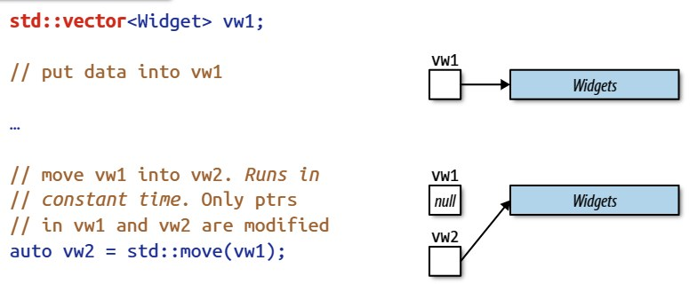
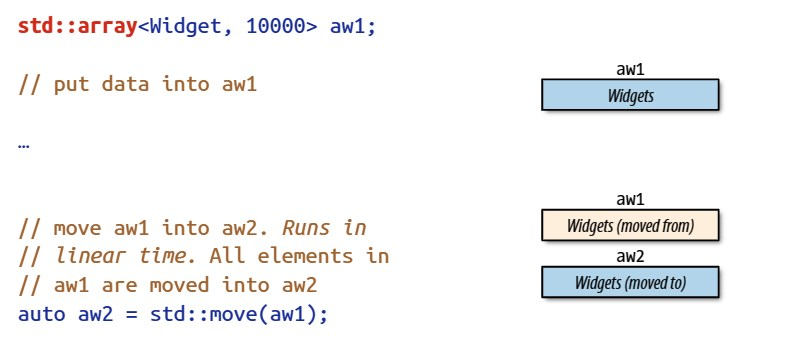

- [_Chapter 5_ 右值引用、移动语义和完美转发](#chapter-5-右值引用移动语义和完美转发)
  - [_Item 23_ 理解 _std::move_ 和 _std::forward_](#item-23-理解-stdmove-和-stdforward)
    - [需要记住的规则](#需要记住的规则)
  - [_Item 24_ 区分 _universal reference_ 和右值引用](#item-24-区分-universal-reference-和右值引用)
    - [需要记住的规则](#需要记住的规则-1)
  - [_Item 25_ _std::move_ 用于右值引用 _std::forward_ 用于 _univeral reference_](#item-25-stdmove-用于右值引用-stdforward-用于-univeral-reference)
    - [需要记住的规则](#需要记住的规则-2)
  - [_Item 26_ 避免重载 _univeral reference_](#item-26-避免重载-univeral-reference)
    - [需要记住的规则](#需要记住的规则-3)
  - [_Item 27_ 熟悉重载 _univeral reference_ 的替代方法](#item-27-熟悉重载-univeral-reference-的替代方法)
    - [放弃重载](#放弃重载)
    - [_pass by const T\&_](#pass-by-const-t)
    - [_pass by value_](#pass-by-value)
    - [使用 _tag dispatch_](#使用-tag-dispatch)
    - [限制持有 _univeral reference_ 的模板](#限制持有-univeral-reference-的模板)
    - [权衡](#权衡)
    - [需要记住的规则](#需要记住的规则-4)
  - [_Item 28_ 理解引用折叠](#item-28-理解引用折叠)
    - [需要记住的规则](#需要记住的规则-5)
  - [_Item 29_ 假设 _move operation_ 是不存在的、成本大的和不可使用的](#item-29-假设-move-operation-是不存在的成本大的和不可使用的)
    - [需要记住的规则](#需要记住的规则-6)
  - [_Item 30_ 熟悉完美转发失败的场景](#item-30-熟悉完美转发失败的场景)
    - [_braced initializer_](#braced-initializer)
    - [_0_ 或 _NULL_ 来做为空指针](#0-或-null-来做为空指针)
    - [只有声明的 _integral static const_ 的数据成员](#只有声明的-integral-static-const-的数据成员)
    - [重载的函数名和模板名](#重载的函数名和模板名)
    - [_bitfield_](#bitfield)
    - [结尾](#结尾)
    - [需要记住的规则：](#需要记住的规则-7)


# _Chapter 5_ 右值引用、移动语义和完美转发

当你第一次学习移动语义和完美转发时，它们看起来是非常简单的：  

* 移动语义使得编译器能够使用成本小的移动来代替成本大的拷贝。像 _copy operation_ 能让你控制拷贝对象的含义一样，_move operation_ 也提供了对移动语义的控制。移动语义也支持创建 _move-only_ 类型的对象了，比如：_std::unique_ptr_ 、_std::future_ 和 _std::thread_。
* 完美转发使得我们能够写这样的函数模板：它可以持有任意实参，并且可以将这些实参转发到其他目标函数中，使得目标函数所接收到的实参和所传递给转发函数的实参完全是相同的。

右值引用将移动语义和完美转发这两个完全不同的特性联系在了一起。它是实现移动语义和完美转发的底层语言机制。

你使用这些特性的经验越丰富，你越能意识到你最初的印象仅仅是冰山一角。移动语义、完美转发和右值引用的世界比它所展现的要更加微妙。例如：_std::move_ 不移动任何东西，而完美转发是不完美的。_move operation_ 并不是一定总是比 _copy operation_ 成本小。就算是，也没有你期待的那么低。在移动是有效的上下文中，_move operation_ 也不总是会被调用到。

不管你对这些特性研究的有多深，但是似乎总是不够深。幸运地是，深度是有限的。本章将会带你去了解根本。一旦你了解了根本，_C++11_ 的这部分内容就容易理解了。例如：你将会了解到 _std::move_ 和 _std::forward_ 的使用惯例。你将会对 _type&&_ 的模糊天性感到舒适。你将会理解为什么 _move operation_ 的行为特点的变化会如此丰富。所有的这些都会被理解。在那时，你将会回到起点，因为移动语义、完美转发和右值引用会再一次显得非常简单。但是这次，你不会再模糊了。

在本章中的 _Item_ 中，一定要记住形参一定是左值，就算形参的类型是右值引用，形参也是左值。也就是，给定：  
```C++
    void f(Widget&& w);
```  
形参 _w_ 是一个左值，即使 _w_ 的类型 _rvalue-reference-to-Widget_。如果这个让你感到很惊讶的话，那么请你回看下 [_Introduction.md_](./Introduction.md) 中关于左值和右值的描述。

## _Item 23_ 理解 _std::move_ 和 _std::forward_ 

从 _std::move_ 和 _std::forward_ 不会做哪些事情的角度来了解它们是有用的 _std::move_ 不移动任何东西。_std::forward_ 也不转发任何东西。在运行时，它们两个都不做任何事情。它们两个不生成执行代码。一个字节都不生成。

_std::move_ 和 _std::forward_ 只是执行转换的函数，它们实际上是函数模板。_std::move_ 会无条件地转换它的实参为右值，而 _std::forward_ 只有在满足特定条件时才会转换它的实参为右值。就是这样。这个解释带来了新的问题，但是基本上，这就是完整的故事了。

为了使故事更具体点，这儿有 _C++11_ 的 _std::move_ 的简单实现。这个简单实现不是完全符合标准细节的，但是也非常接近了。  
```C++
  template<typename T>                            // in namespace std
  typename remove_reference<T>::type&&
  move(T&& param)
  {
    using ReturnType =                            // alias declaration;
      typename remove_reference<T>::type&&;       // see Item 9
    
    return static_cast<ReturnType>(param);
  }
```  

我已经为你高亮了这个代码的两部分。第一部分是函数名，因为返回类型的规范非常复杂，所以我不想你在复杂中迷失方向。第二部分是转换，它包含了本函数的本质。正如你看到的，_std::move_ 持有指向一个对象的引用，是一个 _universal reference_，将会在 [_Item 24_](#item-24-区分-universal-reference-和右值引用) 中进行更详细的描述，然后 _std::move_ 会返回这个对象的引用。

这个函数的返回类型的 _&&_ 部分表明了 _std::move_ 返回的是一个右值引用，但是正如 [_Item 28_](#item-28-理解引用折叠) 所解释的，如果类型 _T_ 是左值引用的话，那么 _T&&_ 就会是左值引用了。为了避免发生这样的情况，所以 _type trait_ _std::remove_reference_ 被应用到了 _T_ 上，见 [_Item 9_](Chapter%203.md#item-9-首选-alias-declaration-而不是-typedef)，从而确保了 _&&_ 被应用到的类型不是引用类型。这也就确保了 _std::move_ 返回的是右值引用，这是非常重要的，因为函数所返回的右值引用肯定是右值。所以 _std::move_ 将它的实参转换为了右值，这正是它所做的全部。

顺便说下，_std::move_ 可以在 _C++14_ 中被轻松实现。由于函数返回类型推导，见 [_Item 3_](Chapter%201.md#item-3-理解-decltype) 和标准库的 _alias template_ _std::remove_reference_t_，见 [_Item 9_](Chapter%203.md#item-9-首选-alias-declaration-而不是-typedef)， _std::move_ 可以被写成这样：  
```C++
  template<typename T>                            // C++14; still in
  decltype(auto) move(T&& param)                  // namespace std
  {
    using ReturnType = remove_reference_t<T>&&;
    return static_cast<ReturnType>(param);
  }
```  
看起来好多了，不是吗？

因为 _std::move_ 除了会将实参转换为右值外，不会再做其他的事情，所以有一个建议：_std::move_ 的更好的名字可能是像 _rvalue_cast_ 这样的名字。尽管有此建议，但是最后定下来的名字还是 _std::move_，所以，重要的是去记住 _std::move_ 会做什么和不会做什么。_std::move_ 会做转换。_std::move_ 不会做移动。

当然，右值适合移动，所以，应用 _std::move_ 到一个对象上是在告诉编译器这个对象是可以被移动的。这也是取名为 _std::move_ 的原因：为了方便指定可以被移动的对象。

事实上，右值只在通常情况下适合移动。假定有一个表示注解的类。这个类所对应的构造函数持有包含有注解的 _std::string_ 类型的形参，这个类的构造函数会将这个形参拷贝到数据成员中。 根据 [_Item 41_](Chapter%208.md#item-41-对于移动是成本小的且总是会被拷贝的可拷贝的形参考虑-pass-by-value) 的解释，你声明了 _by-value_ 形参：
```C++
  class Annotation {
  public:
    explicit Annotation(std::string text);        // param to be copied,
    …                                             // so per Item 41,
  };                                              // pass by value
```    
但是 _Annotation_ 的构造函数只需要读取 _text_ 的值。不需要进行修改。为了符合只要有可能就应该去使用 _const_ 的优良传统，你修改了你的声明，使得 _text_ 为 _const_：
```C++
  class Annotation {
  public:
    explicit Annotation(const std::string text)
    …
  };
```  
将 _text_ 拷贝至数据成员是有成本的，为了避免这种拷贝的成本，你遵循 [_Item 41_](Chapter%208.md#item-41-对于移动是成本小的且总是会被拷贝的可拷贝的形参考虑-pass-by-value)
的建议，将 _std::move_ 应用到了 _text_ 上，从而产生了一个右值：  
```C++
  class Annotation {
  public:
    explicit Annotation(const std::string text)
    : value(std::move(text))                      // "move" text into value; this code
    { … }                                         // doesn't do what it seems to!
    
    …
  
  private:
    std::string value;
  };
```   
这个代码可以编译。这个代码可以链接。这个代码可以运行。这个代码也将数据成员 _value_ 的内容设置为了 _text_ 的内容。这个代码和你所设想的完美实现间的唯一的区别是：_text_ 不是被移动到 _value_ 中的，而是被拷贝到 _value_ 中的。是的，是通过 _std::move_ 将 _text_ 转换为了一个右值，但是 _text_ 是被声明为 _const std::string_ 的，所以 _text_ 在转换之前就是一个 _const std::string_ 类型的左值了，相应地，在转换后就是一个 _const std::string_ 类型的右值了，在这个过程中， _constness_ 一直保留。

考虑一下，当编译器必须要确定调用 _std::string_ 的哪个构造函数时，会面临什么情景。有两种可能性：  
```C++
  class string {                        // std::string is actually a
  public:                               // typedef for std::basic_string<char>
    …
    string(const string& rhs);          // copy ctor
    string(string&& rhs);               // move ctor
    …
  };
```  
在 _Annotation_ 的构造函数的成员初始值列表中，_std::move(text)_ 的结果是一个 _const std::string_ 的右值。这个右值不可以被传递到 _std::string_ 的移动构造函数中，因为 _std::string_ 的移动构造函数持有的是 _non-const std::string_ 的右值引用。然而，这个右值是可以被传递到 _std::string_ 的 _copy constructor_ 中的，因为允许 _lvalue-reference-to-const_ 去绑定一个 _const_ 右值。因此 _Annotation_ 的成员初始化执行的会是 _std::string_ 的 _copy constructor_，尽管 _text_ 已经被转换为了一个右值。这样的行为对于维护 _const-correctness_ 是必不可少的。将值移出对象之外通常会修改这个对象，所以，语言不允许将 _const_ 对象传递给那些像移动构造函数一样的可能会修改它们的函数。 

从这个例子中得出两个注意事项。首先，如果想要让一个对象是可以被移动的话，那么就不要将它声明为 _const_。在 _const_ 对象上的移动请求都会被悄悄地转换为拷贝。其次，实际上，_std::move_ 不仅不移动任何东西，甚至都不能保证它转换后的结果是可以被移动的。对于应用 _std::move_ 到一个对象上所产生的结果，你唯一可以确定的是这个结果肯定是一个右值。

_std::forward_ 和 _std::move_ 的故事是相似的，_std::move_ 会无条件地将它的实参转换为一个右值，而 _std::forward_ 只有在满足特定条件时才会将它的实参转换为一个右值。所以 _std::forward_ 是条件转换。为了了解 _std::forward_ 何时会执行转换何时不执行转换，回忆一下通常是如何使用 _std::forward_ 的。最常见的情景就是：持有一个 _universal reference_ 形参的函数模板，这个函数模板会将这个形参传递给另一个函数：  
```C++
  void process(const Widget& lvalArg);            // process lvalues
  void process(Widget&& rvalArg);                 // process rvalues

  template<typename T>                            // template that passes
  void logAndProcess(T&& param)                   // param to process
  {
    auto now = // get current time
      std::chrono::system_clock::now();
    
    makeLogEntry("Calling 'process'", now);
    process(std::forward<T>(param));
  }
```  
 考虑 _logAndProcess_ 的两个调用，一个是左值，一个是右值：
 ```C++
  Widget w;
  logAndProcess(w);                     // call with lvalue
  logAndProcess(std::move(w));          // call with rvalue
 ```  

在 _logAndProcess_ 中，形参 _param_ 会被传递给函数 _process_。函数 _process_ 对左值和右值进行了重载。当我们使用左值来调用 _logAndProcess_ 时，我们自然期待这个左值可以做为左值被转发给函数  _process_，当我们使用右值来调用 _logAndProcess_ 时，我们自然期待调用的是 _process_ 的右值重载版本。

但是，_param_ 像所有的函数形参一样是一个左值。因此，在 _logAndProcess_ 中调用 _process_ 将会调用的是 _process_ 的左值重载版本。为了避免发生这样的情况，我们需要一个这样的机制：只有当用来初始化 _param_ 的实参，也就是被传递到 _logAndProcess_ 的实参，是一个右值时，才将 _param_ 转换为右值。这正是 _std::forward_ 所做的。这也是为什么 _std::forward_ 是条件转换的原因：只有当 _std::forward_ 的实参是使用右值来初始化时，_std::forward_ 才会将的实参转换为右值。

你可能会好奇 _std::forward_ 是如何可以知道它的实参是被右值所初始化的呢？例如：如上面的代码中，_std::forward_ 是如何知道 _param_ 是被左值还是右值所初始化的呢？简短的回答是信息被编码到了 _logAndProcess_ 的模板形参 _T_ 中。然后，这个模板形参被传递给了 _std::forward_，_std::forward_ 会解码这个信息。在 [_Item 28_](#item-28-理解引用折叠) 中会详细地描述这个过程到底是如何进行的。

鉴于 _std::move_ 和 _std::forward_ 都是转换，而它们之间的唯一差别是：前者总是会转换，而后者仅仅是满足相应条件时才会转换，你可能会问：我们是否可以不使用 _std::move_ 而只使用 _std::forward_ 呢？只从纯技术角度来说，是可以的：_std::forward_ 可以完成全部工作。_std::move_ 不是必须的。当然，这两个都不是必须的，因为我们可以自己写转换，但是，我希望我们都同意那样做是恶心的。

_std::move_ 的吸引力在于使用方便、可以减少错误发生的可能性和拥有更高的清晰度。假定我们想要记录一个类的移动构造函数被调用了多少次。一个会在移动构造期间被增加的 _static counter_ 就是我们所需要的全部了。 假设这个类中只有一个非静态数据成员 _std::string_，下面是可以实现 _move constructor_ 的传统方法，即为：使用 _std::move_：
```C++
  class Widget {
  public:
    Widget(Widget&& rhs)
    : s(std::move(rhs.s))
    { ++moveCtorCalls; }
    
    …

  private:
    static std::size_t moveCtorCalls;
    std::string s;
  };
```  
为了使用 _std::forward_ 来实现相同的行为，代码是下面这样的：
```C++
  class Widget {
  public:
    Widget(Widget&& rhs)                          // unconventional,
    : s(std::forward<std::string>(rhs.s))         // undesirable
    { ++moveCtorCalls; }                          // implementation
    
    …
    
    };
```

注意，首先，_std::move_ 只需要函数实参 _rhs.s_，而 _std::forward_ 需要函数实参 _rhs.s_ 和模板类型实参 _std::string_ 。其次，所传递给 _std::forward_ 的类型应该是 _non-reference_，因为这是用来表明所传递的实参是一个右值的编码惯例，见 [_Item 28_](#item-28-理解引用折叠)。这两者结合起来就意味着： _std::move_ 会比 _std::forward_ 要少输入一些代码，并且 _std::move_ 省去了传递那个编码了所传递的实参是一个右值的类型实参的麻烦。_std::move_ 消除了可能会传递一个错误类型的可能性，比如：_std::string&_ 会导致数据成员 _s_ 是拷贝构造所得，而不是移动构造所得。

更重要的是，使用 _std::move_ 所要表达的是会无条件地转换为右值，而使用 _std::forward_ 所要表达的则是只会将那些绑定了右值的引用转换为右值。这是两个完全不同的动作。_std::move_ 通常只是设置了移动，而 _std::forward_ 则是以保留某个对象的原来的 _lvalueness_ 或者 _rvalueness_ 的方式来将这个对象转发到其他函数。因为这两个动作是不同的，所以使用两个不同的函数来进行区分是很好的。

### 需要记住的规则

* _std::move_ 无条件地执行右值转换。它不移动任何东西。
* _std::forward_ 只在它的实参是绑定了一个右值时，才会将它的实参转换为右值。
* _std::move_ 和 _std::forward_ 在运行时都不做任何事。


## _Item 24_ 区分 _universal reference_ 和右值引用

据说：真理使人自由，但是在适当的情况下，一个恰到好处的谎言也同样可以让你感到解脱。本 _Item_ 就是这样的谎言。因为我们面对的是软件，所以让我们避开 _谎言_ 这个词，而去说本 _Item_ 包含了一个 _抽象_。
        
为了声明类型 _T_ 的右值引用，你写了 _T&&_。因此这样的假设似乎也是合理的：如果你在代码中看到了 _T&&_ 的话，那么你正在看到的是右值引用。但是，没有那么简单：
```C++
  void f(Widget&& param);               // rvalue reference

  Widget&& var1 = Widget();             // rvalue reference

  auto&& var2 = var1;                   // not rvalue reference

  template<typename T>
  void f(std::vector<T>&& param);       // rvalue reference
  
  template<typename T>
  void f(T&& param);                    // not rvalue reference
```

事实上， _T&&_ 有两个不同的含义。当然，第一种含义是表示它是右值引用。这样的引用表现地完全如你所愿：只可以绑定右值。右值引用的作用就是识别那些可以移动的对象。

_T&&_ 的第二种含义是表示它可以是右值引用或左值引用。这样的引用看起来像是代码中的右值引用，即为：_T&&_ ，但是它又表现地好像是左值引用一样，即为：_T&_ 。这样的双重特性允许 _T&&_ 可以像右值引用那样绑定右值，也可以像左值引用那样绑定左值。此外，_T&&_ 可以绑定 _const_ 对象或 _non-const_ 对象，也可以绑定 _volatile_ 对象或 _non-volatile_ 对象，甚至可以绑定 _const_ _volatile_ 的对象。几乎可以绑定所有东西。这样空前灵活的引用值得有它们所拥有的的名字。我称他们为 _universal reference_。

 _universal reference_ 在出现在两种场景下。第一种最常见，是函数模板的形参，例如上面代码中的例子：  
```C++
  template<typename T>
  void f(T&& param);          // param is a universal reference
```  
第二种场景是是 _auto_ 声明，包括来自上面简单代码的例子：
```C++
  auto&& var2 = var1;         // var2 is a universal reference
```  
这两种场景的共同之处是都存在类型推导。在函数模板 _f_ 中， _param_ 的类型是被推导出的，而在 _var2_ 的声明中， _var2_ 的类型也是被推导出的。比较此处的例子和下面的例子，会发现下面的例子中是没有类型推导的。如果你在没有类型推导的情况下看到了 _T&&_ 的话，那么你看到的是右值引用：  
```C++
  void f(Widget&& param);               // no type deduction;
                                        // param is an rvalue reference
  
  Widget&& var1 = Widget();             // no type deduction;
                                        // var1 is an rvalue reference
```  
因为 _universal reference_ 是引用，所以它们必须要进行初始化。 _universal reference_ 所对应的 _initializer_ 决定了这个 _universal reference_ 表示的是右值引用还是左值引用。如果 _initializer_ 是个右值的话，那么 _universal reference_ 对应的是右值引用。如果 _initializer_ 是个左值的话，那么 _universal reference_ 对应的是左值引用。对于函数形参是 _universal reference_ 的情况，_initializer_ 是在调用处被提供的： 
```C++
  template<typename T>
  void f(T&& param);                    // param is a universal reference
  
  Widget w;
  f(w);                                 // lvalue passed to f; param's type is
                                        // Widget& (i.e., an lvalue reference)
  
  f(std::move(w));                      // rvalue passed to f; param's type is
                                        // Widget&& (i.e., an rvalue reference)
```

若想成为 _universal reference_，类型推导是必须的，但这还不够。引用声明的 _形式_ 也要必须正确，而且这种形式是非常严格的。必须严格是 _T&&_ 才可以。再看一次我们之前看的简单代码的例子：  
```C++
  template<typename T>
  void f(std::vector<T>&& param);       // param is an rvalue reference
```
当 _f_ 被执行时，类型 _T_ 将会被推导。除非调用方显式指明了它，我们不关心这种边缘场景。但是 _param_ 的类型声明的形式不是 _T&&_，而是 _std::vector&lt;T&gt;&&_。这就排除了 _param_ 是 _universal reference_ 的可能性。因此，_param_ 是一个右值引用。如果你尝试传递一个左值给到 _f_ 的话，编译器将会很乐意去为你确认一些事情：  
```C++
  std::vector<int> v;
  f(v);                       // error! can't bind lvalue to
                              // rvalue reference
```  
即使存在简单的 _const_ _qualifier_ 也足够取消引用成为 _universal reference_ 的资格：  
```C++
  template<typename T>
  void f(const T&& param);    // param is an rvalue reference
```  
如果你在模板中看到一个函数的形参的类型是 _T&&_ 的话，那么你可能会认为你可以假设 _T&&_ 是 _universal reference_ 了。你不可以。因为在模板中并不能保证存在有类型推导。考虑 _std::vector_ 的 _push_back_ 成员函数：  
```C++
  template<class T, class Allocator = allocator<T>>         // from C++
  class vector {                                            // Standards
  public:
    void push_back(T&& x);
    …
  };
```  
_push_back_ 的形参的类型肯定是 _universal reference_ 的正确形式，但是在这种场景下没有类型推导。这是因为 _push_back_ 是做为 _vector_ 的一部分的，如果特定的 _vector_ 实例化不存在，那么 _push_back_ 也不可能存在，这个实例化的类型完全决定了 _push_back_ 的声明。也就是说：  
```C++
  std::vector<Widget> v;
```  
导致了 _std::vector_ 模板将会被实例化为下面这样：  
```c++
  class vector<Widget, allocator<Widget>> {
  public:
    void push_back(Widget&& x);          // rvalue reference
    …
  };
```  

现在，你可以清晰地看到 _push_back_ 没有应用类型推导。 _vector&lt;T&gt;_ 的 _push_back_ 总是声明了 _rvalue-reference-to-T_ 类型的形参，共有两个函数，是函数重载。

相比之下，概念上类似地 _std::vector_ 的 _emplace_back_ 成员函数却应用了类型推导：  
```C++
  template<class T, class Allocator = allocator<T>>         // still from
  class vector {                                            // C++
  public:                                                   // Standards
    template <class... Args>
    void emplace_back(Args&&... args);
    …
  };
```  
此处，类型形参 _Args_ 和 _vector_ 的类型形参 _T_ 是无关的，每当 _emplace_back_ 被调用时，_Args_ 都是会被推导的。好吧，_Args_ 是类型形参包，而不是类型形参，但是此处只是为了讨论，我们可以认为它就是类型形参。

_emplace_back_ 的类型形参被命名为了 _Args_，但它却仍然是 _universal reference_，这个事实强化了我之前的论点：_universal reference_ 的形式必须是 _T&&_ 。但没有必要非得使用 _T_ 。例如：下面的函数持有 _universal reference_，因为形式 _type&&_ 是正确的，而且 _param_ 的类型是会被推导的，再次强调，排除那种调用方会显式指明类型的极端情况：  
```C++
  template<typename MyTemplateType>               // param is a
  void someFunc(MyTemplateType&& param);          // universal reference
```

我之前就提到过：_auto_ 声明的变量也可以是 _universal reference_。更精确的说，使用类型 _auto&&_ 所声明的变量是 _universal reference_，因为发生了类型推导，并且有正确的形式 _T&&_。_auto_ 所对应的 _universal reference_ 没有函数模板的形参所对应的 _universal reference_ 那么常见，但是在 _C++11_ 中偶尔还是存在的。但是在 _C++14_ 中就非常多了，因为 _lambda expression_ 可以声明 _auto&&_ 形参了。例如：如果你想写一个 _C++14_ 的 _lambda_ 去记录调用任意函数所花费的时间的话，那么你可以这样写：
```C++
  auto timeFuncInvocation =
  [](auto&& func, auto&&... params) // C++14
  {
    start timer;
    std::forward<decltype(func)>(func)(           // invoke func
    std::forward<decltype(params)>(params)...     // on params
    );
    stop timer and record elapsed time;
  };
```

如果你对于 _lambda_ 中的 _std::forward&lt;decltype(blah blah blah)&gt;_ 的反应是 _What the fuck?!_ 的话，
那么很可能是你还没有读 [_Item 33_](Chapter%206.md#item-33-在-auto-形参上使用-decltype-来进行完美转发)。别担心，本 _Item_ 的重点是 _lambda_ 所声明的 _auto&&_ 形参。_func_ 是可以绑定可调用对象、左值或右值的 _universal reference_。_args_ 是可以绑定任意数量的任意类型的对象的 _universal reference_ 形参包。由于 _auto_ 所对应的 _universal reference_ 的存在， _timeFuncInvocation_ 才可以计时几乎任何函数的执行时间。对于 _几乎任何_ 和 _任何_ 之间的差别，请看 [_Item 30_](#item-30-熟悉完美转发失败的场景)。

牢牢记住本 _Item_，也就是 _universal reference_ 的基础，是一个 _谎言_ ，不，是一个 _抽象_。底层真相被称为引用折叠，[_Item 28_](#item-28-理解引用折叠) 会专门来探讨这个主题。但是，真相不会降低这种抽象的实用性。区分右值引用和 _universal reference_ 可以帮助你更加精确地阅读代码，我看到的 _T&&_ 是只能绑定右值呢？还是可以绑定所有？它还可以避免在你和你同事沟通时产生歧义，我在这里使用的是 _universal reference_，而不是右值引用。它能帮助你理解 [_Item 25_](#item-25-stdmove-用于右值引用-stdforward-用于-univeral-reference) 和 [_Item 26_](#item-26-避免重载-univeral-reference)，它们依赖于这个区分。所以拥抱 _抽象_ 吧。享受 _抽象_ 吧。严格来说牛顿运动定律是不正确的，而爱因斯坦广义相对论则是正确的，但是前者和后者一样有用，并且更容易应用，同样地，掌握 _universal reference_ 的概念比掌握引用折叠的细节要更好。
        
### 需要记住的规则

* 如果函数模板的形参有类型 _T&&_ 且 _T_ 是会被推导的话，或者如果一个对象是使用 _auto&&_ 所声明的话，那么这个形参或者这个对象是 _universal reference_。
* 如果类型声明的形式并不是严格为 _type&&_ 的话，或者如果并没有发生类型推导的话，那么 _type&&_ 表示的是右值引用。
* 如果 _universal reference_ 是被右值所初始化的话，那么 _universal reference_ 对应的是右值引用。如果 _universal reference_ 是被左值所初始化的话，那么 _universal reference_ 对应的是左值引用。

## _Item 25_ _std::move_ 用于右值引用 _std::forward_ 用于 _univeral reference_

右值引用只绑定那些适合移动的对象。如果你有一个右值引用形参的话，那么你就是知道了这个形参所绑定的对象是可以被移动的。
```C++
  class Widget {
    Widget(Widget&& rhs);     // rhs definitely refers to an

    …                         // object eligible for moving
};
```  
既然如此，你可能希望将这样的对象传递给其他函数，以允许其他函数可以利用这些对象的右值性。完成这个的方法是将绑定这些对象的形参转换为右值。正如 [_Item 23_](#item-23-理解-stdmove-和-stdforward) 解释的，这不仅是 _std::move_ 的作用，也是它被创造出的原因：  
```C++
  class Widget {
  public:
    Widget(Widget&& rhs)                // rhs is rvalue reference
    : name(std::move(rhs.name)),
      p(std::move(rhs.p))
    { … }
    …

  private:
    std::string name;
    std::shared_ptr<SomeDataStructure> p;
  };
```
另一方面，见 [_Item 24_](#item-24-区分-universal-reference-和右值引用)，_universal reference_ 只是可能会绑定一个是适合移动的对象了。只有当 _universal reference_ 是被右值所初始化时，这个 _universal reference_ 对应的才是右值引用。[_Item 23_](#item-23-理解-stdmove-和-stdforward) 解释了这真是 _std::forward_ 所做的：  
```C++
  class Widget {
  public:
    template<typename T>
    void setName(T&& newName)                     // newName is
    { name = std::forward<T>(newName); }          // universal reference

    …
  }; 
```

简而言之，当转发右值引用给其他函数时，应该通过 _std::move_ 将右值引用无条件地转换为右值，因为右值引用总是绑定着右值，而当转发 _universal reference_ 给其他函数时，应该通过 _std::forward_ 将 _universal reference_ 有条件地转换为右值，因为 _universal reference_ 只是有时绑定着右值。

[_Item 23_](#item-23-理解-stdmove-和-stdforward) 解释了在右值引用上使用 _std::forward_ 可以表现出正确的行为，但是代码是冗长的、易错的和不符合语言习惯的，所以你应该避免在右值引用上使用 _std::forward_。在 _universal reference_ 上使用 _std::move_ 是更糟糕的，因为这可能会意外地修改了左值，比如：局部变量：
```C++
  class Widget {
  public:
    template<typename T>
    void setName(T&& newName)           // universal reference
    { name = std::move(newName); }      // compiles, but is
    …                                   // bad, bad, bad!

  private:
    std::string name;
    std::shared_ptr<SomeDataStructure> p;
  };

  std::string getWidgetName();          // factory function

  Widget w;

  auto n = getWidgetName();             // n is local variable
调用方
  w.setName(n);                         // moves n into w!

  …                                     // n's value now unknown
```  
此处，局部变量 _n_ 被传递给了 _w.setName_，调用方如果假设这对于 _n_ 来说应该只是只读操作也是可以被原谅的。但是，因为在 _setName_ 中使用了 _std::move_，这会将它的形参无条件地转换为一个右值，所以 _n_ 的值将会被移动到 _w.name_ 中，在 _setName_ 调用结束后，_n_ 的值将会是不确定的。这种行为让调用方感到绝望，甚至可能会去打人。

你可能会争辩说 _setName_ 不应该声明它的形参为 _universal reference_。这样的引用不能是 _const_ 的，见 [_Item 24_](#item-24-区分-universal-reference-和右值引用)，但是 _setName_ 确实不应该修改它的形参。你可能还会指出：如果 _setName_ 简单地能为 _const_ 左值和右值进行重载的话，那么这个问题就可以被避免了。就像这样：
```C++
  class Widget {
  public:
    void setName(const std::string& newName)      // set from
    { name = newName; }                           // const lvalue

    void setName(std::string&& newName)           // set from
    { name = std::move(newName); }                // rvalue
    
    …
  };
```
这样肯定可以工作，但是有缺点。首先，需要写和维护更多的代码，因为两个函数代替了一个模板。其次，这也是低效的。例如：考虑下面这种 _setName_ 的用法：
```C++
  w.setName("Adela Novak");
```
在 _setName_ 的 _universal reference_ 版本中，_string literal_ _Adela Novak_ 会被传递给 _setName_，然后在 _setName_ 中，_string literal_ _Adela Novak_ 会被传递给 _w_ 中的 _std::string_ 的 _move assignment operator_。因此，_w_ 的 _name_ 数据成员将直接根据这个 _string literal_ 来赋值；此期间没有 _std::string_ 类型的临时对象产生。然而在 _setName_ 的重载版本中，_std::string_ 类型的临时对象则会被创建出，用于绑定 _setName_ 的形参，然后这个临时对象会被移动到 _w_ 的数据成员中。调用 _setName_ 一次将会需要：执行一次 _std::string_ 的构造函数，它用于创建临时对象；执行一次 _std::string_ 的 _move assignment operator_，它用于将 _newName_ 移动到 _w.name_ 中；执行一次 _std::string_ 的析构函数，它用于销毁这个临时变量。相对于只会执行持有 _const char*_ 指针的 _std::string_ 的 _move assignment operator_ 的前者，后者几乎肯定是成本更大的执行序列。额外的成本因实现的不同而不同 ，这个额外的成本是否值得担忧因应用和库的不同而不同，但是事实就是：使用一对重载了左值引用和右值引用的函数来代替 _universal reference_ 可能会在一些场景下带来运行成本。如果我们泛化这个例子，使 _Widget_ 的数据成员的类型为任意类型，而不是已知的 _std::string_ 类型，那么性能差距可能会非常地大，因为不是所有的类型在移动时都像 _std::string_ 一样成本小，见 [_Item 29_](#item-29-假设-move-operation-是不存在的成本大的和不可使用的)。

然而，关于左值和右值重载，最严重的问题不在于代码的体积和语言习惯，也不是代码的运行性能。最严重的问题是这种设计的可扩展性很差。_Widget::setName_ 只持有一个形参，所以只要两个重载函数就可以，但是对于持有多个形参的函数来说，每一个形参都要有其所对应的左值和右值，重载函数的数量将会几何级数式地增长：_n_ 个形参需要 2<sup>n</sup> 个重载函数。这也不是最糟糕的，一些函数，实际是函数模板，可以持有无限个形参，每一个形参都要有其所对应的左值和右值。这样的函数的典型例子是 _std::make_shared_ 和 _C++14_ 的 _std::make_unique_，见 [_Item 21_](Chapter%204.md#item-21-首选-stdmake_unique-和-stdmake_shared-而不是直接使用-new)。看看它们最常用的重载的声明：  
```C++
template<class T, class... Args>                // from C++11
shared_ptr<T> make_shared(Args&&... args);      // Standard

template<class T, class... Args>                // from C++14
unique_ptr<T> make_unique(Args&&... args);      // Standard
```

对于像这些函数的函数来说，重载左值和右值是不可行的：只有 _universal reference_ 才是唯一可行的方法。我向你保证，在这些函数内部，当 _universal reference_ 类型的形参被传递给其他函数时，在这些形参上应用的是 _std::forward_ 的。这正是你应该做的。

好吧，通常应该这样做，最后也应该这样做，但是刚开始时并不是必须就要这样。在一些场景下，你想要在一个函数中多次使用绑定着右值引用或者 _universal reference_ 的对象，并且你需要确保这个对象直到你用完它后它才可以被移动。在这样的场景下，你只能在最后一次使用完这个引用后，对于右值引用再去应用 _std::move_ 或者对于 _universal reference_ 再去应用 _std::forward_。比如：  
```C++
  template<typename T>                  // text is
  void setSignText(T&& text)            // univ. reference
  {
    sign.setText(text);                 // use text, but
                                        // don't modify it
    auto now =                          // get current time
    std::chrono::system_clock::now();

    signHistory.add(now,
      std::forward<T>(text));           // conditionally cast
  }                                     // text to rvalue
```
此处，我们想要确保 _text_ 的值不会被 _sign.setText_ 所改变，因为还要在调用 _signHistory_ 时使用 _text_，因此只在最后使用 _universal reference_ 时才使用 _std::forward_。

对于 _std::move_ 来说，也是相同的想法，即为：只在最后使用右值引用时才使用 _std::move_，需要注意的是：在一些罕见场景中，你想要使用 _std::move_if_noexcept_ 来代替 _std::move_。为了弄清楚何时和为何应该这样，请查询 [_Item 14_](Chapter%203.md#item-14-当函数不会抛出异常时声明函数为-noexcept)。

如果一个 _return-by-value_ 的函数返回了一个右值引用或者 _universal reference_ 的话，那么你想要的是在返回这个引用的时去应用 _std::move_ 或 _std::forward_。为了弄清楚这是为什么，考虑一个 _operator+_ 函数，它将两个 _matrix_ 做加法，其中左侧的 _matrix_ 被认为是右值，它被用来储存两个 _matrix_ 的和：  
```C++
  Matrix                                          // by-value return
  operator+(Matrix&& lhs, const Matrix& rhs)
  {
    lhs += rhs;

    return std::move(lhs);                        // move lhs into
  }                                               // return value
```
通过在 _return_ 语句中通过 _std::move_ 将 _lhs_ 转换为一个右值，_lhs_ 将会被移动到函数的返回值的位置。如果省略了调用 _std::move_ 的话：  
```C++
  Matrix                                          // as above
  operator+(Matrix&& lhs, const Matrix& rhs)
  {
    lhs += rhs;
    return lhs;                                   // copy lhs into
  }                                               // return value 
```
_lhs_ 是一个左值的事实将会强迫编译器将它拷贝到函数的返回值的位置。假设 _Matrix_ 支持移动构造且它的移动构造比拷贝构造要高效，那么在 _return_ 语句中使用 _std::move_ 会产生高效率的代码。

如果 _Matrix_ 不支持移动的话，那么将 _lhs_ 转换为右值也不会有任何伤害，因为这个右值也只是会被 _Matrix_ 的 _copy constructor_ 所拷贝而已，见 [_Item 23_](#item-23-理解-stdmove-和-stdforward)。如果 _Matrix_ 后续被修改支持了移动的话，那么 _operator+_ 在下次编译之后就能自动获得益处了。既然如此，那么应用 _std::move_ 到 _return-by-value_ 的函数所返回的右值引用上是不会有任何损失的，反而可能还会有很多益处。

这种情况对于 _universal reference_ 和 _std::forward_ 都是类似的。现在考虑一个函数模板 _reduceAndCopy_，它持有一个可能是未约分的 _Fraction_ 对象，它会去约分这个 _Fraction_ 对象，并返回这个已约分的值的副本。如果实参是个右值的话，那么实参的值应该被移动到返回值中，这样可以避免执行拷贝所产生的成本，但是如果实参是个左值的话，那么实际的拷贝必须产生。因此：
```C++
  template<typename T> 
  Fraction                              // by-value return
  reduceAndCopy(T&& frac)               // universal reference param
  {
    frac.reduce();
    return std::forward<T>(frac);       // move rvalue into return
  }                                     // value, copy lvalue
```
如果省略了调用 _std::forward_ 的话，那么 _frac_ 将会被无条件地拷贝到 _reduceAndCopy_ 的返回值中。

一些开发者获取到了上面的信息，然后就尝试将这些信息到扩展到一些不适合的场景中。“如果在会被拷贝到返回值的右值引用形参上使用 _std::move_ 可以将拷贝构造转换为移动构造的话，那么我也可以在我返回的局部变量上执行这种优化”。换句话说，它们认为给定一个会返回局部变量的 _return-by-value_ 的函数，就像这样：
```C++
  Widget makeWidget()                   // _Copying_ version of makeWidget
  {
    Widget w;                           // local variable
    
    …                                   // configure w
    
    return w;                           // _copy_ w into return value
}
```
它们可以通过将 _拷贝_ 转换为移动来 _优化_ 它：
```C++
  Widget makeWidget()         // Moving version of makeWidget
  {
    Widget w;
    …
    return std::move(w);      // move w into return value
  }                           // (don't do this!)
```
我的特殊标记的使用应该会让你觉察到这种推理方式是有缺陷的。但是为什么是有缺陷的呢？

是有缺陷的，因为对于这种优化 _Standardization Committee_ 是远远领先于这些程序员的。_Standardization Committee_ 在很早之前就意识到了： _makeWidget_ 的 _拷贝版本_ 可以通过在为函数的返回值所分配的内存中构建这个局部变量 _w_ 来避免拷贝这个局部变量 _w_。这被称为 _RVO_ _return value optimization_，自从 _C++_ 标准存在后，_RVO_ 就得到了明确支持。

写这样的支持要非常的严谨，因为你想要的是只有当不影响软件的可观测行为时才去允许拷贝省略。转述标准中的那种法律表达简直就是有毒，这种特定的支持说的是：当满足下面条件时，编译器可以省略是 _return-by-value_ 的函数中的局部对象的拷贝或移动：（1）局部对象的类型和函数返回值的类型是相同的，（2）函数返回了这个局部对象。现在，再看下 _makeWidget_ 的拷贝版本：
```C++
  Widget makeWidget()         // _Copying_ version of makeWidget
  {
  
    Widget w;
    …
    return w;                 // _copy_ w into return value
}
```
这个代码满足所有的条件，当我告诉你，对于这个代码来说，每个合格的 _C++_ 编译器都会应用 _RVO_ 去避免拷贝 _w_ 时，你要相信我。这意味着：_makeWidget_ 的 _拷贝版本_ 实际上不会拷贝任何东西。

假设 _Widget_ 提供了 _move constructor_，_makeWidget_ 的移动版本就会这样做：将 _w_ 的内容移动到 _makeWidget_ 的返回值空间。但是为什么编译器不使用 _RVO_ 去消除移动呢？为什么要再一次地在为函数的返回值所分配的内存中构建 _w_ 呢？答案非常简单：不可以。条件规定了：只有当函数返回的是局部对象时，_RVO_ 才可以被执行，但是 _makeWidget_ 的移动版本并不是这样的。再看一次 _return_ 语句：  
```C++
return std::move(w);
```  
这里所返回的并不是局部对象 _w_，而是 _w_ 的引用，也就是 _std::move_ 的结果。因为返回局部对象的引用没有满足 _RVO_ 所需要的条件，所以编译器必须将 _w_ 移动到函数返回值空间中。开发者尝试通过在所返回的局部变量上应用 _std::move_ 来帮助编译器进行优化，但这却反而限制了编译器可用的优化选项。

但是 _RVO_ 是一种优化。编译器不需要去省略拷贝和移动，即使允许这样做。可能你是偏执的，你担心你的编译器会使用拷贝来惩罚你，因为这是可能的。或者你可能有足够洞察力，已经识别到了存在有编译器很难实现 _RVO_ 的情况，比如，当函数的不同的路径返回不同的局部变量时。编译器必须要生成代码在为函数的返回值所分配的内存中构建合适的局部变量，但是编译器如何确定哪个局部变量是合适的呢？如果是这样的话，你可能愿意付出移动的成本来做为对拷贝成本的保险。也就是说，你可能仍然认为应用 _std::move_ 到你正在返回的局部对象是合理的，仅仅因为你知道你永远都不想付出拷贝的成本。

在这种情况下，应用 _std::move_ 到一个局部变量上仍然是一个坏主意。支持 _RVO_ 的标准继续说了：如果满足了 _RVO_ 的条件，但是编译器没有选择去执行拷贝省略的话，那么所返回的对象必须被做为右值。实际上，标准要求：当 _RVO_ 被允许时，要么发生拷贝省略，要么隐式应用 _std::move_ 到所返回的局部对象上。所以在 _makeWidget_ 的拷贝版本中，  
```C++
  Widget makeWidget() // as before
  {
    Widget w;
    …
    return w;
  }
```
编译器必须省略 _w_ 的拷贝或必须将函数做为下面这样：
```C++
  Widget makeWidget()
  {
    Widget w;
    …
    return std::move(w);      // treat w as rvalue, because
  }                           // no copy elision was performed
```

函数的 _by-value_ 的形参也是这种情况。当这样的形参做为函数返回值时，是符合拷贝省略的，但是编译器必须把这样的形参做为右值处理。因此，如果你的代码看起来像是这样，  
```C++
  Widget makeWidget(Widget w)           // by-value parameter of same
  {                                     // type as function's return
    …
    return w;
  }
```
编译器必须将这个代码做为下面这样：
```C++
  Widget makeWidget(Widget w)
  {
    …
    return std::move(w);                // treat w as rvalue
  }
```

这意味着：如果你在 _return-by-value_ 的函数所返回的局部对象上使用 _std::move_ 的话，那么这样并不能帮助你的编译器，因为如果编译器不能执行拷贝省略的话，那么编译器必然会把局部对象做为右值，这样反而肯定可以帮倒忙，因为可以排除 _RVO_ 的执行。应用 _std::move_ 到局部变量也有合理的场景，比如：当你传递这个局部变量到一个函数中，并且你知道你将不会再使用使用这个局部变量了，但做为 _return_ 语句的一部分，要么符合 _RVO_，要么返回 _by-value_ 的形参，都不属于上属于场景。

### 需要记住的规则

* 在右值引用上应用 _std::move_，在 _universal reference_ 上应用 _std::forward_，但都必须是在最后一次使用这些引用后。
* 对于 _return-by-value_ 的函数所返回的右值引用和 _universal reference_ 也是按照上述情况处理。
* 如果局部对象符合返回值优化的条件的话，永远不要应用 _std::move_ 或 _std::forward_ 到局部对象上。

## _Item 26_ 避免重载 _univeral reference_

假定你要写一个函数，这个函数持有一个形参 _name_，然后会记录当前的日期和时间并将 _name_ 添加到全局数据结构中。你提出一个像下面这样的函数：  
```C++
  std::multiset<std::string> names;               // global data structure
  
  void logAndAdd(const std::string& name)
  {
    auto now =                                    // get current time
      std::chrono::system_clock::now();
    
    log(now, "logAndAdd");                        // make log entry
    
    names.emplace(name);                          // add name to global data
  }                                               // structure; see Item 42
                                                  // for info on emplace
```

这是合理的代码，但是没有达到应有的高效。考虑三个潜在的调用：  
```C++
  std::string petName("Darla");
  
  logAndAdd(petName);                   // pass lvalue std::string
  
  logAndAdd(std::string("Persephone")); // pass rvalue std::string
  
  logAndAdd("Patty Dog");               // pass string literal

```
在第一个调用中，_logAndAdd_ 的形参 _name_ 绑定着的是变量 _petName_。在 _logAndAdd_ 中，_name_ 最终被传递到了 _names.emplace_ 中。因为 _name_ 是一个左值，所以 _name_ 是被拷贝到 _names_ 中的。没有方法可以避免拷贝，因为是左值 _petName_ 被传递给了 _logAndAdd_。

在第二个调用中，_logAndAdd_ 的形参 _name_ 绑定着的是一个右值，这个右值是根据 _"Persephone"_ 所显式创建的 _std::string_ 类型的临时对象。因为 _name_ 本身是一个左值，所以 _name_ 是被拷贝到 _names_ 中的，但是我们知道原则上 _name_ 的值是可以被移动到 _names_ 中的。在这个调用中，我们付出了拷贝的成本，但是我们应该能够只通过一次移动来完成。

在第三个调用中，_logAndAdd_ 的形参 _name_ 绑定着的是一个右值，这个右值是根据 _"Patty Dog"_ 所隐式创建的 _std::string_ 类型的临时对象。在第二个调用中，_name_ 是被拷贝到 _names_ 中的，但在本场景下，最初传递给 _logAndAdd_ 的实参是个 _string literal_。如果这个 _string literal_ 是直接传递给 _emplace_ 的话，那么就不需要创建 _std::string_ 类型的临时对象了。相反，_emplace_ 会使用这个 _string literal_ 直接在 _std::multiset_ 中来创建 _std::string_ 类型的对象。在第三个调用中，我们付出的是拷贝一个 _std::string_ 的成本，实际上，甚至没有理由付出移动成本，更不用说拷贝了。

我们可以通过重写 _logAndAdd_ 来持有 _universal reference_，见 [_Item 24_](#item-24-区分-universal-reference-和右值引用)，并依据 [_Item 25_](#item-25-stdmove-用于右值引用-stdforward-用于-univeral-reference) 来将这个 _universal reference_ 完美转发到 _emplace_ 中以去消除第二个调用和第三个调用中的低效。结果不言自明：  
```C++
  template<typename T>
  void logAndAdd(T&& name)
  {
    auto now = std::chrono::system_clock::now();
    log(now, "logAndAdd");
    names.emplace(std::forward<T>(name));
  }
  std::string petName("Darla");                   // as before
  
  logAndAdd(petName);                             // as before, copy
                                                  // lvalue into multiset
  
  logAndAdd(std::string("Persephone"));           // move rvalue instead
                                                  // of copying it
  
  logAndAdd("Patty Dog");                         // create std::string
                                                  // in multiset instead
                                                  // of copying a temporary
                                                  // std::string
```

完美的优化！

如果这就是故事的结局的话，那么我们现在可以停下来骄傲地退休了，但是我还没有告诉过你客户并不是总能直接访问 _logAndAdd_ 所需要的 _name_。有些客户只有一个索引，_logAndAdd_ 可以使用这个索引到表中去查找相应的 _name_。为了支持这些客户，重载了 _logAndAdd_：
```C++
  std::string nameFromIdx(int idx);               // return name
                                                  // corresponding to idx

  void logAndAdd(int idx)                         // new overload
  {
      auto now = std::chrono::system_clock::now();
      log(now, _logAndAdd_);
      names.emplace(nameFromIdx(idx));
  }
```
对于这两个函数的重载决议可以像所期待地那样去工作：
```C++
  std::string petName(_Darla_);                   // as before

  logAndAdd(petName);                             // as before, these
  logAndAdd(std::string("Persephone"));           // calls all invoke
  logAndAdd("Patty Dog");                         // the T&& overload

  logAndAdd(22);                                  // calls int overload
```

实际上，只有当你没有太多期待的时候，重载决议才可以像所期待地那样去工作。假设有一个客户使用 _short_ 来持有索引，然后会传递这个 _short_ 到 _logAndAdd_ 中：  
```C++
  short nameIdx;
  …                                               // give nameIdx a value

  logAndAdd(nameIdx);                             // error!
```  
因为最后一行的注释不是很明显，所以让我来解释此处发生了什么。

存在两个 _logAndAdd_ 重载函数。持有 _universal reference_ 的重载函数可以推导 _T_ 为 _short_，因此产生一个精确匹配。持有 _int_ 形参的重载函数只能在 _promotion_ 后才能匹配 _short_ 实参。根据一般的重载决议规则，精确匹配优于 _promotion_ 匹配，所以 _universal reference_ 的重载函数会被调用。

在 _universal reference_ 的重载函数中，形参 _name_ 绑定的是所传入的 _short_。_name_ 会被完美转发到 _names_ 的成员函数 _emplace_ 中，_names_ 是一个 _std::multiset&lt;std::string&gt;_，然后这个 _emplace_ 负责轮流将 _name_ 转发到 _std::string_ 的构造函数中。因为 _std::string_ 没有持有 _short_ 的构造函数，所以在 _logAndAdd_ 中的 _multiset::emplace_ 中的 _std::string_ 的构造函数会失败。这都是因为对于 _short_ 实参来说，_universal reference_ 比 _int_ 是更精确的匹配。

持有 _universal reference_ 的函数是 _C++_ 中最贪婪的函数。在这个函数实例化时，几乎可以为所有类型的实参创建精确匹配，只有几种类型不可以，会在 [_Item 30_](#item-30-熟悉完美转发失败的场景) 中描述。这也是为什么将重载和 _universal reference_ 做组合几乎总是一个糟糕的想法：_universal reference_ 的重载函数可以接受很多的实参类型，远远比写重载函数的开发者期待地要多。

填上这个坑的简单方法是去写一个完美转发构造函数。对 _logAndAdd_ 例子做个小改动来演示这个问题。先不去写一个持有 _std::string_ 的或者持有用来查找 _std::string_ 的索引的 _free_ 函数，而是去写一个类 _Person_，它的构造函数有着相同功能：  
```C++
  class Person {
  public:
    template<typename T> 
    explicit Person(T&& n)                        // perfect forwarding ctor;
    : name(std::forward<T>(n)) {}                 // initializes data member

    explicit Person(int idx)                      // int ctor
    : name(nameFromIdx(idx)) {}
    …
    
    private:
    std::string name;
  };
```
就像 _logAndAdd_ 的场景，传递 _int_ 之外的 _integral_ 类型，比如：_std::size_t_、_short_ 和 _long_ 等，将会调用的是 _universal reference_ 的重载函数而不是 _int_ 的重载函数，这会导致编译失败。然而，这里的问题更糟糕，因为在 _Person_ 中存在着的重载函数比我们看到的要多。[_Item 17_](Chapter%203.md#item-17-理解特殊成员函数的生成) 解释了：在合适的条件下， _C++_ 将会生成 _copy constructor_ 和 _move constructor_，即使当类中包含了一个泛化构造函数且这个泛化构造函数可以被实例化成 _copy constructor_ 和 _move constructor_ 的 _signature_ 时，也是这样。因此，如果 _Person_ 的 _copy constructor_ 和 _move constructor_ 是被生成的话，那么 _Person_ 实际上看起来像是这样：  
```C++
  class Person {
  public:
    template<typename T>                // perfect forwarding ctor
    explicit Person(T&& n)
    : name(std::forward<T>(n)) {}
    
    explicit Person(int idx);           // int ctor
    
    Person(const Person& rhs);          // copy ctor
                                        // (compiler-generated)
    
    Person(Person&& rhs);               // move ctor
    …                                   // (compiler-generated)
  };
```  
只有当你花费大量的时间在编译器和编译器开发者上时，才能产生这种直觉，这时你已经忘记了什么是人类的思维：
```C++
  Person p("Nancy");
  
  auto cloneOfP(p);                     // create new Person from p;
                                        // this won't compile!
```  
此处，我们尝试根据另一个 _Person_ 来创建一个 _Person_，这似乎是可以得到的最明显的拷贝构造的场景，_p_ 是左值，所以我们可以排除所有拷贝是通过移动而完成的想法。但是这个代码没有调用 _copy constructor_。这个代码调用的是完美转发构造函数。这个完美转发构造函数会使用 _Person_ 对象 _p_ 来初始化 _Person_ 的 _std::string_ 数据成员。_std::string_ 没有持有 _Person_ 的构造函数，你的编译器会愤怒地举手投降，大概率你的编译器会使用冗长和难以理解的错误信息来惩罚你，以表达它们的愤怒。

你可能会好奇：为什么完美转发构造函数会被调用而不是 _copy constructor_ 呢？ 我们是使用另一个 _Person_ 来初始化一个 _person_ 的。的确应该这样，但是编译器发誓要遵守 _C++_ 的规则，而这个规则是用来管理重载函数的重载决议的。

编译器如下推理。_cloneOfP_ 被 _non-const_ 左值类型的 _p_ 所初始化，这意味着泛化构造函数可以被实例化成持有 _Person&_ 的构造函数。在这样的实例化后， _Person_ 看起来像是这样：  
```C++
  class Person {
  public:
    explicit Person(Person& n)          // instantiated from
    : name(std::forward<Person&>(n)) {} // perfect-forwarding
                                        // template

    explicit Person(int idx);           // as before

    Person(const Person& rhs);          // copy ctor
    …                                   // (compiler-generated)
};
```  
在这个语句中：
```C++
auto cloneOfP(p);
```  
_p_ 可以被传递给 _copy constructor_ 或者所实例化出的构造函数。调用 _copy constructor_ 是需要增加 _const_ 到 _p_ 上的，以去匹配 _copy constructor_ 的形参的类型，但是调用所实例化出的构造函数是不需要这些额外操作的。因此所实例化出的构造函数是更好的匹配，所以编译器这样做是符合设计的：调用更匹配的函数。所以此时调用的是完美转发构造函数，而不是 _copy constructor_。

如果我们稍微改动下例子，将被拷贝的对象的类型修改为 _const_ 的话，那么我们会听到完全不同的音调：
```C++
const Person cp("Nancy");               // object is now const

auto cloneOfP(cp);                      // calls copy constructor!
```
因为现在被拷贝的对象的类型是 _const_ 了，所以 _copy constructor_ 现在是更精确的匹配了。所实例化出的构造函数有着相同的签名，  
```C++
  class Person {
  public:
  explicit Person(const Person& n);     // instantiated from
                                        // template

  Person(const Person& rhs);            // copy ctor
        // (compiler-generated)
  …
};   
```
但是没有用，因为 _C++_ 的重载决议规则的其中一个是：当模板所实例化出的函数和非模板所实例化出的函数，即为：**_普通_** 函数，对于函数调用来说都是同样好的匹配时，首选普通函数。因为 _copy constructor_ 是普通函数，所以它胜过和它有着相同的 _signature_ 的所实例化出的函数。

如果你好奇为什么编译器可以实例化出一个和 _copy constructor_ 有着相同的 _signature_ 的构造函数却仍然要生成 _copy constructor_ 的话，那么请复习 [_Item 17_](Chapter%203.md#item-17-理解特殊成员函数的生成)。

当继承介入时，完美转发构造函数和编译器所生成的 _copy constructor_ 和 _move constructor_ 之间的交互会变得更复杂。特别是 _derived class_ 的 _copy constructor_ 和 _move constructor_ 的常规的实现会表现得非常令人惊讶。看下面：  
```C++
  class SpecialPerson: public Person {
  public:
    SpecialPerson(const SpecialPerson& rhs)       // copy ctor; calls
    : Person(rhs)                                 // base class
    { … }                                         // forwarding ctor!

    SpecialPerson(SpecialPerson&& rhs)            // move ctor; calls
    : Person(std::move(rhs))                      // base class
    { … }                                         // forwarding ctor!
  };
```  
就像注释说明的，_derived class_ 的 _copy constructor_ 和 _move constructor_ 调用的不是 _base class_ 的 _copy constructor_ 和 _move constructor_，调用的是 _base class_ 的完美转发构造函数。为了弄清楚为什么会这样，请注意：_derived class_ 的函数正在使用 _SpecialPerson_ 类型的实参来传递给它们的 _base class_，然后在类 _Person_ 的构造函数中完成模板实例化和重载决议。最终，这个代码不可以通过编译，因为 _std::string_ 没有持有 _SpecialPerson_ 的构造函数。

我希望我现在已经说服你了，你应该尽量避免重载 _universal reference_ 形参。但是如果重载 _universal reference_ 是一个糟糕的想法的话，那么当大部分类型的实参需要转发，而小部分类型的实参需要按照特殊方式去处理时，应该怎么做呢？这个鸡蛋可以使用很多方法来剥开。事实上，方法非常多，我会使用一整个 _Item_ 来做介绍。那就是 [_Item 27_](#item-27-熟悉重载-univeral-reference-的替代方法)，继续阅读就会遇到答案。

### 需要记住的规则

* 重载 _universal reference_ 几乎总是会导致 _universal reference_ 的重载函数在不期望被调用的情况下却被调用到。
* 完美转发构造函数尤其有问题，因为对于 _non-const_ 左值来说，完美转发构造函数通常比 _copy constructor_ 是更好的匹配，而且完美转发构造函数还会劫持 _derived class_ 对 _base class_ 的 _copy constructor_ 和 _move constructor_ 的调用。

## _Item 27_ 熟悉重载 _univeral reference_ 的替代方法

[_Item 26_](#item-26-避免重载-univeral-reference) 解释了：重载 _univeral reference_ 可能会导致各种各样的问题，独立函数和成员函数都是这样的，尤其是构造函数。然而它也给出了一些重载 _univeral reference_ 可能是有用的例子。如果重载 _univeral reference_ 的行为能像我们所期望的那样就好了！本 _Item_ 就来探讨可以实现我们所期望的行为的方法，通过设计来避免重载 _univeral reference_ 或者通过限制 _univeral reference_ 可以匹配的类型来完成。

接下来的讨论都是基于 [_Item 26_](#item-26-避免重载-univeral-reference) 所引入的例子的。如果你最近还没有读 [_Item 26_](#item-26-避免重载-univeral-reference) 的话，在继续之前先去复习下。

### 放弃重载

[_Item 26_](#item-26-避免重载-univeral-reference) 中的第一个例子 _logAndAdd_ 代表了很多这样的函数：可以通过将那些重载函数分别命名为不同的名字来避免重载 _univeral reference_ 的缺点。例如，两个 _logAndAdd_ 重载函数就可以分别重命名为 _logAndAddName_ 和 _logAndAddNameIdx_。但是，这种方法不适用于我们考虑的第二个例子：_Person_ 的构造函数，这是因为构造函数的名字是被语言所固定的。此外，谁想要放弃重载呢？

### _pass by const T&_

这个替代方法是回到 _C++98_ 中，然后使用 _pass by const T&_ 来代替 _pass by univeral reference_。实际上，这是 [_Item 26_](#item-26-避免重载-univeral-reference) 考虑的第一种方法。这种设计的缺点是没有像我们所希望的那样高效。在了解了 _univeral reference_ 和重载之间的交互后，放弃一些效率而让事情变得简单可能是一个比最初看起来要有吸引力的权衡。

### _pass by value_

这种方法允许你在没有增加复杂度的情况下提升性能，这种方法反常地使用 _pass-by-value_ 来代替 _pass-by-reference_。这种设计遵循 [_Item 41_](Chapter%208.md#item-41-对于移动是成本小的且总是会被拷贝的可拷贝的形参考虑-pass-by-value) 的建议，当你知道你要拷贝对象时，考虑去按 _by-value_ 的形式去传递它们，我将这样做的原理和如何提升的效率的相关细节推迟到 [_Item 41_](Chapter%208.md#item-41-对于移动是成本小的且总是会被拷贝的可拷贝的形参考虑-pass-by-value) 中讨论。我在此处只展示下如何在 _Person_ 例子中使用这种技术：  
```C++
  class Person {
  public:
    explicit Person(std::string n)      // replaces T&& ctor; see
    : name(std::move(n)) {}             // Item 41 for use of std::move

    explicit Person(int idx)            // as before
    : name(nameFromIdx(idx)) {}
    …

  private:
    std::string name;
};
```

因为 _std::string_ 没有只持有一个 _integer_ 的构造函数，所以对于 _person_ 的构造函数来说，所有 _int_ 和 _int-like_ 类型，比如：_std::size_t_、_short_ 和 _long_，都会被引导至 _int_ 重载函数中。类似地，那些可以被用来创建 _std::string_ 的对象，比如：像 _"Ruth"_ 这样的 _literal_，都会被引导至持有 _std::string_ 的构造函数中。这对于调用者来说没有什么惊讶之处。我想你可能会争辩说：当使用 _0_ 和 _NULL_ 去表示空指针时，这会调用到 _int_ 构造函数，这会让一些人感到惊讶，这些人应该去学习 [_Item 8_](Chapter%203.md#item-8-首选-nullptr-而不是-0-和-null)，并且让他们重复多读几遍，直到使用 _0_ 或者 _NULL_ 做为空指针的想法让他们退缩。

### 使用 _tag dispatch_

_pass by const T&_ 和 _pass by value_ 都没有提供对完美转发的支持。如果使用 _univeral reference_ 的动机是完美转发的话，那么我们必须要使用 _univeral reference_，没有其他选择。同时我们还不想放弃重载。所以如果我们既不想放弃重载，也不想放弃 _univeral reference_ 的话，那么我们如何可以避免重载 _univeral reference_ 呢？

实际上并不难。通过观察所有重载函数的所有形参和所有调用处的所有实参，然后选择一个整体上最匹配的函数，也就是考虑所有形参实参的组合，来完成重载函数的调用。无论什么类型的实参被传入，_univeral reference_ 形参通常都是最精确的匹配，但是如果 _univeral reference_ 只是形参列表的一部分，并且这个形参列表包含有不是 _univeral reference_ 的形参的话，那么在 _non-univeral reference_ 形参上产生足够差的匹配就可以使 _univeral reference_ 重载函数失去竞争的机会。这是 _tag dispatch_ 方法的基础，下面这个例子会让前面的描述更容易理解。

我们应用 _tag dispatch_ 到 _logAndAdd_ 例子上。下面是例子的代码，免得你查询的时候走神。  
```C++
  std::multiset<std::string> names;     // global data structure

  template<typename T>                  // make log entry and add

  void logAndAdd(T&& name)              // name to data structure
  {
    auto now = std::chrono::system_clock::now();
    log(now, "logAndAdd");
    names.emplace(std::forward<T>(name));
  }
```  
这个函数本身没有问题，但是当我们引入持有一个 _int_ 的重载函数时，这个重载函数会通过索引来查询一些对象，我们就回到了 [_Item 26_](#item-26-避免重载-univeral-reference) 的麻烦之地。本 _Item_ 的目标就是来解决这个问题的。不会增加重载函数，而是会重新实现 _logAndAdd_，将其委托给其他两个函数，一个用于 _integral_ 值，另一个用于其他的所有。_logAndAdd_ 它自己将接收所有类型的实参，包括 _integral_ 和 _non-integral_。

完成真正工作的这两个函数被命名为 _logAndAddImpl_，即为：我们将会使用重载。其中的一个函数会持有 _univeral reference_。我们会同时有重载和 _univeral reference_。但是每个重载函数都将会持有第二个形参，它被用来表明所传入的实参是否是 _integral_ 的。这个第二个形参可以避免我们陷入 [_Item 26_](#item-26-避免重载-univeral-reference) 所描述的泥沼，因为我们会使用这个第二个形参来确定哪个重载函数会被选择。

是的，我知道，“烦死了，别说了，给我展示代码吧。”没问题。下面是几乎正确的更新后的 _logAndAdd_ 版本。  
```C++
template<typename T>
void logAndAdd(T&& name)
{
    logAndAddImpl(std::forward<T>(name),
                    std::is_integral<T>());       // not quite correct
} 
```  
这个函数转发它的形参到 _logAndAddImpl_ 中，而且还传递一个实参来表明形参的类型 _T_ 是否是 _integral_。至少，这是应该做的。对于是右值的 _integral_ 实参来说，这个函数做到了它该做的。但是正如 [_Item 28_](#item-28-理解引用折叠) 所解释的：如果一个左值实参被传递给了 _univeral reference_ 的 _name_ 的话，那么 _T_ 将会被类型推导为左值引用。这不是一个 _integral_ 类型，因为引用不是 _integral_ 类型。这意味着 _std::is_integral&lt;T&gt;_ 对于左值实参都将会失败，即使这个实参真的代表了一个 _integral_ 值。

意识有这个问题等同于解决了这个问题，因为 _C++_ 标准库有 _type trait_，见 [_Item 9_](Chapter%203.md#item-9-首选-alias-declaration-而不是-typedef)， _std::remove_reference_，它做了它名字所表明的和我们所需要的事情：移除类型中的 _reference qualifier_。因此实现 _logAndAdd_ 的合适方法是：  
```C++
  template<typename T>
  void logAndAdd(T&& name)
  {
      logAndAddImpl(
      std::forward<T>(name),
      std::is_integral<typename std::remove_reference<T>::type>()
      );
  }
```  
这很管用。在 _C++14_ 中，可以通过使用 _std::remove_reference_t&lt;T&gt;_ 代替 _typename std::remove_reference&lt;T&gt;::type_ 来让你少敲几下键盘。细节见 [_Item 9_](Chapter%203.md#item-9-首选-alias-declaration-而不是-typedef)。

这个问题解决了，我们现在可以关注所调用的函数 _logAndAddImpl_ 了。共有两个重载，第一个只对 _non-integral_ 类型适用，即为：_std::is_integral&lt;typename std::remove_reference&lt;T&gt;::type&gt;_ 是错误的类型。  
```C++
  template<typename T>                                      // non-integral
  void logAndAddImpl(T&& name, std::false_type)             // argument:
  {                                                         // add it to
    auto now = std::chrono::system_clock::now();            // global data
    log(now, "logAndAdd");                                  // structure
    names.emplace(std::forward<T>(name));
  } 
```  
一旦你明白了上面的形参背后的机制，这就是简单直观的代码了。概念上，_logAndAdd_ 传递了一个 _boolean_ 到了 _logAndAddImpl_ 中用来指明所传递给 _logAndAdd_ 的实参的类型是否是 _integral_ 类型，但是 _true_ 和 _false_ 是运行期间的值，而我们需要的是使用重载决议，一种编译期间的现象，去选择正确的 _logAndAddImpl_ 重载函数。这就意味着我们需要一个对应于 _true_ 的类型和一个对应于 _false_ 的类型。这个需求非常合理，所以标准库提供了 _std::true_type_ 和 _std::false_type_ 来满足需求。如果 _T_ 是 _integral_ 的话，那么 _logAndAdd_ 所传递给 _logAndAddImpl_ 的实参就是一个继承自 _std::true_type_ 类型的对象；如果 _T_ 不是 _integral_ 的话，那么 _logAndAdd_ 传递给 _logAndAddImpl_ 的实参就是一个继承自 _std::false_type_ 类型的对象了。所以只有当 _T_ 不是 _integral_ 类型时，_logAndAddImpl_ 重载函数才是可以在 _logAndAdd_ 中被调用的。

第二种重载函数覆盖了相反的场景：当 _T_ 是一个 _integral_ 类型时。在这种场景下，_logAndAddImpl_ 只需要找到传入的索引所对应的 _name_，并且回传这个 _name_ 到 _logAndAdd_ 中：  
```C++
  std::string nameFromIdx(int idx);                         // as in Item 26

  void logAndAddImpl(int idx, std::true_type)               // integral
  {                                                         // argument: look
      logAndAdd(nameFromIdx(idx));                          // up name and
  }                                                         // call logAndAdd
                                                            // with it
```  
这个 _logAndAddImpl_ 使用索引来查询所对应的 _name_ 并把这个 _name_ 传给 _logAndAdd_，这个 _name_ 会被完美转发给另一个 _logAndAddImpl_ 重载函数。通过这样的方法，我们避免了在两个 _logAndAddImpl_ 中都去添加日志相关的代码。

在这个设计中，类型 _std::true_type_ 和 _std::false_ 是 _tag_，它的唯一目的是迫使重载决议去走向我们想要的方向。注意我们甚至都没有命名它们的形参。这些形参在运行时毫无作用，事实上，我们希望编译器能够知道 _tag_ 的形参是被没有被使用的，并将这些形参优化在程序的执行镜像之外，一些编译器是可以的，至少在某些时候是可以的。在 _logAndAdd_ 中的重载实现函数是通过创建合适的 _tag_ 对象来将工作 **_dispatch_** 给正确的重载函数的。因此这种设计的名字是 _tag dispatch_。这是模板元编程的标准构建块，你看的现代 _C++_ 库的代码越多，你越是能经常遇到它。

对于我们的目的而言，关于 _tag dispatch_ 的重点并不在于它是如何工作的，而是在于它允许我们可以在没有 [_Item 26_](#item-26-避免重载-univeral-reference) 所描述的问题的情况下将 _univeral reference_ 和重载组合在一起。_dispatch function_ _logAndAdd_ 持有没被限制的 _univeral reference_ 形参，这个 _logAndAdd_ 不是重载的。_implementation function_ _logAndAddImpl_ 是重载的，这个两个重载函数都持有 _univeral reference_ 形参，但是重载函数的重载决议不只依赖于 _univeral reference_ 形参，还依赖于 _tag_ 形参，设计出 _tag_ 为的就是只有一个重载函数可以被匹配到。因此，_tag_ 是用来确定哪个重载函数会被调用到。_univeral reference_ 形参总是会为它的实参生成精确匹配的事实也就不重要了。

### 限制持有 _univeral reference_ 的模板

 _tag dispatch_ 的关键是存在一个单一的非重载的函数来做为客户的 _API_，这个单一的函数会将被完成的工作分发给 _implementation function_。创建一个非重载的 _dispatch function_ 一般都是容易的，但是 [_Item 26_](#item-26-避免重载-univeral-reference) 中考虑到的第二个问题 _Person_ 类的完美转发构造函数则是个例外。编译器可能会生成 _copy constructor_ 和 _move constructor_，所以即使你只写了一个构造函数，并且在这个构造函数中使用了 _tag dispatch_，但一些构造函数的调用仍然可能会被编译器所生成的函数所处理掉，从而会绕过 _tag dispatch_ 系统。

事实上，真正的问题并不在于编译器所生成的函数会绕过 _tag dispatch_ 设计，而在于编译器所生成的函数并不是一定会绕过 _tag dispatch_ 设计。你几乎总是想要类的 _copy constructor_ 去处理拷贝左值的请求，但是正如 [_Item 26_](#item-26-避免重载-univeral-reference) 所描述的，提供一个持有 _univeral reference_ 的构造函数会导致：当拷贝 _non-const_ 左值时，调用的是 _univeral reference_ 构造函数，而不是 _copy constructor_。 [_Item 26_](#item-26-避免重载-univeral-reference) 也解释了：当 _base class_ 声明有一个完美转发构造函数，当 _derived class_ 按照传统方式实现了它们的 _copy constructor_ 和 _move constructor_ 时，_base class_ 的完美构造函数通常会被调用到，尽管正确的行为应该是 _base class_ 的 _copy constructor_ 和 _move constructor_ 应该被调用。

对于像这样的情况：持有 _univeral reference_ 的重载函数比你想到的要更贪婪，但却又未贪婪到成为单个的 _dispatch function_，_tag dispatch_ 不是你正在寻找的技术。你需要不同的技术，这个技术可以让你逐步降低 _univeral reference_ 所在的函数模板被使用的条件。我的朋友，你需要的是 _std::enable_if_。

_std::enable_if_ 给了你一种方法可以迫使编译器表现地就好像某个特定的模板不存在一样。这些模板被认为是无效的。默认情况下，全部的模板都是有效的。但是只有当满足了 _std::enable_if_ 所指定的条件时，使用了 _std::enable_if_ 的模板才是有效的。在我们的场景中，当所传递的类型不是 _Person_ 时，_person_ 的完美转发构造函数是有效的。当所传递的类型是 _Person_ 时，_person_ 的完美转发构造函数是无效的，即为：让编译器忽略这个完美转发构造函数，因为这将会导致类的 _copy constructor_ 和 _move constructor_ 去处理调用，这正是当使用另一个 _Person_ 初始化 _Person_ 时，我们想要的结果。

表达这个想法不是特别困难，但是语法是令人厌恶的。特别是如果你之前没有看过它的话，我会让你慢慢让你上手。_std::enable_if_ 的条件部分存在一些可以套用的模板，所以我们就从这些模板开始。下面是 _Perosn_ 中的完美转发构造函数的声明，它只显示了 _std::enable_if_ 所需要的那部分。我只展示了这个完美构造函数的声明，因为使用 _std::enable_if_ 不会影响函数的实现。相关函数的实现和 [_Item 26_](#item-26-避免重载-univeral-reference) 中是一样的。  
```C++
class Person {
public:
  template<typename T,
            typename = typename std::enable_if<condition>::type>
  explicit Person(T&& n); 

  ...

};
```  
如果想要理解上面的代码到底发生了什么的话，我必须遗憾地建议你去查询其他的资料，因为细节需要花费时间去解释，而在本书中并没有足够的空间去解释这些细节。你研究时，请看 _SFINAE_ 和 _std::enable_if_ ，因为前者是使后者可以工作的技术。在这里，我想要关注的是可以控制所对应的构造函数是否是有效的条件表达式。

我们想要指定的条件是 _T_ 不是 _Person_，即为：只有当 _T_ 不是 _Person_ 时，所实例化出的构造函数才应该是有效的。由于可以确定两个类型是否是相同的 _type trait_ _std::is_same_ 的存在，我们想要的条件是 _!std::is_same&lt;Person, T&gt;::value_。注意表达式前面的是 _!_。我们希望 _Person_ 和 _T_ 是不同的。这已经接近我们所需要的了，但这还不是完全正确的，因为，正如 [_Item 28_](#item-28-理解引用折叠) 所解释的，使用左值所初始化的 _univeral reference_ 总是被类型推导为左值引用。这意味着像下面这样的代码，  
```C++
  Person p("Nancy");

  auto cloneOfP(p);           // initialize from lvalue
```  
_univeral reference_ 构造函数中的类型 _T_ 将会被推导为 _Person&_。而 _Person_ 和 _Person&_ 是不同的类型，那么 _std::is_same_ 的结果将会反映出：_std::is_same&lt;Person, Person&&gt;::value_ 是 _false_。

只有当 _T_ 不是 _Person_ 时，_Person_ 中的所实例化出的构造函数才应该是有效的，如果我们仔细思考这句话的含义的话，我们就会意识到：当我们看到 _T_ 时，我们希望去忽略：  
* _T_ 是否是引用。为了确定 _univeral reference_ 构造函数是否是有效的，_Person_、_Person&_ 和 _Person&&_ 都和 _Person_ 是相同的。
* _T_ 是否是 _const_ 或 _volatile_。对于我们来说，_const Person_、_volatile Person_ 和 _const volatile Person_ 都和 _Person_ 是相同的。

这意味着我们需要这样的一个方法：在检查 _T_ 和 _Person_ 是否是相同的前，先去剥离了 _T_ 中的 _reference_、_const_ 和 _volatile_。标准库再一次以 _type trait_ 的形式给了我们所需要的工具，那就是 _std::decay_。_std::decay&lt;T&gt;::type_ 除了 _reference_ 和 _cv-qualifier_，即为：_const_ 和 _volatile_，会被移除外，剩下的就和 _T_ 是相同的了。我正在胡说，因为 _std::decay_ 就像它的名字一样，它还会将数组类型和函数类型转换为指针类型，见 [_Item 1_](Chapter%201.md#item-1-理解模板的类型推导)，但是为了当前的讨论，它变现地就像我所描述的那样就行了。那么我们想要控制我们的构造函数是否是有效的条件是：  
```C++
  !std::is_same<Person, typename std::decay<T>::type>::value
```  
即为：在忽略了 _T_ 的 _reference_ 或 _cv-qualifier_ 后，_Person_ 和 _T_ 是不同的。正如 [_Item 9_](Chapter%203.md#item-9-首选-alias-declaration-而不是-typedef) 解释的： _std::decay_ 前面的 _typename_ 是必须的，因为 _std::decay&lt;T&gt;::type_ 是依赖于模板形参 _T_ 的。

将这个条件插入到前面的 _std::enable_if_ 模板中，为了是容易看到各部分是如何连接的，对插入后的结果做一些格式处理，经过上面的操作，产生了这个 Person_ 的完美构造函数的声明：  
```C++
class Person {
public:
  template<
    typename T,
    typename = typename std::enable_if<
                !std::is_same<Person,
                              typename std::decay<T>::type
                              >::value
              >::type
    >
  explicit Person(T&& n);
    
    …

};
```  
如果你还没有看过这样的东西的话，那么感恩吧。我把这个设计放在最后是有理由的。当你可以选择其他的机制来避免 _univeral reference_ 和重载的组合时，你应该去使用那些机制，你几乎总是可以这样的。不过一旦你熟悉这种函数语法和大量 _&lt;&gt;_ 后，这也就没那么糟了。此外，它实现了你一直努力实现的行为。有了上面的声明后，在使用另一个 _Person_ 来构建 _Person_ 时，永远不会再去执行持有 _univeral reference_ 的构造函数了，这个 _Person_ 可以是左值或右值、可以是 _const_ 或 _non-const_ 和 _volatile_ 或 _non-volatile_。

成功了，对吗？我们完成了！

没结束呢，先停止庆祝吧。在 [_Item 26_](#item-26-避免重载-univeral-reference) 中还有一个问题没有解决。我们需要解决它。

假设 _Person_ 的 _derived class_ 按照传统的方式实现了 _copy constructor_ 和 _move constructor_：   
```C++
  class SpecialPerson: public Person {
  public:
    SpecialPerson(const SpecialPerson& rhs)       // copy ctor; calls
    : Person(rhs)                                 // base class
    { … }                                         // forwarding ctor!

    SpecialPerson(SpecialPerson&& rhs)            // move ctor; calls
    : Person(std::move(rhs))                      // base class
    { … }                                         // forwarding ctor!
    
    …
  };
```    
这和我在 [_Item 26_](#item-26-避免重载-univeral-reference) 中所展示的代码是相同的，包括注释也是相同的，注释仍然是准确的。当我们拷贝或者移动 _SpecialPerson_ 对象时，我们希望使用 _SpecialPerson_ 的 _base class_ 的 _copy constructor_ 和 _move constructor_ 去拷贝和移动 _SpecialPerson_ 的 _base class_ 部分，但是在这些函数中，我们是将 _SpecialPerson_ 对象传递给它的 _base class_ 的构造函数的，因为 _SpecialPerson_ 和 _Person_ 是不同的，甚至在应用 _std::devcay_ 之后仍然是不同的，所以它的 _base class_ 中的 _univeral reference_ 构造函数是有效的，会欢快地进行实例化以去执行 _SpecialPerson_ 实参的精确匹配。在  _Person_ 的 _copy constructor_ 和 _move constructor_ 中，将 _SpecialPerson_ 对象绑定到 _Person_ 形参一定是会产生 _derived-to-base_ 转换的，而精确匹配比 _derived-to-base_ 转换要更好，所以我们现在的代码拷贝和移动 _SpecialPerson_ 对象将会使用 _Person_ 的完美转发构造函数去拷贝和移动 _SpecialPerson_ 对象的 _base class_ 部分！又重现了一次 [_Item 26_](#item-26-避免重载-univeral-reference) 中的问题。

_derived class_ 只是遵循一般的规则来实现 _derived class_ 的 _copy constructor_ 和 _move constructor_，所以要解决这个问题还得是要在 _base class_ 中，特别是那个控制 _Person_ 的 _univeral reference_ 构造函数是否是有效的条件。现在我们已经意识到了：想要的并不是只有当 _T_ 不是 _Person_ 时，_Person_ 中的所实例化出的构造函数才应该是有效的，想要的是只有当 _T_ 不是 _Person_ 和派生自 _Person_ 的类型时，_Person_ 中的所实例化出的构造函数才应该是有效的。讨厌的继承。

当你听到标准 _type trait_ 可以被用来确定一个类型是否是派生自另一个类型时，你不应该再感到惊讶了。它就是 _std::is_base_of_。如果 _T2_ 是派生自 _T1_ 的话，那么 _std::is_base_of&lt;T1, T2&gt;::value_ 就是 _true_。因为类也被认为是从它自己派生出的，所以 _std::is_base_of&lt;T, T&gt;::value_ 也是 _true_。这很方便，我们要去修改控制着 _Person_ 的完美转发构造函数的条件，为的是：在剥离了 _T_ 的 _reference_ 和 _cv-qualifier_ 后，只有当 _T_ 既不是 _Person_ 也不是派生自 _Person_ 的类型时，_Person_ 的完美转发构造函数才是有效的。使用 _std::is_base_of_ 来代替 _std::is_same_ 会带给我们所需要的：  
```C++
  class Person {
  public:
    template<
      typename T,
      typename = typename std::enable_if<
                  !std::is_base_of<Person,
                                  typename std::decay<T>::type
                                >::value
                >::type
    >
    explicit Person(T&& n);
      
    …

  };
```  
现在，我们终于结束了。前提是，我们是在 _C++11_ 下写代码的。如果我们使用的是 _C++14_ 的话，这个代码仍然可以工作，但是对于其中的 _std::enable_if_ 和 _std::decay_ 来说，我们可以利用 _alias template_ 来摆脱其中令人讨厌的 _typename_ 和 _::type_ ，因此产生了下面这个更精致的代码：  
```C++
  class Person { // C++14
  public:
    template<
    typename T,
      typename = std::enable_if_t< // less code here
                  !std::is_base_of<Person,
                                    std::decay_t<T> // and here
                                  >::value
                > // and here
    >
    explicit Person(T&& n);
    
    …
  
  };
```  

好吧，我承认我撒谎了。我们仍然没有结束。但是非常接近了。真的非常非常接近了。相信我。

我们已经看到了：对于一些实参类型来说，我们可以使用 _std::enable_if_ 有选择地来让 _Person_ 的 _univeral reference_ 构造函数变成是无效的，而让 _Person_ 的 _copy constructor_ 和 _move constructor_ 去进行处理这些实参类型，但是我们还没有看到如何以去区分 _integral_ 和 _non-integral_ 实参。毕竟这才是我们最初的目标；构造函数的多义性问题只是我们在讨论的过程中被卷入的一个问题而已。

我们需要做的全部，这次真的是全部了，是去增加一个 _Person_ 构造函数去处理 _integral_ 实参，然后再进一步地去限制所实例化出的构造函数，为的是让这些 _integral_ 实参变成是无效的。把这些佐料和之前已经讨论过的所有东西一起倒进锅里，然后慢慢炖，最后来品尝成功的滋味：  
```C++
class Person {
  public:
    template<
      typename T,
      typename = std::enable_if_t<
        !std::is_base_of<Person, std::decay_t<T>>::value
        &&
        !std::is_integral<std::remove_reference_t<T>>::value
      >
    > 
    explicit Person(T&& n)              // ctor for std::strings and
    : name(std::forward<T>(n))          // args convertible to
    { … }                               // std::strings

    explicit Person(int idx)            // ctor for integral args
    : name(nameFromIdx(idx))
    { … }

    
    …  
                                        // copy and move ctors, etc.
  private:
    std::string name;
};
```
完美，多么美妙的事情。嗯，好吧，对于那些对模板元编程有一定偏爱的人来说，这可能会更加美妙，但是事实上，这种方法不仅完成了工作，还是以独特优雅方式完成的。因为这个使用了完美转发，所以是最高效的，然后又因为这个是控制而不是禁止 _univeral reference_ 和重载的组合，所以这种技术可以应用到必须使用重载的场景中。

### 权衡

本 _Item_ 中所提到的前三种技术：放弃重载、_pass by const T&_ 和 _pass by value_ 都是指明了所调用的函数的每一个形参的类型的。后两种技术：_tag dispatch_ 和限制持有 _univeral reference_ 的模板，都是使用了完美转发的，因此是没有指明所调用的函数的形参的类型的。这个基础决定：指明还是不指明，是有后果的。

通常，完美转发是更高效的，因为完美转发避免了为符合形参声明的类型而去创建临时对象的情况。在 _Person_ 的构造函数的场景中，完美转发允许将像 _"Nancy"_ 这样的 _string literal_ 转发到 _std::string_ 的构造函数中，但是，那些没有使用完美转发的技术则必须要根据 _string literal_ 来创建 _std::string_ 临时对象，以去满足 _Person_ 的构造函数的形参规范。

但是完美转发也是有缺点的。第一个缺点是：有些实参不可以被完美转发，即使它们可以被传递给那些持有特定类型的函数。[_Item 30_](#item-30-熟悉完美转发失败的场景) 解释了这些完美转发失败的场景。

第二个缺点是：当客户传递无效实参时，错误信息难以理解。例如：假定有一个要创建 _Person_ 对象的客户传递了一个由 _char16_t_ 而不是 _char_ 所组成的 _string literal_，_char16_t_ 是一种 _C++11_ 引入的类型，代表了 _16-bit_ 的字符，而 _std::string_ 由 _char_ 所组成：
```C++
Person p(u"Konrad Zuse");               // "Konrad Zuse" consists of
                                        // characters of type const char16_t
```  
在本 _Item_ 所介绍的前三种方法中，编译器将会看到可用的构造函数持有的是 _int_ 或 _std::string_，这会引入或多或少算是直观的错误信息来表示没有从 _const char16_t[12]_ 到 _int_或 _std::string_ 的转换。

然而，在基于完美转发的方法中，_const char16_t_ 的数组在没有抱怨的情况下就可以绑定构造函数的形参。紧接着这个 _const char16_t_ 的数组会被转发给 _Person_ 的 _std::string_ 数据成员的构造函数中，直到此时，调用者所传递的 _const char16_t_ 的数组和 _std::string_ 数据成员的构造函数所需要的类型的之间的不匹配才会被发现。所导致的错误信息可能是令人印象深刻的。我使用的其中一个编译器所报的错误超过了 _160_ 行。

在这个例子中，_univeral reference_ 只被转发了一次，从 _Person_ 的构造函数到了 _std::string_ 的构造函数，但是越复杂的系统，越有可能需要经过多层函数调用，这个 _univeral reference_ 最终才能到达那个可以确定实参的类型是否是可被接受的调用之处。_univeral reference_ 被转发的次数越多，出错时的错误信息可能就越令人困惑。很多的开发者认为应该把 _univeral reference_ 形参留给性能至上的接口。

在 _Person_ 的场景中，我们知道转发函数的 _univeral reference_ 形参应该被用来做为 _std::string_ 的 _initializer_，所以可以使用 _static_assert_ 来验证这个 _univeral reference_ 可以扮演这个角色。 _std::is_constructible_ _type trait_ 会执行一个编译期间的测试去确定某个类型的对象是否可以被特定类型的对象而构建，所以这个 _assertion_ 很容易写：  
```C++
  class Person {
  public:
    template<                                               // as before
      typename T,
      typename = std::enable_if_t<
        !std::is_base_of<Person, std::decay_t<T>>::value
        &&
        !std::is_integral<std::remove_reference_t<T>>::value
      >
    >
    explicit Person(T&& n)
    : name(std::forward<T>(n))
    {
      // assert that a std::string can be created from a T object
      static_assert(
        std::is_constructible<std::string, T>::value,
        "Parameter n can't be used to construct a std::string"
      );
      
      …                                                     // the usual ctor work goes here
    
    }

    …                                                       // remainder of Person class (as before)

  };
```  
如果客户代码尝试使用那些不能用于构建 _std::string_ 的类型来创建 _person_ 的话，那么就会产生这个特定的错误信息。不幸运地是，在这个例子中，_static_assert_ 是在构造函数实现中的，但是转发代码是成员初始值列表的一部分，是在 _static_assert_ 调用之前的。在我使用的其中一个编译器中，结果是 _static_assert_ 所产生的易读的友好的信息只能在普通的错误信息也就是那 _160_ 多行错误信息之后才可以出现。

### 需要记住的规则

* _univeral reference_ 和重载的组合的替代方法包括：使用不同的函数名、_pass by const T&_ 和 _pass by value_ 和使用 _tag dispatch_。
* 通过 _std::enable_if_ 来限制模板可以允许同时使用 _univeral reference_ 和重载，它控制了编译器可以使用 _univeral reference_ 重载函数的条件。
* _univeral reference_ 形参通常有效率性优势，但是通常也有易用性劣势。

## _Item 28_ 理解引用折叠

[_Item 23_](#item-23-理解-stdmove-和-stdforward) 说过：当一个实参被传递给模板函数时，所推导出的模板形参的类型编码了这个实参是左值还是右值。但是 [_Item 23_](#item-23-理解-stdmove-和-stdforward) 并没有提及的是：只有当实参是被用来初始化 _univeral reference_ 形参时，上述情况才会发生，因为直到 [_Item 24_](#item-24-区分-universal-reference-和右值引用) 才介绍 _univeral reference_，所以这样做是有原因的，总之，这些关于 _univeral reference_ 和左值右值的编码的论述都意味着：对于这样的模板，  
```C++
  template<typename T>
  void func(T&& param);
```
所推导出的模板形参 _T_ 会编码所传递给 _param_ 的实参是左值还是右值。

这种编码机制是简单的。当实参是左值时，_T_ 会被推导为左值引用。当实参是右值时，_T_ 会被推导为 _non-reference_。注意是不对称的：左值被推导为左值引用，而右值被推导为 _non-reference_。因此：  
```C++  
  Widget widgetFactory();               // function returning rvalue
  
  Widget w;                             // a variable (an lvalue)

  func(w);                              // call func with lvalue; T deduced
                                        // to be Widget&

  func(widgetFactory());                // call func with rvalue; T deduced
                                        // to be Widget
```  
在 _func_ 的两个调用中，所传入的都是 _Widget_，但是因为一个是左值另一个是右值，所以模板形参 _T_ 被推导为了不同的类型。正如我们很快就会看到的，这决定了 _univeral reference_ 会成为左值引用还是右值引用，这也是 _std::forward_ 可以工作的底层机制。

在我们更进一步看 _std::forward_ 和 _univeral reference_ 之前，我们必须注意：在 _C++_ 中，引用的引用是不合法的。如果你试着声明一个引用的引用的话，那么你的编译器将会训斥你：  
```C++
  int x;
  …
  auto& & rx = x;                       // error! can't declare reference to reference
```  
但是，考虑当左值被传递给持有 _univeral reference_ 的函数模板时：  
```C++
  template<typename T>
  void func(T&& param);                 // as before
  
  func(w);                              // invoke func with lvalue;
                                        // T deduced as Widget&
```  
如果我们获取到了所推导出的 _T_ 的类型，即为：_Widget&_，并且用 _Widget&_ 来实例化模板的话，那么我们会得到：  
```C++
  void func(Widget& && param);
```  
一个引用的引用！但是编译器却没有报错。从 [_Item 24_](#item-24-区分-universal-reference-和右值引用) 中我们知道了：因为 _univeral reference_ 是被左值所初始化的，所以 _Param_ 的类型应该是左值引用，但是编译器是如何根据所推导出的 _T_ 的类型并将其替换到模板中而得到下面的函数签名的呢？哪个是最终的函数签名呢？  
```C++
  void func(Widget& param);
```  
答案是引用折叠。是的，禁止你声明引用的引用，但是编译器却可能会在特定的上下文中产生引用的引用，模板实例化就是其中之一。当编译器生成引用的引用时，引用折叠规定了接下来该怎么做。

因为共有两种引用：左值引用和右值引用，所以有四种可能的 _reference-reference_ 组合：_lalue to lvalue_、_lvalue to rvalue_、_rvalue to lvalue_ 和 _rvalue to rvalue_。如果引用的引用是在所允许的环境下所产生的话，比如：在模板实例化过程中，那么按照下面的规则来将引用的引用折叠为一个单引用：如果任意一个引用是左值引用的话，那么组合的结果就是左值引用。否则，也就是如果全部都是右值引用的话，那么组合的结果是右值引用。

在上面的例子中，将所推导出的类型 _Widget&_ 替换到模板 _func_ 中生成右值引用的左值引用，引用折叠规则告诉我们这个结果为左值引用。

引用折叠是使 _std::forward_ 可以工作的关键部分。正如 [_Item 25_](#item-25-stdmove-用于右值引用-stdforward-用于-univeral-reference) 所解释的，_std::forward_ 被应用到 _univeral reference_ 形参上，所以常见的用法看起来像下面这样：  
```C++
  template<typename T>
  void f(T&& fParam)
  {
      …                                           // do some work

      someFunc(std::forward<T>(fParam));          // forward fParam to
  }                                               // someFunc
```  
因为 _fParam_ 是 _univeral reference_，所以我们知道类型形参 _T_ 会编码所传递给 _f_ 的实参，即为：被用来初始化 _fParam_ 的表达式，是左值还是右值。只有当 _T_ 编码了所传递给 _f_ 的实参是右值时，即为：当 _T_ 是 _non-reference_ 类型时，_std::forward_ 的工作才是将左值 _fParam_ 转换为右值。 

这里显示 _std::forward_ 是如何来做到这些的：   
```C++
  template<typename T>                                      // in
  T&& forward(typename                                      // namespace
                remove_reference<T>::type& param)           // std
  {
    return static_cast<T&&>(param);
  }
```  
这并不完全符合标准，我已经省略了少量接口细节，但是这些省略对于理解 _std::forward_ 是如何工作来说是不相关的。

假设所传递给 _f_ 的实参是一个 _Widget_ 类型的左值。_T_ 会被推导为 _Widget&_，_std::forward_ 的调用会被实例化为 _std::forward &lt;Widget&&gt;_。将 _Widget&_ 加到 _std::forward_ 实现中会产生下面这样的代码：  
```C++
  Widget& && forward(typename
                      remove_reference<Widget&>::type& param)
  { return static_cast<Widget& &&>(param); } 
```

_type trait_ _std::remove_reference&lt;Widget&&gt;::type_ 产生了 _Widget_，见 [_Item 9_](Chapter%203.md#item-9-首选-alias-declaration-而不是-typedef)，所以变为了下面这样：  
```C++
  Widget& && forward(Widget& param)
  { return static_cast<Widget& &&>(param); }
```

引用折叠也被应用到了返回类型和转换上，_std::forward_ 的最终版本的结果为：  
```C++
  Widget& forward(Widget& param)                                // still in
  { return static_cast<Widget&>(param); }                             // namespace std
```  
正如你可以看到的，当一个左值实参被传递给函数模板 _f_ 时，_std::forward_ 被实例化为持有左值引用和返回左值引用。_std::forward_ 中的转换不做任何事情，因为 _param_ 的类型已经是 _Windet&_ 了，所以转换没有效果。因此，一个所传递给 _std::forward_ 的左值实参将会返回左值引用。根据定义左值引用是左值，所以，传递一个左值到 _std::forward_ 会导致返回的是左值，就像它应该做的那样。

现在，假设所传递给 _f_ 的实参是一个 _Widget_ 类型的右值。在这种场景下，所推导出的 _f_ 的模板类型形参 _T_ 就是为 _Widget_。因此，在 _f_ 中的 _std::forward_ 的调用就是为 _std::forward&lt;Widget&gt;_。在 _std::forward_ 实现中使用 _Widget_ 替换 _T_ 后，会得到下面的代码：
```C++  
  Widget&& forward(typename
                    remove_reference<Widget>::type& param)
  { return static_cast<Widget&&>(param); }
```  
应用 _std::remove_reference_ 到 _non-reference_ 类型的 _Widget_ 上得到是 _Widget_，所以 _std::forward_ 变为了下面这样：
```C++  
  Widget&& forward(Widget& param)
  { return static_cast<Widget&&>(param); }
```  
这里没有引用的引用，所以没有引用折叠，这是 _std::forward_ 的最终的实例化版本。

因为函数所返回的右值引用肯定是右值，所以在这种场景下，_std::forward_ 会将 _f_ 的形参 _fParam_，一个左值，转换为一个右值。最终的结果是：所传递给 _f_ 的右值实参做为一个右值被转发给了 _someFunc_，这正是应该发生的。

在 _C++14_ 中，_std::remove_reference_t_ 的存在使 _std::forward_ 的实现变得更加简洁：
```C++
  template<typename T>                            // C++14; still in
  T&& forward(remove_reference_t<T>& param)       // namespace std
  {
      return static_cast<T&&>(param);
  }
```
引用折叠发生在四个上下文中。第一个也是最常见的是模板实例化。第二个是 _auto_ 变量的类型生成。第二个的细节和第一个的细节在本质上是相同的，这是因为 _auto_ 变量的类型推导和模板的类型推导在本质上是相同的，见 [_Item 2_](Chapter%201.md#item-2-理解-auto-的类型推导)。再一次思考这个在本 _Item_ 之前就出现过的例子：  
```C++
  template<typename T>
  void func(T&& param);

  Widget widgetFactory();               // function returning rvalue

  Widget w;                             // a variable (an lvalue)

  func(w);                              // call func with lvalue; T deduced
                                        // to be Widget&

  func(widgetFactory());                // call func with rvalue; T deduced
                                        // to be Widget
```  
这个可以被模仿为 _auto_ 格式。这个声明  
```C++
  auto&& w1 = w;
```  
使用左值来初始化 _w1_，所推导出的 _auto_ 为 _Widget&_。在  _w1_ 的声明中使用 _Widget&_ 替换 _auto_ 会产生下面这个 _reference-to-reference_ 的代码，  
```C++
  Widget& && w1 = w;
```  
在引用折叠后，这会变为：
```C++
  Widget& w1 = w;
```   
所以， _w1_ 是一个左值引用。

另一方面，这个声明，  
```C++
  auto&& w2 = widgetFactory();
```  
使用右值来初始化 _w2_，所推导出的 _auto_ 为 _non-reference_ 类型的 _Widget_。使用 _Widget_ 替换 _auto_ 后得到了下面的代码：  
```C++
  Widget&& w2 = widgetFactory();
```  
这里没有引用的引用，所以我们做完了，_w2_ 是一个右值引用。

我们现在真正地理解了 [_Item 24_](#item-24-区分-universal-reference-和右值引用) 所介绍的 _univeral reference_。_univeral reference_ 不是一种新的引用，实际上它是在满足两个条件的上下文中的右值引用：
* 类型推导区分左值和右值。类型 _T_ 的左值被推导为类型 _T&_，同时类型 _T_ 的右值被推导为类型 _T_ 。
* 引用折叠发生。

 _univeral reference_ 的概念是有用的，因为 _univeral reference_ 可以让你无需识别引用折叠上下文的存在，也无需在脑中推导左值和右值的不同类型，更无需在将脑中所推导出的类型进行替换后再去应用引用折叠规则。

我说过共有四种上下文，但是我们只讨论了其中的两个：模板实例化和 _auto_ 类型生成。第三个是 _typedefs_ 和 _alias declaration_ 的生成和使用，见 [_Item 9_](Chapter%203.md#item-9-首选-alias-declaration-而不是-typedef)。在 _typedef_ 的生成和评估期间，如果引用的引用产生了的话，引用折叠会介入去消除引用的引用。例如：假设我们有一个类模板 _Widget_，它内嵌了一个 _typedef_ 的右值引用类型，  
```C++
  template<typename T>
  class Widget {
  public:
    typedef T&& RvalueRefToT;
  
    …
  };
```  
然后，假设使用一个左值引用类型来实例化 _Widget_：   
```C++
  Widget<int&> w;
```  
在 _Widget_ 模板内部使用 _int&_ 替换 _T_ 会得到下面的代码：  
```C++
  typedef int& && RvalueRefToT;
```  
引用折叠进行会简化它为，  
```C++
  typedef int& RvalueRefToT;
```  
很显然，我们为 _typedef_ 所选择的名称大概率不是我们所希望的：当使用一个左值引用类型来实例化 _Widget_ 时， _RvalueRefToT_ 却是一个左值引用的 _typedef_。

最后一个折叠引用发生的上下文是使用 _decltype_ 时。在执行 _decltype_ 分析类型期间，如果引用的引用的产生了的话，引用折叠会介入去消除引用的引用，对于 _decltype_ 的详细信息，请看 [_Item 3_](Chapter%201.md#item-3-理解-decltype)。

### 需要记住的规则

* 折叠引用发生了四种上下文种，分别是：模板实例化、 _auto_ 类型生成、_typedef_ 和 _alias declaration_ 的生成和使用以及 _decltype_。
* 当编译器在引用折叠的上下文中生成引用的引用时，结果会变为单引用。如果任意一个原始引用是左值引用的话，那么结果就是左值引用。否则，结果就是右值引用。
*  _univeral reference_ 是在类型推导区分左值还是右值和发生引用折叠的上下文中的右值引用。     

## _Item 29_ 假设 _move operation_ 是不存在的、成本大的和不可使用的

移动语义可以说是 _C++11_ 的首要特性。你可能听过：“移动 _container_ 和拷贝指针现在是一样成本小的了”，“拷贝临时对象现在是非常高效的了，避免拷贝临时对象等同于就是在过早优化！” 这些观点非常容易理解。移动语义确实是一个重要的特性。移动语义不仅允许编译器去使用相对成本小的 _move operation_ 来替换相对成本大的 _copy operation_，实际上还要求编译器这样做，当然是在满足合适条件时。获取你的 _C++98_ 代码，然后使用 _C++11_ 编译器和标准库来重新编译，那么你的软件运行的更快了。

移动语义确实可以做到这些，而这些也赋予给了移动语义一个传奇般的光环。然而，传奇通常来说都是夸张的结果。本 _Item_ 的目的就是让你的期望现实点。

很多的类型是不支持移动语义的，就让我们从这个观察开始。整个 _C++98_ 的标准库在 _C++11_ 中进行了彻底的重写，为那些移动比拷贝要更快的类型增加了 _move operation_，库组件的实现也进行了修改，以去利用那些 _move operation_，但也有可能的是：你正在使用的代码还没有被完全修改以去使用 _C++11_ 的优势。对于应用中或使用的库中的那些并没有为 _C++11_ 做过更改的类型，你的编译器中的移动支持可能对你就没好处了。是的，_C++11_ 会为那些没有 _move operation_ 的类来生成 _move operation_，但那也只是为那些没有声明 _copy operation_、_move operation_ 和析构函数的类来生成 _move operation_，见 [_Item 17_](Chapter%203.md#item-17-理解特殊成员函数的生成)。删除了移动，比如：删除 _move operation_，见 [_Item 11_](Chapter%203.md#item-11-首选-deleted-function-而不是-private-undefined-function)，的类型的数据成员和 _base class_ 也会阻止编译器生成 _move operation_。对于那些没有显式支持 _move operation_ 和没有编译器所生成的 _move operation_ 的类型，就别期待 _C++11_ 会比 _C++98_ 有任何性能改进了。

即使那些显式支持了 _move operation_ 的类型也可能不会有你所期望的那么大的益处。例如：标准 _C++11_ 库中的所有的 _container_ 都是支持移动的，但是，如果去假设移动所有的 _container_ 都是成本小的话，那就错了。因为对于一些 _container_ 来说，没有真正成本小的方法去移动它们的元素。对于另外一些 _container_ 来说，_container_ 所提供的真正成本小的 _move operation_ 又有 _container_ 元素无法满足的限制条件。

考虑 _std::array_，它是一个 _C++11_ 的新 _container_。_std::array_ 本质上是一个有 _STL_ 接口的内建数组。_std::array_ 和其他的标准 _container_ 在本质上是不相同的，其他的标准 _container_ 都是将它们的内容存储在堆上的。在概念上，这些 _container_ 类型的对象持有的只是一个指针，是将这个指针做为的数据成员的，这个指针指向是存储着所对应的 _container_ 的内容的堆内存。这个实现是非常复杂的，但是对于现在的分析来说并不重要。这个指针的存在使得可以在恒定的时间内来移动整个 _container_ 的内容：将指向 _container_ 的内容的指针从源 _container_ 拷贝到目标 _container_ 中，并将源 _container_ 的指针设置为空。
 


_std::array_ 没有这样的一个指针，因为 _std::array_ 的内容是被直接存储在 _std::array_ 对象中的：



注意 _aw1_ 中的所有元素是被移动到 _aw2_ 中的。假设 _Widget_ 是一个移动比拷贝要快的类型的话，那么移动一个 _Widget_ 类型的 _std::array_ 是比拷贝一个 _Widget_ 类型的 _std::array_ 要快的。_std::array_ 肯定是提供移动支持的。然而，移动和拷贝 _std::array_ 都是有线性时间计算复杂度的，因为 _container_ 中的每个元素都必须被拷贝或移动。这和我们有时会听到的“移动 _container_ 现在和分配一组指针是一样成本小的了”的说法相去甚远。

另一方面，_std::string_ 提供了恒定时间的移动和线性时间的拷贝。这听起来像是移动快于拷贝的，但其实并不是。很多的 _string_ 的实现都利用了 _small string optimization_ _SSO_。当使用了 _SSO_ 时，**_小_** _string_，比如：不超过 _15_ 个字符容量的 _string_，是被存储在 _std::string_ 对象中的，不会使用堆分配的内存空间。对于使用了基于 _SSO_ 的实现的小 _string_ 来说，移动并不会比拷贝还快，因为 _copy-only-a-pointer_ 技巧通常是移动快于拷贝的性能优势的基础，但是此时并不能应用这个技巧。 

发明 _SSO_ 的动机就充分说明了短 _string_ 才是许多程序的标准。使用内置的空间去存储这些 _string_ 的内容避免了动态内存分配，这通常是一种效率上的胜利。但是，这种胜利所带来的的后果就是移动没有拷贝快，当然也可以采取半杯满的态度来这样说：拷贝不比移动慢。

甚至对于那些支持了快速 _move operation_ 的类型来说，一些似乎肯定是移动的情况也最终可能成为拷贝。[_Item 14_](Chapter%203.md#item-14-当函数不会抛出异常时声明函数为-noexcept) 解释了：标准库中的一些 _container_ 操作提供的是强异常安全保证，为了确保依赖于这个保证的 _legacy_ _C++98_ 代码在升级到 _C++11_ 时不会被破坏，所以只有当所对应的 _move operation_ 被认为是不会抛出异常时，才会使用 _underlying_ _move operation_ 来代替 _underlying_ _copy operation_。后果是：即使当一个类型提供了 _move operation_ 且这个 _move operation_ 的效率又是高于 _copy operation_ 时，甚至在代码中的某个特定点上 _move operation_ 又是非常合适时，比如：源对象是个右值，编译器仍然会被迫使去执行 _copy operation_，因为所对应的 _move operation_ 没有声明为 _noexcept_。

因此，在下面的这几种场景中，_C++11_ 的移动语义不会给你带来什么好处：  
* 没有 _move operation_：被移动的对象没有提供 _move operation_。因此，移动需求变为了拷贝需求。
* 移动并不快：被移动的对象有 _move operation_，但是这个 _move operation_ 并没有 _copy operation_ 快。
* 移动并不可用：移动会发生的上下文需要不会抛出异常的 _move operation_，但是这个 _move operation_ 没有被声明为 _noexcept_。

值得一提的是：还有另外一种 _move operation_ 没有提供效率增益的场景：  
* 源对象是左值：很少有例外，见 [_Item 25_](#item-25-stdmove-用于右值引用-stdforward-用于-univeral-reference)，只有右值才可以被用来做为 _move operation_ 源。

但是本 _Item_ 的标题是：去假设 _move operation_ 是不存在的、成本大的和不可使用的。这是泛型代码中的常见场景，比如：当写模板时，因为你不能知道你所处理的所有类型。在这样的状况下，对于 _copy operation_ 必须得是保守的，就像是在 _C++98_ 中没有移动语义一样。这也是 _unstable_ 代码的场景，即为：代码中的所使用的类型的 _characteristic_ 是经常被修改的。

然而，通常你是了解你的代码所使用的类型的，也是可以信任所使用的类型的 _characteristic_ 是不会改变的，比如：这些类型是否支持成本小的 _move operation_。当是这种场景时，你不需要再做本 _Item_ 标题的假设了。你可以简单地查看你正在使用的类型的关于 _move operation_ 支持的细节。如果这些类型提供了成本小的 _move operation_，并且你是在这些 _move operation_ 会被执行的场景下使用的这些 _move operation_ 所对应的对象的话，那么你可以安全地信任移动语义，去使用相对成本小的 _move operation_ 来代替 _copy operation_。

### 需要记住的规则

* 假设 _move operation_ 是不存在的、成本大的和不可使用的。
* 在已知类型或已知支持移动语义的代码中，不需要做上述假设。

## _Item 30_ 熟悉完美转发失败的场景

_C++11_ 的盒子上最显著的特性之一是完美转发。完美转发是完美的！哎，打开这个盒子，你会发现理想的 **_完美_** 和现实的 **_完美_**。 _C++11_ 的完美转发是非常好的，但是只有当你愿意忽略一点点小的不足时，才能实现真正的完美。本 _Item_ 致力于让你熟悉这些小的不足。

在开始研究这些不足前，值得去重新看下 **_完美转发_** 的含义。**_转发_** 只是意味着：一个函数将它的形参传递也就是转发到另一个函数中。目标是让第二个函数也就是所转发到的那个函数所接收到的对象和第一个函数也就是进行转发的那个函数所接收到的对象是相同的。这就排除了 _by-value_ 的形参，因为它们是原始调用方所传入的实参的副本。我们希望被转发到那个函数能够使用那个原始传入的对象。指针形参也被排除了，因为我们不想强迫调用者去传递指针。当要达到通用意义上的转发时，我们要使用是引用形参。

完美转发意味着我们不仅转发了对象，我们还转发了这些对象的显著 _characteristic_：这些对象的类型，它们是左值还是右值，它们是 _const_ 还是 _volatile_。结合我们要使用的是引用形参的观察，这意味着我们要使用的是 _univeral reference_，见 [_Item 24_](#item-24-区分-universal-reference-和右值引用)，因为只有 _univeral reference_ 形参编码了所传递给这个形参的实参的 _lvalueness_ 和 _rvalueness_。

让我们假设我们有一个函数 _f_ ，我们想要写一个转发给 _f_ 的函数，实际上是函数模板。我需要做的核心看起来像下面这样：  
```C++
  template<typename T>
  void fwd(T&& param)                   // accept any argument
  {
    f(std::forward<T>(param));          // forward it to f
  }
```  
本质上说，转发函数是泛型的。例如：_fw_ 模板可以接收任意类型的实参，并转发这些实参。这种泛型的一个逻辑扩展是让转发函数不仅仅是模板，而是可以接收任意数量的实参的 _variadic_ 模板。_fwd_ 所对应的的 _variadic_ 形式看起来像下面这样：  
```C++
  template<typename... Ts>
  void fwd(Ts&&... params)              // accept any arguments
  {

    f(std::forward<Ts>(params)...);     // forward them to f
  }
```  
这个形式会在一些地方看到：标准 _container_ 的 _emplacement_，见 [_Item 42_](Chapter%208.md#item-42-考虑使用-emplacement-来代替-insertion)，和智能指针工厂函数：_std::make_shared_ 和 _std::make_unique_，见 [_Item 21_](Chapter%204.md#item-21-首选-stdmake_unique-和-stdmake_shared-而不是直接使用-new)。

对于我们的目标函数 _f_ 和我们的转发函数 _fwd_，如果使用一个特定的实参调用 _f_ 会执行某个操作，而使用这个特定的实参调用 _fwd_ 却会执行另一个不同的操作的话，那么完美转发就是失败的：  
```C++
  f( expression );                      // if this does one thing,
  fwd( expression );                    // but this does something else, fwd fails
                                        // to perfectly forward expression to f 
```  
多种类别的实参都会导致这种错误，知道是哪些类别和知道如何进行解决是非常重要的，所以让我们来浏览这些不能被完美转发的实参的类别。

### _braced initializer_

假定 _f_ 被声明为这样：  
```C++
  void f(const std::vector<int>& v);
```  
在这种场景下，使用 _braced initializer_ 来调用 _f_ 可以编译：  
```C++
  f({ 1, 2, 3 });                       // fine, _{1, 2, 3}_ implicitly
                                        // converted to std::vector<int>
```  
但是传递这个相同的 _braced initializer_ 给 _fwd_ 却不可以编译：  
```C++
  fwd({ 1, 2, 3 });                     // error! doesn't compile
```  
因为使用 _braced initializer_ 是完美转发的失败场景。

全部这些失败场景都有相同的理由。在 _f_ 的直接调用中，比如: _f({ 1, 2, 3 })_，编译器在调用处知道了所传递的实参和 _f_ 所声明的形参的类型。编译器会将调用处的实参和形参的声明进行比较，检查它们是否是兼容的，如果是兼容的话，那么编译器会执行隐式转换，让这个调用能够成功执行。在上面的例子中，编译器会根据 _{ 1, 2, 3 }_ 来生成一个临时的 _std::vector&lt;int&gt;_ 对象，为的是 _f_ 的形参 _v_ 有 _std::vector&lt;int&gt;_ 对象可以绑定。

当通过转发函数模板 _fwd_ 来间接调用 _f_ 时，编译器就不会再将 _fwd_ 的调用处所传递的实参和 _f_ 的形参的声明进行比较了。相反的是，编译器会推导所传递给 _fwd_ 的实参的类型，然后再将所推导出的类型和 _f_ 的形参的声明进行比较，当出现以下任一场景时，完全转发会失败：  
* 编译器无法推导出 _fwd_ 的一个或多个形参的类型。在这种场景下，代码会编译失败。
* 编译器可以推导出 _fwd_ 的一个或多个形参的类型，但却是 **_错误_** 类型。这里的 **_错误_** 的意思是：使用所推导出的类型对 _fwd_ 进行实例化会导致编译失败，或者使用 _fwd_ 所推导出的类型去调用 _f_ 所产生的行为和直接使用所传递给 _fwd_ 的实参去调用 _f_ 所产生的行为是不一样的。造成这些差异的原因是：如果 _f_ 是一个重载函数名，并且又发生了 **_错误_** 的类型推导的话，那么 _fwd_ 中所调用的重载函数 _f_ 和直接调用而被执行的重载函数 _f_ 是不一样的。

在上面的 _fwd({ 1, 2, 3 })_ 调用中，它的问题是在于：它是将 _braced initializer_ 传递给了一个没有被声明为 _std::initializer_list_ 的函数模板形参，按照标准所说，这是一个 **_non-deduced context_**。再直白点说，编译器禁止为 _fwd_ 中的表达式 _{1, 2, 3}_ 进行类型推导，因为 _fdw_ 的形参不是没有被声明为 _std::initializer_list_。因为禁止为 _fwd_ 的形参来进行类型推导，所以编译器必须拒绝这个调用，这也是可以理解的。

有趣地是，[_Item 2_](#item-23-理解-stdmove-和-stdforward) 解释了：使用 _braced initializer_ 来初始化 _auto_ 变量是可以类型推导成功的。这些 _auto_ 变量会被认为是 _std::initializer_list_ 对象。这就为转发函数的形参的类型应该被推导为 _std::initializer_list_ 的场景提供了一种解决方法：先使用 _auto_ 来声明一个局部变量，再将这个局部变量转递给转发函数。
```C++
  auto il = { 1, 2, 3 };                // il's type deduced to be
                                        // std::initializer_list<int>
  
  fwd(il);                              // fine, perfect-forwards il to f
```
### _0_ 或 _NULL_ 来做为空指针

[_Item 8_](Chapter%203.md#item-8-首选-nullptr-而不是-0-和-null) 解释了：当你尝试将 _0_ 或 _NULL_ 做为空指针来传递给模板时，类型推导将会出错。对于你所传递的实参，所推导出的是 _integral_ 类型，通常是 _int_，而不是指针类型。结果是 _0_ 和 _NULL_ 都不可以做为空指针来被完美转发。但是，解决方法是很简单的：传递 _nullptr_ 而不是 _0_ 或 _NULL_。对于相关细节，见 [_Item 8_](Chapter%203.md#item-8-首选-nullptr-而不是-0-和-null)。

### 只有声明的 _integral static const_ 的数据成员

通常情况下，不需要在类中定义 _integral static const_ 的数据成员，声明就足够了。因为编译器会对这些成员的值执行 _const propagation_，因此不再需要为这些成员分配内存空间了。例如：考虑这样的代码：  
```C++
  class Widget {
  public:
      static const std::size_t MinVals = 28;      // MinVals' declaration
      …
  };
  …                                               // no defn. for MinVals
  
  std::vector<int> widgetData;
  widgetData.reserve(Widget::MinVals);            // use of MinVals
```  
此处，我们使用 _Widget::MinVals_，此后简称为 _MinVals_，去指明 _widgetData_ 的初始容量，即使 _MinVals_ 还没有定义。通过将值 _28_ 放到所有提及到 _MinVals_ 的地方，来让编译器绕过缺失的定义，因为是要求这样做的。没有为 _MinVals_ 分配内存空间也就没问题了。如果 _MinVals_ 的地址被获取了的话，比如：如果有人创建了一个指向 _MinVals_ 的指针的话，那么 _MinVals_ 将会需要所对应的内存空间，为的是指针有内存空间可以指，这样的代码是可以编译的，但是会在链接的时候失败，直到提供了 _MinVals_ 的定义。 

考虑到这一点，想象 _f_ 被声明为下面这样，而 _fwd_ 会转发它的实参给到 _f_：  
```C++
  void f(std::size_t val);
```  
使用 _MinVals_ 调用 _f_ 是可以的，因为编译器可以使用 _MinVals_ 的值来代替 _MinVals_：  
```C++
  f(Widget::MinVals);             // fine, treated as _f(28)_
```  
如果我们尝试通过 _fwd_ 来调用 _f_ 的话，那么事情可能就不会那么顺利了：  
```C++
  fwd(Widget::MinVals);           // error! shouldn't link
```  
这个代码可以编译，但应该不能链接。如果这让你想起了当我们编写获取 _MinVals_ 地址的代码时所发生的情况的话，那就很好，因为底层的问题是相同的。

虽然此时没有去获取 _MinVals_ 的地址，但是 _fwd_ 的形参是一个 _univeral reference_，而在编译器所生成的代码中，引用通常是被视为指针的。在程序的底层二进制代码中和在硬件中，指针和引用本质上是相同的。引用只是会自动被解引用的指针，在这个层次上，这说的也就是正确的了。既然如此，按 _by-reference_ 的形式传递 _MinVals_ 和按 _by-value_ 的形式传递的 _MinVals_ 就是一样高效的了，因此，必须存在指针所指向的内存空间。当需要按 _by-reference_ 的形式来传递 _integral static const_ 的数据成员时，通常需要它们是被定义过的，这会导致使用完美转发的代码失败，而没有使用完美转发的相同代码则会成功。

但是，通过前面的讨论，你大概也注意到了我的模糊的措辞。代码 **_应该不能_** 链接。引用 **_通常_** 是被视为指针。按 _by-reference_ 的形式传递 _integral static const_ 数据成员 **_通常_** 需要这些数据成员是被定义过的。这几乎就像是我知道一些我不能告诉你的事情。

是有的。根据标准，按 _by-reference_ 的形式传递 _MinVals_ 需要它是被定义过的。但不是所有的实现都强迫这样做。所以，依赖于所使用的编译器和链接器，你可能会发现你可以完美转发那些没有被定义过的 _integral static const_ 的数据成员。如果可以的话，那么恭喜你，但也没有理由期待这样的代码可以进行移植。为了可以移植，只需要为正在讨论的 _integral static const_ 的数据成员来提供定义。对于 _MinVals_ 来说，就像是下面这样：  
```C++
  const std::size_t Widget::MinVals;    // in Widget's .cpp file
```  
注意定义不可以被重复初始化，在 _MinVals_ 的场景中是 _28_。然而，不要担心这个细节。如果你忘记了并在定义的时候也提供了 _initializer_ 的话，那么你的编译器将会抱怨，提醒你只可以初始化一次。

### 重载的函数名和模板名

假定我们的函数 _f_ 可以通过传递一个会完成一部分它的工作的函数来定制它的行为，我们仍然希望通过 _fwd_ 来将实参转发 _f_。假设所传递的这个函数是持有和返回都是 _int_，那么 _f_ 可以被声明为下面这样：  
```C++
  void f(int (*pf)(int));               // pf = _processing function_
```  
值得注意的是也可以使用简单的非指针语法来声明 _f_。这样的声明看起来像是下面这样，它和上面的声明有着相同的含义：  
```C++
  void f(int pf(int));                  // declares same f as above
```
不管怎样，现在假设我们有一组重载函数 _processVal_：  
```C++
  int processVal(int value);
  int processVal(int value, int priority);
```  
我们可以传递 _processVal_ 给 _f_，   
```C++
  f(processVal);              // fine
```
居然可以这样做。_f_ 要求的是一个指向函数的指针来做为它的实参，但是 _processVal_ 不是一个函数指针，甚至都不是一个函数，而是两个不同函数的名字。然而，编译器是知道需要哪个 _processVal_ 的：可以和 _f_ 的形参类型所匹配的那个。因此，编译器会选择那个持有一个 _int_ 的 _processVal_，并将这个 _processVal_ 的地址转递给 _f_。

之所以这样可以工作，都是因为 _f_ 的声明让编译器知道了那个 _processVal_ 的版本是它所需要的。然而，_fwd_ 做为一个函数模板，是没有任何关于它所需要的类型的信息的，那么编译器也就不可能知道哪个重载函数应该被传递了：  
```C++
  fwd(processVal);                      // error! which processVal?
```  
单独的 _processVal_ 没有类型。没有类型，就没有类型推导，而没有类型推导，我们留下的也就是另一个完美转发失败的场景了。

如果我们尝试使用函数模板来代替重载函数名，或者是尝试将函数模板添加到重载函数中的话，也会产生相同的问题。一个函数模板代表的不是一个函数，而是很多个函数：  
```C++
  template<typename T>
  T workOnVal(T param)                  // template for processing values
  { … }
  
  fwd(workOnVal);                       // error! which workOnVal
                                        // instantiation?
```  
为了让像 _fwd_ 这样的完美转发函数可以接受重载函数名或模板名，需要做是手动指明你想要去转发的重载函数或实例化。例如：你首先可以创建一个和 _f_ 的形参有着相同类型的函数指针，且利用 _processVal_ 或 _workOnVal_ 来初始化这个指针，这样就有合适的 _processVal_ 版本可以被选择了，或者就有合适的 _workOnVal_ 实例化可以被生成了，然后将这个指针再传递给 _fwd_：
```C++
  using ProcessFuncType =                         // make typedef;
  int (*)(int);                                   // see Item 9

  ProcessFuncType processValPtr = processVal;     // specify needed
                                                  // signature for
                                                  // processVal
  fwd(processValPtr);                             // fine
  
  fwd(static_cast<ProcessFuncType>(workOnVal));   // also fine
```
当然，这需要你知道 _fwd_ 正在转发的函数指针的类型。去假设完美转发函数会写出这个函数指针的类型是不合理的。毕竟。完美转发函数是被设计用来接受一切的，所以，如果没有文档告诉你该传递什么的话，你如何知道呢？

### _bitfield_

最后一个完美转发失败的场景是当 _bitfield_ 被用来做为函数实参时。为了了解这在实际中的意义，观察 _IPV4_ 头，它可以被表示为：  
```C++
  struct IPv4Header {
    std::uint32_t version:4,
                  IHL:4,
                  DSCP:6,
                  ECN:2,
                  totalLength:16;
    …
  };
```  

如果我们的 _long-suffering_ 的函数 _f_ 被声明为持有一个 _std::size_t_ 形参，这个函数 _f_ 是我们的转发函数_fwd_ 的长期目标，当使用 _IPv4Header_ 对象的 _totalLength_ 域来调用 _f_ 时，可以成功编译：  
```C++
  void f(std::size_t sz);               // function to call

  IPv4Header h;
  …
  f(h.totalLength);                     // fine
```
然而，当试着通过 _fwd_ 来将 _h.totalLength_ 转发给 _f_ 时，这就是一个不同的故事了：  
```C++
  fwd(h.totalLength);                   // error!
```  

问题在于 _fwd_ 的形参是引用，而 _h.totalLength_ 是一个 _non-const_ _bitfield_。这听起来可能没那么糟糕，但是 _C++_ 的标准用异常清晰的文字谴责了这种组合：“一个 _non-const_ 引用不应该去绑定一个 _bitfield_”。对于这个禁止有一个极好的理由。_bitfield_ 可能是由机器字的任意部分所组成的，比如：_32-bit_ _int_ 的 _bits 3-5_，但是没有方法直接对这些部分进行取地址。我之前就提到过：引用和指针在硬件层面上是相同的，既然没有方法去创建指向任意位的指针，也就没有方法去创建绑定任意位的引用，另外 _C++_ 规定了你所可以指向的最小单位是 _char_。

解决不能完美转发 _bitfield_ 的方法是简单的。只要你知道了任意接受 _bitfield_ 做为实参的函数最终接收到是 _bitfield_ 的值的副本就可以了。毕竟，没有函数可以将引用绑定到 _bitfield_ 上，也没有函数可以接受指向 _bitfield_ 的指针，因为就不存在指向 _bitfield_ 的指针。可以传递 _bitfield_ 的形参是 _by-value_ 的形参和 _reference-to-const_。在 _by-value_ 的形参的场景中，所调用的函数明显地接收的是一个 _bitfield_ 的值的副本，而在 _reference-to-const_ 的场景中，标准要求引用实际上绑定的必须得是 _bitfield_ 的值的副本，而这个副本是存储在一些标准 _integral_ 类型的对象中的，比如 _int_。_reference-to-const_ 绑定的不是 _bitfield_，而是 **_普通_** 对象，并且 _bitfield_ 的值是已经被拷贝到这个对象中了。

那么，可以将 _bitfield_ 传递给完美转发函数的关键就是去利用所转发到函数所接收到的将是 _bitfield_ 的值的副本的事实。因此，你可以自己去创建一个副本，然后再使用这个副本去调用转发函数。在 _IPv4Header_ 的场景中，代码会使用这种技巧：  
```C++
  // copy bitfield value; see Item 6 for info on init. form
  auto length = static_cast<std::uint16_t>(h.totalLength);
  
  fwd(length);                          // forward the copy
```

### 结尾

在大多数场景中，完美转发可以像所宣传的那样工作。你几乎不需要去特别注意什么。但是当完美转发不能工作时，当那些看起来是合理的代码却不能通过编译时，或者更糟糕地，当这些代码可以通过编译，但是这些代码的行为却不是如你所愿时，了解完美转发的不完美就非常重要了。同样重要的是知道如何解决这些不完美。在大多数场景下，都是简单的。

### 需要记住的规则：

* 当模板类型推导失败或者推导出错误的类型时，完美转发会失败。
* _braced initializer_ 、_0_ 或 _NULL_ 来表示空指针、只有声明的 _integral static const_ 的数据成员、重载的函数名和模板名以及 _bitfield_，这些是导致完美转发失败的实参的类别。