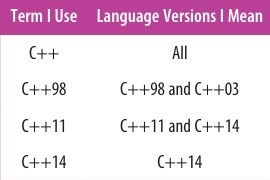

# 引言  

如果你是一名有经验的 _C++_ 程序员，并且是我一样的话，那么你最初接触到 _C++11_ 时的想法一定是：“是的，是的，这就是 _C++_，只不过多了一些特性而已”。但是当你学的越多，你就越会被改动的范围所惊讶到。_auto_ 声明、基于范围的 _for_ 循环、_lambad_ 表达式和右值引用改变了 _C++_ 的外貌，更不用说新的并发特性了。还有一些习惯用法的改变。_0_ 和 _typedef_ 退出了，_nullptr_ 和 _alias_ 声明被引入了。枚举现在有作用域了。相比于内置指针来说，智能指针是更好的。移动对象通常比拷贝对象是要好的。

关于 _C++11_ 就有很多需要学习的内容，更不用说 _C++14_ 了。
 
更有趣地是，关于高效使用这些新特性有很多需要学习的内容。如果你需要的是 **_modern_** _C++_ 特性的基础资料的话，那么资料是丰富的，但如果你正在寻找的是如何利用这些新特性以去创建正确的、高效的、可维护的和可移植的软件的指导方针的话，那么寻找这样的资料是非常有挑战性的。这就是本书的由来。本书不致力于描述 _C++11_ 和 _C++14_ 的特性，而是致力于了这些特性的高效应用。

本书的内容被分成了称为 _Item_ 的指导方针。想要明白各种形式的类型推导？想要知道何时该何时不该使用类型推导？你对下面的内容感兴趣吗？为什么 _const_ 成员函数应该是线程安全的呢？如何使用智能指针 _std::unique_ptr_ 来实现 _Pimpl Idiom_？为什么你应该在使用 _lambad_ 时避免使用默认捕获模式呢？_std::atomic_ 和 _volatile_ 的区别是什么？这些答案都在这里。更进一步。它们都是平台独立的且符合标准的答案。本书是关于可移植 _C++_ 的。

本书中的 _Item_ 是指导方针，但不是规则，因为指导方针是有例外的。每一个 _Item_ 最重要的并不是它所提供的建议，而是这些建议背后的逻辑依据。一旦你了解了这些 _Item_，你就能确定你的项目的场景是否有理由去违反这些 _Item_ 的指导方针。本书真正的目标不是告诉你去做什么或者避免去做什么，而是要去传递 _C++11_ 和 _C++14_ 如何运行的更深层次的理解。

## 术语和惯例

为了确保我们彼此理解，重要的是在一些术语上达成一致，讽刺的是要从 **_C++_** 这个词开始。_C++_ 共有 _4_ 个官方版本，每一个后都跟着一个相应的 _ISO_ 标准被采用的年份：_C++98_、_C++03_、_C++11_ 和 _C++14_。_C++98_ 和 _C++03_ 只是在一些技术细节上有所不同，所以在本书中一起将它们称为 _C++98_。当我提及 _C++11_ 时，指的是 _C++11_ 和 _C++14_，因为 _C++14_ 实际上只是 _C++11_ 的超集。如果我只是提到了 _C++_ 的话，我正在做一个适用于所有语言版本的广泛陈述。  

  

因此，我可能会说：_C++_ 是非常注重效率的，所有版本都是这样；_C++98_ 缺少并发特性的支持，_C++98_ 和 _C++03_ 都是这样；_C++11_ 支持 _lambda expression_，_C++11_ 和 _C++14_ 都是这样；_C++14_ 提供广义函数的返回类型推导，只有 _C++14_ 是这样。

_C++11_ 的最广泛的特性大概是移动语义，移动语义的基础是区分左值表达式和右值表达式。这是因为右值表示是适合 _move operation_ 的对象，而左值通常则不是。在概念上，尽管在实际中不总是，右值对应的是函数所返回的临时对象，而左值对应的则是你可以通过名字或者通过指针或左值引用来引用的对象。

一个可以确定一个表达式是否是左值的方法是：你是否可以获取这个表达式的地址。如果可以，它通常就是左值。如果不可以，它通常就不是左值。这个方法的一个友好特性是可以帮助你记住：一个表达式的类型是和这个表达式是左值还是右值无关的。也就是说，给定一个类型 _T_，你可以有类型 _T_ 的左值和右值。更重要的是当处理右值引用类型的形参时牢记这个方法，因为形参本身就是一个左值:  
```C++
  class Widget {
  public:
    Widget(Widget&& rhs);   // rhs is an lvalue, though it has
    …                       // an rvalue reference type
  };
```  
在这里，在 _Widget_ 的移动构造函数中获取 _rhs_ 的地址是完全有效的，尽管 _rhs_ 的类型是一个右值引用。类似地就可以推导出所有的形参都是左值。

这个代码片段描述了我通常遵循的一些惯例：  
* 类的名字是 _Widget_。当我想要一个任意的用户定义的类型时，我就会使用 _Widget_。除非我需要展示这个类的特定的细节以外，否则我就会在不声明这个类的情况下就去使用它。  
                                                                           
* 我使用形参名 _rhs_ 来表示 **_right-hand side_**。这是我喜欢在 _move operation_ 上，即为：_move constructor_ 和 _move assignment operator_，和 _copy operation_ 上，即为：_copy constructor_ 和 _copy assignment operator_，喜欢用的形参名，其中我也用它做为二元操作符函数的右侧形参：  
  ```C++
    Matrix operator+(const Matrix& lhs, const Matrix& rhs);
  ```  
  不要惊讶，我会用 _lhs_ 代表 **_left-hand side_**。

* 我在代码中和注释中应用了特殊的格式，以去引起你的注意。在上面的 _Widget_ 的移动构造函数中，我已经高亮了 _rhs_ 的声明和注释中 _rhs_ 是左值的那部分。高亮代码既不是固有地好或坏。高亮代码只是你应该特别关注的代码。

* 我使用 **_..._** 来表示 **_其他代码会在这里_**。这个窄省略和在 _C++11_ 中的可变参数模板所对应的源码中所使用的宽省略是不同的。这听起来是令人困惑的，但并不是。例如：  
  ```C++
    template<typename... Ts>                // these are C++
    void processVals(const Ts&... params)   // source code
    {                                       // ellipses

      …                                     // this means "some
                                            // code goes here"
    }
  ```  
* _processVals_ 的声明展示了：当我在模板中声明类型形参时，我使用的是 _typename_，但这仅仅是个人喜好；关键字 _class_ 也可以工作。在我展示来自于 _C++_ 标准库的代码的场合中，我使用 _class_ 来声明类型形参，因为标准库就是这么做的。
  
当使用另一个相同类型的对象来初始化一个新对象时，这个新对象被称为初始化对象的副本，甚至这个副本是通过移动构造函数所创建的。遗憾地是，在 _C++_ 中没有区分拷贝构造的副本和移动构造的副本的术语。  
```C++
  void someFunc(Widget w);    // someFunc's parameter w
                              // is passed by value

  Widget wid;                 // wid is some Widget
  
  someFunc(wid);              // in this call to someFunc,                            
                              // w is a copy of wid that's
                              // created via copy construction

  someFunc(std::move(wid));   // in this call to SomeFunc,
                              // w is a copy of wid that's
                              // created via move construction
```  
右值的副本通常是移动构造得到的，而左值的副本则通常是拷贝构造得到的。如果你只知道一个对象是另一个对象的副本的话，那么是不能说构造这个副本是如何的代价大的。例如：在不知道是左值还是右值会传递给 _someFunc_ 的情况下，就不能说创建形参 _w_ 是如何的代价大的。你还必须得知道移动和拷贝 _Widget_ 的成本。  
  
在函数调用中，在调用处所传递的表达式是函数的实参。这个实参是被用来初始化函数的形参的。在上面的第一个 _somefunc_ 调用中的实参是 _wid_。在第二个调用中的实参是 _std::move(wid)_。在所有的调用中形参都是 _w_。区分形参和实参是重要的，因为形参是左值，但是初始化形参所用的实参可以是左值或者右值。这在 **_完美转发_** 过程中更为重要，在其中所传递给第一个函数的实参是被传递给第二个函数的，从而保留原始实参的右值性或者左值性。完美转发会在 [_Item 30_](Chapter%205.md#item-30-熟悉完美转发失败的场景) 中详细讨论。
 
精心设计的函数是 _exception safe_ 的，这意味着至少提供了基本异常安全的保证，即为：_basic guarantee_。这样的函数确保调用方：即使抛出了一个异常，程序的不变量也是保持不变的，即为：没有数据结构被损坏，同时也是没有资源被泄露的。提供了强异常安全保证的函数，即为：_strong guarntee_，确保调用方：如果有出现了一个异常的话，那么程序的状态也会保持在它被调用之前的那样。
  
当我提及函数对象时，通常说的是支持有 _operator()_ 成员函数的类型的一个对象。换句话说，一个表现地像是函数的对象。偶尔我也会在稍微更广义的意义上来使用这个术语，以去表示任何可以使用非成员函数调用语法而调用的东西，这个语法是：**_functionName(arguments)_**。这个广义定义不仅包括支持有 _operator()_ 的对象，还包括函数指针和 _C_ 函数指针。这个狭义是定义来自于 _C++98_ 的，而这个广义定义来自于 _C++11_。通过增加成员函数指针来进一步广义化，这会产生被称为可调用对象。你通常可以忽略这个友好的区别，然后简单地认为函数对象和可调用对象是一些可以使用函数调用语法而进行调用的东西。
  
_lambda expression_ 所创建的函数对象被称为 _closure_。我们很少有必要去区分  _lambda expression_ 和它们所创建的 _closure_。类似地还有，我也很少区分函数模板，即为：生成函数的模板，和模板函数，即为：根据函数模板生成的函数。同理类模板和模板类。  

_C++_ 中的很多东西都可以被声明和定义。声明是介绍了名字和类型，但是没有给出细节，比如：是在哪里存储的或者是如何实现的：  
```C++
  extern int x;                 // object declaration
  
  class Widget;                 // class declaration
  
  bool func(const Widget& w);   // function declaration
  
  enum class Color;             // scoped enum declaration
                                // (see Item 10)
```

定义提供了存储地点和实现细节：  
```C++
  int x;                      // object definition

  class Widget {              // class definition
    …
  };
  
  bool func(const Widget& w)
  { return w.size() < 10; }   // function definition
  
  enum class Color
  { Yellow, Red, Blue };      // scoped enum definition
```

定义也可以做为声明，除了非用定义不可以外，我更倾向于声明。

我定义函数的 _signature_ 为它的声明中指明了形参类型和返回类型的那部分。函数名和形参名不不属于 _signature_ 的一部分。在上面的例子中，_func_ 的 _signature_ 为 _bool(const Widget&)_。函数声明中除了形参类型和返回类型以外的其他元素是被排除在外的，比如：_noexcept_ 或者 _constexpr_，这两个会分别在 [_Item 14_](Chapter%203.md#item-14-当函数不会抛出异常时声明函数为-noexcept) 和 [_Item 15_](Chapter%203.md#item-15-只要有可能就使用-constexpr) 中进行描述。官方对于 _signature_ 的定义和我稍有不同，但是对于本书来说，我的定义更有效。官方的定义有时候会省略返回值类型。

新的 _C++_ 标准通常会保留在老的标准下所写的代码的有效性，但是偶尔标准委员也会反对一些特性。这些特性是被废弃的，后续会从未来的标准中被删除。关于这些被反对的特性，编译器可能会警告，也可能不会警告，但是你应该尽量去避免使用它。这些被反对的特性会导致未来的移植问题，并且那些可以替换它们的新特性通常是更好的。例如：_C++_ 中 _std::auto_ptr_ 是被废弃的，因为 _std::unique_ptr_ 也能完成相同的工作，而且完成的更好。

有时候标准会说一个操作的结果是 **_undefined behavior_**。这意味着运行行为是不可预测的，不用说，你应该避开它们。**_undefined behavior_** 包括：使用 **_[]_** 去索引超出 _std::vector_ 边界的位置、解引用未初始化的 _iterator_ 或参与到数据竞争中，即为：有两个或多个线程在同时访问同一个内存位置，并且其中至少有一个线程在写。

我将内建指针称为原始指针，比如 _new_ 所返回的原始指针。与原始指针相反的是智能指针。智能指针通常会重载 _operator->_ 和 _operator*_，[_Item 20_](Chapter%204.md#item-20-对于可能会悬空的-stdshared_ptr-like-指针使用-stdweak_ptr) 解释了 _std::weak_ptr_ 是一个例外。

在源码注释中，我有时候将构造函数和析构函数分别称为 _ctor_ 和 _dtor_。

## 提交 _bug_ 和改进建议

我已经尽可能使用清晰的、准确的和有用的信息来完成这本书，但肯定有方法使本书变得更好。如果你发现了任何错误，技术上的、阐述上的、语法上的和排版上的等等，或者如果你有改进本书的建议，请给我发邮件，这是我的邮箱 <emc++@aristeia.com>。新的印刷给我机会去修正本书，但是我不能解决我不知道的问题。

要查看我所知道的问题列表，请查阅本书的勘误页 <http://www.aristeia.com/BookErrata/emc++-errata.html>。
